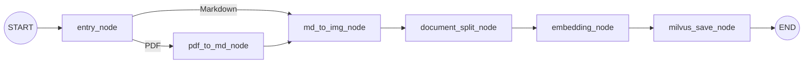
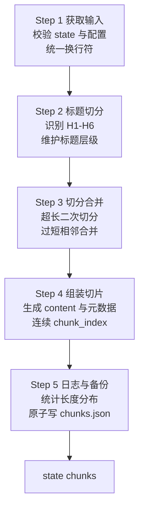

# RAG 文档切分节点技术设计

> 文档状态：实施中（Step 1-4 已完成，Step 5 待开发）<br>
> 适用项目：`shopkeeper_brain_ai/knowledge`<br>
> 目标节点：`DocumentSplitNode` / `document_split_node`<br>
> 上游节点：`MdToImgNode` / `md_to_img_node`<br>
> 下游节点：`EmbeddingNode`，随后由 `MilvusSaveNode` 入库<br>
> 最后更新：2026-09-02

## 1. 背景与结论

PDF 或 Markdown 经过入口识别、PDF 转换和图片处理后，`state["md_content"]`
已经包含可供 RAG 使用的完整 Markdown。整篇文档不能直接生成单一向量，否则会带来
上下文超限、语义稀释、召回噪声过大和更新成本高等问题，因此需要在向量化之前增加
`DocumentSplitNode`。

本节点采用“标题结构优先、长度约束兜底”的策略，并严格收敛为五个步骤：

1. 获取并校验输入；
2. 按 Markdown 标题切分 section；
3. 对超长 section 二次切分，并贪心合并过短 section；
4. 组装下游统一使用的 chunk；
5. 输出统计日志，并将结果原子备份为 `chunks.json`。

节点成功后把最终列表写入 `state["chunks"]`。后续 `EmbeddingNode` 只读取每个
chunk 的 `content` 生成向量，`MilvusSaveNode` 再将 chunk、元数据和向量一并入库。

## 2. 设计依据与现状

### 2.1 输入资料

本设计参考以下素材：

- `06_掌柜智库项目（导入处理）文档切分节点（上）.md`；
- Markdown 五步处理流程图；
- 导入节点位置图和 RAG 检索流程图；
- 当前仓库中的 `state.py`、`config.py`、`exceptions.py`、`base.py`、
  `main_graph.py` 和已实现节点。

参考资料仅用于提取业务需求和算法思路，最终设计以当前仓库代码和本设计中的明确决策
为准。

### 2.2 当前实现基线

项目目前已经具备：

- `EntryNode` 对 PDF/Markdown 的条件路由；
- `PdfToMdNode` 将 PDF 转换为 Markdown，并写入 `state["md_path"]`；
- `MdToImgNode` 读取 Markdown、处理图片，并写入 `state["md_content"]` 和
  `state["md_path"]`；
- `ImportGraphState` 中预留的 `file_title`、`file_dir` 和 `chunks` 字段；
- `ImportConfig.max_content_length=2000`、`min_content_length=500` 和
  `overlap_sentences=1`；
- `StateFieldError`、`ConfigurationError`、`FileProcessingError` 和
  `DocumentSplitError`；
- `BaseNode` 的统一调用、日志和异常处理框架。

项目已新增 `document_split_node.py`，完成 Step 1 输入校验、Step 2 标题切分、
Step 3 长切分/短合并和 Step 4 `ChunkRecord` 组装，并通过对应场景测试。
`main_graph.py` 已编排为 `md_to_img_node → document_split_node → END`；Step 5 的统计
备份仍待实现，但不影响当前切片结果写入 `state["chunks"]`。

### 2.3 关键决策

| 主题 | 设计决策 |
| --- | --- |
| 步骤数量 | 按需求合并为五步，统计和 JSON 备份共同属于 Step 5 |
| 长度单位 | 本期沿用配置语义，以 Python `len()` 得到的字符数计算，不按 token 计数 |
| 配置默认值 | 采用仓库当前值 2000/500，不采用参考资料中的旧值 500/100 |
| Markdown 节点名称 | 使用仓库实际名称 `md_to_img_node`，不使用图片中的 `md_img_node` |
| 向量入库顺序 | 必须先 `embedding_node`，再 `milvus_save_node` |
| 空文档 | 空字符串是合法输入，输出空 chunks 并正常生成统计和备份 |
| 最大长度 | 对普通文本为硬限制；不可安全拆开的 Markdown 原子结构允许单独超限并记录 warning |
| 备份策略 | 固定写 `chunks.json` 并原子替换；历史版本归档不在本期范围 |

## 3. 范围

### 3.1 本期范围

- 支持 Markdown ATX H1-H6 标题，即 `#` 到 `######`；
- 正确跳过 fenced code block 内看似标题的行；
- 保留标题层级、父标题和来源文件信息；
- 对超长内容按自然边界逐级降级切分；
- 对相邻短内容进行有边界的贪心合并；
- 输出结构稳定、顺序确定的 chunk 列表；
- 记录结构化统计日志；
- 使用 UTF-8 JSON 原子备份完整结果；
- 为 Embedding 和 Milvus 节点定义清晰的数据契约。

### 3.2 非本期范围

- Embedding 模型调用、重试、批处理和限流；
- Milvus collection 建表、索引、upsert 和删除策略；
- 基于语义模型的智能切分；
- 完整 CommonMark AST 和所有扩展语法；
- HTML 标题、Setext 标题和 Word 原始格式解析；
- 对历史 `chunks.json` 按日期长期归档；
- RAG 查询、重排和答案生成。

## 4. 总体架构

### 4.1 导入与入库主链路



当前实际链路暂时以 `document_split_node → END` 结束；Embedding 和 Milvus 节点完成后，
再替换为图中的完整入库链路。

### 4.2 节点内部五步流程



## 5. 状态与数据契约

### 5.1 输入状态

| 字段 | 必需 | 类型 | 规则 |
| --- | --- | --- | --- |
| `md_content` | 是 | `str` | 允许空字符串；缺失、`None` 或非字符串时报错 |
| `md_path` | 是 | `str` | 非空，用于记录来源并确定默认备份目录 |
| `file_title` | 否 | `str` | 优先使用；为空时按 `import_file_path`、`md_path` 顺序推导 |
| `file_dir` | 否 | `str` | 备份目录；为空时使用 `md_path.parent` |
| `import_file_path` | 否 | `str` | 用于推导稳定的原始文件标题 |
| `task_id` | 否 | `str` | 只用于任务追踪和日志上下文 |

Step 1 应把最终确定的 `file_title` 和 `file_dir` 回写状态，使后续节点不再重复推导。
建议后续同时让 `EntryNode` 在最早阶段写入这两个字段，但切分节点仍需保留兼容兜底。

### 5.2 配置契约

| 配置 | 当前默认值 | 校验规则 | 用途 |
| --- | ---: | --- | --- |
| `max_content_length` | 2000 | 正整数 | 最终 `content` 的目标最大字符数 |
| `min_content_length` | 500 | 正整数且小于最大值 | 触发短 chunk 合并的阈值 |
| `overlap_sentences` | 1 | 大于等于 0 | 长内容切分时携带的前文句子数 |

配置不合法时抛出 `ConfigurationError`，不要使用通用 `ValueError`，以便调用方区分输入
状态错误和部署配置错误。

### 5.3 内部数据模型

推荐使用不可变 dataclass 表达中间态，直到 Step 4 再转成字典：

```python
@dataclass(frozen=True)
class Section:
    title: str
    heading_level: int
    parent_title: str
    heading_path: tuple[str, ...]
    body: str
    source_section_index: int


@dataclass(frozen=True)
class ChunkDraft:
    parts: tuple[Section, ...]
    source_section_indexes: tuple[int, ...]
```

`ChunkDraft.parts` 能在合并短章节时保留每个原始标题，避免只拼接正文导致下级标题丢失。

### 5.4 输出 chunk 结构

建议在 `state.py` 中增加 `ChunkRecord` TypedDict，并把 `chunks` 从裸 `List` 收紧为
`list[ChunkRecord]`。单个 chunk 格式如下：

```json
{
  "chunk_index": 0,
  "file_title": "万用表的使用",
  "title": "# 第一章 基础知识",
  "parent_title": "# 第一章 基础知识",
  "heading_path": ["# 第一章 基础知识", "## 1.1 安全说明"],
  "source_titles": ["## 1.1 安全说明"],
  "source_section_indexes": [1],
  "body": "使用前请检查表笔……",
  "content": "## 1.1 安全说明\n\n使用前请检查表笔……",
  "char_count": 31,
  "source_path": "D:/docs/万用表的使用_new.md"
}
```

字段规则：

- `chunk_index` 从 0 开始且连续，等于列表顺序；
- `content` 是 Embedding 节点唯一需要向量化的字段；
- `body` 保留正文，便于调试、展示和重新组装；
- `source_titles` 保留短章节合并前的所有标题；
- `heading_path` 保留当前章节从顶层到自身的语义路径；
- `char_count` 必须等于 `len(content)`；
- `source_path` 使用规范化后的绝对 `md_path`；
- 本节点不生成向量，也不写入 Milvus 主键。

## 6. 五步详细设计

### 6.1 Step 1：获取输入

建议方法：

```python
def _validate_state(
    self,
    state: ImportGraphState,
) -> tuple[str, str, Path, Path, int, int, int]:
    ...
```

处理顺序：

1. 校验 `state` 是字典；
2. 校验 `md_content` 存在且是字符串，空字符串合法；
3. 将 `\r\n` 和 `\r` 统一为 `\n`，并仅移除文档开头可能存在的 UTF-8 BOM；
4. 校验并规范化 `md_path`，要求是非空 Markdown 路径；
5. `file_title` 为空时，优先从 `import_file_path` 的 stem 推导，再回退到
   `md_path.stem`；
6. `file_dir` 为空时使用 `md_path.parent`，并规范化为绝对路径；
7. 校验 `max_content_length`、`min_content_length` 和 `overlap_sentences`；
8. 将确定后的 `file_title`、`file_dir` 回写 state。

不要对完整 Markdown 调用全局 `strip()`，否则可能无意改变代码块、列表和文档结尾的
格式。各 section 在组装时再清理多余的边界空行。

### 6.2 Step 2：标题切分

建议方法：

```python
def _split_by_headings(
    self,
    md_content: str,
    file_title: str,
) -> list[Section]:
    ...
```

标题识别采用 ATX H1-H6：

```python
heading_pattern = re.compile(r"^ {0,3}(#{1,6})[ \t]+(.+?)\s*$")
```

关键规则：

1. 仅允许 0-3 个前导空格，`#标签` 和七级 `####### 标题` 不视为标题；
2. 标题行从 body 中移除，并单独存入 `Section.title`；
3. 使用长度为 7 的 hierarchy 数组追踪 H1-H6；
4. 遇到新标题时清空所有更低层级，避免旧子标题污染新章节；
5. 标题跳级时向上查找最近的非空标题作为 `parent_title`；
6. H1 没有更高层级，沿用现有业务规则，以自身作为 `parent_title`；
7. 首个标题前存在非空正文时，以 `file_title` 作为该 section 的标题和父标题；
8. 全文没有标题时生成一个以 `file_title` 命名的 section；
9. 纯空白内容不生成 section。

代码围栏不能使用“看到任意围栏就简单取反”的方式。需要记录打开围栏的字符类型和
长度，只有相同字符且长度不短于打开围栏的行才能关闭。围栏内部的 `# 注释`、
`## 示例` 均作为正文。

```text
正常模式 --遇到 ```python--> 反引号围栏模式
围栏模式 --遇到 ```--------> 正常模式
围栏模式 --遇到 ~~~--------> 保持围栏模式
```

### 6.3 Step 3：切分与合并

本步骤分为“先拆长、后并短”，顺序不能颠倒。

#### 6.3.1 超长 section 二次切分

已实现方法：

```python
def _split_long_section(
    self,
    section: DocumentSection,
    *,
    max_content_length: int,
    overlap_sentences: int,
) -> list[ChunkDraft]:
    ...
```

最终长度按组装后的 `content` 计算，因此切正文前必须先扣除重复标题及分隔换行占用的
字符。若标题本身已经不小于 `max_content_length`，抛出 `DocumentSplitError`，避免
输出明知无法满足配置的普通文本 chunk。

正文切分边界按以下优先级逐级降级：

1. 空行分隔的段落；
2. 普通换行；
3. 中文和英文句末标点；
4. 对仍然超长的纯文本执行定长切分。

代码围栏和独占一行的 Markdown 图片/链接作为原子结构优先保留。标准 Markdown 管道
表格和 MinerU HTML 表格统一通过独立 `MarkdownTableUtil` 采用“方案三：降维转译法”：
HTML 先把 `rowspan`/`colspan` 物理投影为二维矩阵，管道表格直接解析成矩阵；随后嗅探
标准表头表、交叉表或 K-V 表，最后生成每行自带列头/行头的自然语言。这样表格在后续
再次切分时仍保有完整语义。
单个原子结构超过
最大长度且无法安全拆分时，允许它独立成为超限 chunk，并记录包含类型、实际长度和
section 序号的 warning；不得静默截断或生成语法损坏的 Markdown。

`MarkdownTableUtil` 的模块说明同时保留四种方案的设计：方案一表格隔离、方案二表头
续传、方案三降维转译、方案四 VLM 视觉解析。目前只有方案三存在运行实现，其余方案
明确标记为“仅设计、未实现”，后续增加动态路由时无需修改 `DocumentSplitNode`。

`overlap_sentences` 只对句子级切分生效。下一个片段最多携带上一个片段末尾指定数量
的完整句子，并在加入重叠内容后重新检查最大长度。段落恰好落在边界时不人为制造重复。

#### 6.3.2 过短 chunk 贪心合并

已实现方法：

```python
def _merge_short_drafts(
    self,
    drafts: list[ChunkDraft],
    *,
    min_content_length: int,
    max_content_length: int,
) -> list[ChunkDraft]:
    ...
```

按原文顺序扫描：

1. 当前 draft 长度小于 `min_content_length` 时，优先尝试与后一个相邻 draft 合并；
2. 若没有后一个或合并后超长，再尝试与已经输出的前一个 draft 合并；
3. 只允许合并同一 H1 分支内的相邻内容，不跨顶级章节；
4. 合并后的最终 `content` 不得超过最大长度，原子结构超限例外除外；
5. 合并时保留双方完整 Markdown 标题，并累积 `parts`、`source_titles` 和 section 序号；
6. 无法安全合并的短 chunk 原样保留，不丢弃、不跨章节强行合并。

该策略保证顺序稳定并尽量减少碎片，同时不会为了满足最小长度破坏文档的主要语义边界。

### 6.4 Step 4：组装切片

已实现方法：

```python
def _assemble_chunks(
    self,
    drafts: list[ChunkDraft],
    file_title: str,
    source_path: Path,
) -> list[ChunkRecord]:
    ...
```

组装规则：

1. 单 section draft 的 `content` 为 `title + "\n\n" + body`；
2. 多 section draft 依次组装每个 `title + body`，section 之间使用两个换行；
3. 标题或正文为空时不产生多余分隔符；
4. 仅清理每个组成部分首尾的空行，不改变内部换行；
5. 生成连续的 `chunk_index`、`char_count` 和来源元数据；
6. 多 section 合并时，`heading_path` 取各 part 的最长公共标题前缀；例如两个
   同属 `# 安装` 的 H2 合并后，公共路径为 `["# 安装"]`；
7. 当前 Step 4 在完整列表组装成功后一次性写入 `state["chunks"]`；Step 5 接入后，
   将进一步调整为备份成功后再写入。

最后写 state 可以避免处理中途失败时留下“看似已完成”的部分 chunks。输出顺序必须完全
由原文顺序决定，相同输入和配置应得到相同的 chunk 内容与索引。

### 6.5 Step 5：日志统计与备份

建议方法：

```python
def _log_summary(self, chunks: list[ChunkRecord], metrics: SplitMetrics) -> None:
    ...

def _backup_chunks(
    self,
    chunks: list[ChunkRecord],
    output_dir: Path,
    metadata: dict,
) -> Path:
    ...
```

INFO 日志至少包含：

- `task_id` 和 `file_title`；
- 原始字符数、标题 section 数和最终 chunk 数；
- 超长拆分次数、短内容合并次数、原子结构超限数量；
- chunk 最小、最大、平均字符数；
- `chunks.json` 输出路径。

WARNING 日志用于不可安全拆分的超限原子结构。ERROR 日志记录备份失败的路径和异常类型，
但不得打印完整正文、密钥或其他敏感数据。

`chunks.json` 建议使用带版本的封装对象，而不是只写裸数组：

```json
{
  "schema_version": 1,
  "task_id": "task_001",
  "file_title": "万用表的使用",
  "source_path": "D:/docs/万用表的使用_new.md",
  "generated_at": "2026-09-01T08:00:00Z",
  "statistics": {
    "source_char_count": 15320,
    "section_count": 18,
    "chunk_count": 12,
    "min_chunk_length": 620,
    "max_chunk_length": 1980,
    "average_chunk_length": 1276.7
  },
  "chunks": []
}
```

备份流程：

1. 确保输出目录存在且是目录；
2. 在同目录创建唯一临时文件；
3. 使用 UTF-8、`ensure_ascii=False`、`indent=2` 写入；
4. flush 后原子替换正式的 `chunks.json`；
5. 任一步骤失败都清理临时文件并抛出 `FileProcessingError`；
6. 备份成功后才把 `chunks` 和可选的 `chunks_backup_path` 写回 state。

固定文件名便于调试和下游发现，也让重复执行自然覆盖旧结果。若未来需要按日期保留历史，
应增加独立归档策略，而不是改变本节点的默认幂等行为。

## 7. 类与方法设计

建议文件：

```text
knowledge/processor/import_processor/
├── nodes/
│   └── document_split_node.py
├── main_graph.py
├── state.py
├── config.py
└── exceptions.py
```

主节点只负责编排五步，复杂逻辑放入职责单一的私有方法：

```python
class DocumentSplitNode(BaseNode):
    name = "document_split_node"

    def process(self, state: ImportGraphState) -> ImportGraphState:
        inputs = self._validate_state(state)
        sections = self._split_by_headings(inputs.md_content, inputs.file_title)
        drafts = self._split_and_merge(
            sections,
            max_content_length=inputs.max_content_length,
            min_content_length=inputs.min_content_length,
            overlap_sentences=inputs.overlap_sentences,
        )
        chunks = self._assemble_chunks(
            drafts,
            inputs.file_title,
            inputs.md_path,
        )
        metrics = self._build_metrics(inputs.md_content, sections, chunks)
        self._log_summary(chunks, metrics)
        backup_path = self._backup_chunks(chunks, inputs.file_dir, metrics)

        state["chunks"] = chunks
        state["chunks_backup_path"] = str(backup_path)
        return state
```

示例用于说明职责边界，不作为需要逐字复制的最终实现。`SplitInputs`、`SplitMetrics`、
`Section` 和 `ChunkDraft` 推荐使用内部 frozen dataclass。

## 8. 异常策略

| 场景 | 异常类型 | 处理方式 |
| --- | --- | --- |
| state 非字典 | `StateFieldError` | 立即失败 |
| `md_content` 缺失或类型错误 | `StateFieldError` | 立即失败；空字符串除外 |
| `md_path` 缺失或无效 | `StateFieldError` | 立即失败 |
| 长度配置关系错误 | `ConfigurationError` | 立即失败 |
| 标题或切分内部不变量破坏 | `DocumentSplitError` | 记录上下文后失败 |
| 单个 Markdown 原子结构超长 | 不抛异常 | 独立保留并记录 warning |
| JSON 目录或写入失败 | `FileProcessingError` | 清理临时文件后失败 |

`BaseNode.__call__()` 当前会捕获所有异常并重新包装为 `ImportProcessError`。实现本节点前建议
调整为：已经是 `ImportProcessError` 的异常直接透传，只包装未知异常，否则上表中的具体
异常类型会在 LangGraph 边界丢失。

## 9. LangGraph 接入设计

当前 `main_graph.py` 已调整为：

```text
pdf_to_md_node → md_to_img_node → document_split_node → END
             ↗
Markdown ────
```

`build_import_graph()` 已完成：

1. 实例化并注册 `DocumentSplitNode(config=config)`；
2. 将 `md_to_img_node → END` 改为 `md_to_img_node → document_split_node`；
3. 增加 `document_split_node → END`；
4. Embedding 和 Milvus 节点完成后，再把末端替换成
   `document_split_node → embedding_node → milvus_save_node → END`。

文档切分没有外部网络调用，不需要条件边、重试边或并行 fan-out。Embedding 是否按 chunk
批量并发应由 `EmbeddingNode` 自己处理，不应把每个 chunk 展开成 LangGraph 节点。

## 10. Embedding 与 Milvus 下游契约

### 10.1 EmbeddingNode

输入：`state["chunks"]`。

职责：

- 按 `embedding_batch_size` 批量读取 `chunk["content"]`；
- 生成固定 `embedding_dim` 的向量；
- 校验返回数量、顺序和维度；
- 将向量按 `chunk_index` 对齐写入新的结构，不改变 chunk 内容。

### 10.2 MilvusSaveNode

输入：包含向量的 chunks。

建议至少持久化：

- 文档或知识库标识；
- chunk 主键；
- `chunk_index`；
- `content`；
- `file_title`、`title`、`parent_title`、`heading_path`；
- `source_path`；
- embedding vector。

Milvus 主键及文档级幂等更新需要稳定的 `document_id`。当前 state 尚未定义该字段，应在
Embedding/Milvus 技术设计中补充，不能用本机绝对路径作为跨环境永久主键。

## 11. 测试设计

### 11.1 Step 1

- state 不是字典；
- `md_content` 缺失、`None`、非字符串和空字符串；
- Windows、Unix、旧 Mac 换行统一；
- BOM 清理但正文空格保持；
- `file_title` 的三层获取优先级；
- 2000/500 合法，0、负数、相等和最小值大于最大值非法；
- overlap 为 0 合法，负数非法。

### 11.2 Step 2

- H1-H6 正常切分；
- `#标签`、七级标题和四空格缩进行不切分；
- 反引号和波浪号围栏中的 `#` 不切分；
- 围栏字符不匹配时不提前关闭；
- 标题跳级、同级切换和回到上级时 hierarchy 正确；
- 标题前正文、全文无标题、连续空标题正文和纯空白文档；
- 中文标题、图片引用、表格和列表保持原样。

### 11.3 Step 3

- 小于、等于和大于最大长度的边界；
- 段落、换行、中文句号和英文句号的优先切分；
- overlap 为 0、1 和大于可用句子数；
- 单段超长的定长兜底；
- 超长代码块、图片或表格行单独保留并告警；
- 短 chunk 向后合并、向前合并和无法合并；
- 不跨 H1 合并；
- 合并后所有原始标题仍出现在 content 中。

### 11.4 Step 4 与 Step 5

- chunk_index 连续且顺序稳定；
- `char_count == len(content)`；
- 单 section 和多 section content 无重复或多余空行；
- 中文 JSON 不转义；
- `chunks.json` schema、统计值和内容正确；
- 重复运行原子覆盖成功，不残留临时文件；
- 目录不可写、磁盘写入失败时抛出正确异常；
- 日志不包含完整正文和敏感配置。

### 11.5 LangGraph 集成测试

使用 fake 节点隔离 MinerU、VLM、MinIO、Embedding 和 Milvus：

- PDF 路径执行 `entry → pdf_to_md → md_to_img → document_split`；
- Markdown 路径执行 `entry → md_to_img → document_split`；
- 两条路径均能把非空 chunks 传给 Embedding；
- 上游失败时切分节点不执行；
- 切分或备份失败时下游节点不执行。

## 12. 性能、可靠性与可观测性

- 标题扫描和顺序组装均应保持 O(n) 时间复杂度；
- 不反复对完整字符串做前插或中间拼接，优先积累 list 后一次 `join`；
- 中间 section 和 chunk 保存在内存中，空间复杂度 O(n)，与现有 `md_content` 状态模型一致；
- 所有输出顺序必须稳定，便于测试、比较和幂等更新；
- 只在处理全部成功后更新 state，备份采用同目录原子替换；
- 日志以数量、长度、路径和索引为主，不输出正文；
- 备份文件固定 schema version，为未来字段迁移保留空间。

## 13. 验收标准

满足以下条件即可认为本节点完成：

1. `DocumentSplitNode` 继承 `BaseNode`，五步职责在代码中清晰对应；
2. PDF 和 Markdown 两条导入路径均在图片处理后进入该节点；
3. H1-H6 与代码围栏识别通过全部单元测试；
4. 普通 chunk 满足长度边界，短内容尽可能在同一 H1 内合并；
5. `state["chunks"]` 满足统一 schema，content 可直接供 Embedding 使用；
6. `chunks.json` UTF-8 原子写入，内容和 state 一致；
7. 统计日志完整且不泄露正文或敏感信息；
8. 相同输入与配置重复运行得到相同的 chunks 内容和顺序；
9. 异常类型明确，失败时不运行 Embedding 或 Milvus 入库。

## 14. 推荐实施顺序

1. 在 `state.py` 增加 `ChunkRecord` 和可选的 `chunks_backup_path`；
2. 修正 `BaseNode` 对已有 `ImportProcessError` 的透传；
3. 实现 Step 1 和 Step 2，并完成标题/围栏测试；
4. ~~实现 Step 3，并完成所有长度边界和合并测试；~~（已完成）
5. Step 4 已完成；继续实现 Step 5 及 JSON 原子写入测试；
6. ~~将节点接入 `main_graph.py`，完成 PDF/Markdown 双路径集成测试；~~（已完成）
7. 单独设计并实现 Embedding 和 Milvus 入库节点。
