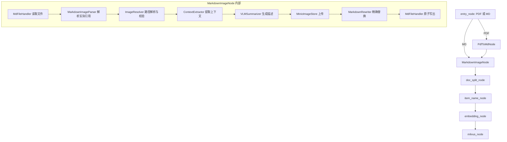
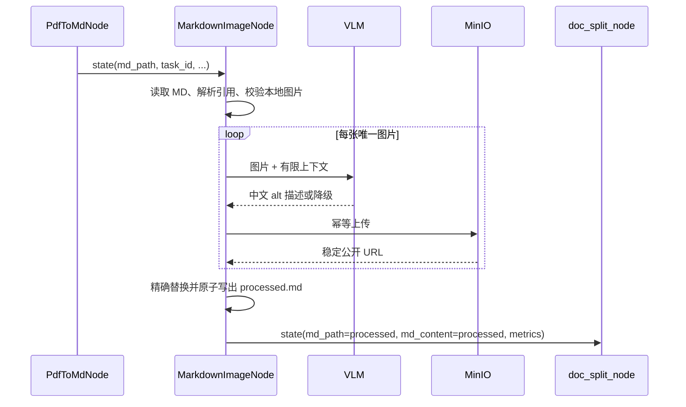

# PDF 转 Markdown 图片处理技术设计

> 文档状态：待评审  
> 适用项目：`shopkeeper_brain_ai/knowledge`  
> 目标节点：`md_img_node`（建议类名 `MarkdownImageNode`）  
> 上游节点：`PdfToMdNode`  
> 最后更新：2026-08-30

## 1. 背景与结论

当前 `PdfToMdNode` 通过 MinerU 将 PDF 转换为 Markdown，并把生成文件路径写入
`state["md_path"]`。MinerU 生成的图片位于 Markdown 同级的 `images/` 目录，文档中以
本地相对路径引用，例如：

```markdown

```

本地路径无法被后续浏览器稳定访问，空 alt 文本也无法参与切片、向量化和语义检索。
因此在文档切分前新增 `md_img_node`，完成以下工作：

1. 解析 Markdown **实际引用**的本地图片；
2. 提取图片所在章节及前后文，调用 VLM 生成简短中文描述；
3. 将本地图片持久化到 MinIO；
4. 把 Markdown 图片的 alt 和 URL 替换为“VLM 描述 + 可公开访问的远程 URL”；
5. 原子写出处理后的 Markdown，并同时更新 `state["md_content"]` 与
   `state["md_path"]`。

推荐采用“VLM 可降级、MinIO 默认不可降级”的处理原则：图片描述失败仍可使用原 alt
或默认描述继续处理；图片上传失败则节点失败，避免下游把仍含临时本地路径的文档当成
成功结果入库。

## 2. 设计依据与项目现状

### 2.1 输入资料

本设计综合以下信息形成：

- `D:\zdsoft\ai-test\重新开始\2_resource\05_掌柜智库项目_导入处理_图片处理与MinIO上传节点 .md`
- 同目录中的节点位置图、状态流转图、上下文提取图和详细流程图
- 当前项目中的 `pdf_to_md_node.py`、`state.py`、`config.py`、`base.py`、
  `exceptions.py` 与 `main_graph.py`

资料中的文字和代码仅作为需求及方案素材，本设计以用户当前目标和仓库实际状态为准。

### 2.2 当前实现基线

`PdfToMdNode` 已实现：

- 校验 `state["import_file_path"]`；
- 调用本地 MinerU CLI；
- 按 `{PDF目录}/{PDF名}/auto/{PDF名}.md` 定位输出；
- 写入 `state["md_path"]`。

项目已有：

- `ImportConfig` 中的 VLM、MinIO、图片扩展名、上下文长度和限流配置；
- `StateFieldError`、`FileProcessingError`、`ImageProcessingError`、
  `MinioError`、`LLMError` 等异常类型；
- `BaseNode` 的统一执行及日志框架；
- `minio` 和 OpenAI 相关依赖。

项目尚缺：

- `md_img_node.py`；
- `knowledge/utils/client/` 下的 AI 与 MinIO 客户端管理；
- 导入流程 LangGraph 的节点及边编排；
- 本功能测试目录和测试用例；
- `.env.example` 中的图片处理配置示例。

## 3. 范围

### 3.1 本期范围

- 处理 MinerU 产生的标准 Markdown 行内图片语法；
- 支持相对路径、`./images/...`、URL 编码后的相对路径及 Windows 分隔符；
- 跳过 `http://`、`https://`、`data:` 等已是远程或内嵌的图片；
- 只处理存在、可读、格式合法且位于允许目录内的本地图片；
- 支持一张图片被多次引用；
- 支持不同目录下的同名图片，不以文件名作为唯一标识；
- 为每个图片引用提取章节标题、上文和下文；
- 上传 MinIO、替换引用、输出处理结果并记录结构化统计日志。

### 3.2 非本期范围

- 下载并重新托管外部 HTTP 图片；
- OCR、图片内容纠错或图表数据结构化；
- SVG 内部资源处理；
- 完整 CommonMark AST 的所有扩展语法；
- 清理 MinIO 中已经不再被文档引用的历史对象；
- 用户直接上传 Markdown 时配套图片包的前端交互。

## 4. 总体架构



主节点只负责编排，业务拆分为以下组件：

| 组件 | 主要职责 | 建议公开方法 |
| --- | --- | --- |
| `MdFileHandler` | 状态校验、UTF-8 读取、原子写出 | `read()`、`write_processed()` |
| `MarkdownImageParser` | 解析图片引用及其精确位置 | `parse_references()` |
| `ImageResolver` | URL 判定、路径规范化、安全校验、格式验证 | `resolve()` |
| `ContextExtractor` | 按引用位置提取标题、前后文 | `extract()` |
| `VLMSummarizer` | VLM 调用、限流、重试、描述清洗 | `summarize_all()` |
| `MinioImageStore` | Bucket 检查、幂等上传、公开 URL 生成 | `upload_all()` |
| `MarkdownRewriter` | 按引用位置替换 alt 与目标 URL | `rewrite()` |
| `MarkdownImageNode` | 解包配置并串联上述组件 | `process()` |

客户端通过构造参数或工厂注入，单元测试使用 fake client，不在业务组件内部直接读取环境变量。

## 5. 核心数据模型

建议在 `md_img_node.py` 或独立 `models.py` 中定义：

```python
@dataclass(frozen=True)
class ImageReference:
    raw: str                    # 原始 Markdown 图片标签
    alt: str                    # 原 alt
    destination: str            # Markdown 中的原始目标
    title: str | None           # 可选 title
    start: int                  # 在 md_content 中的起始偏移
    end: int                    # 在 md_content 中的结束偏移
    line_index: int             # 所在行，用于上下文提取及日志


@dataclass(frozen=True)
class ImageContext:
    heading: str
    pre_text: str
    post_text: str


@dataclass(frozen=True)
class ResolvedImage:
    reference: ImageReference
    local_path: Path
    relative_path: str          # 相对 Markdown 目录的 POSIX 路径，作为逻辑标识
    media_type: str
    content_sha256: str
    context: ImageContext


@dataclass(frozen=True)
class ProcessedImage:
    image: ResolvedImage
    summary: str
    object_name: str
    public_url: str
```

内部字典必须使用规范化相对路径或内容哈希作为 key，不能只使用 `Path.name`。否则
`images/a/logo.png` 与 `images/b/logo.png` 会互相覆盖。

## 6. 详细处理流程

### 6.1 Step 1：读取与前置校验

输入必须是字典，且 `md_path` 为非空字符串。随后校验：

- 文件存在且为普通文件；
- 扩展名为 `.md` 或 `.markdown`；
- 文件可按 UTF-8 读取；UTF-8 BOM 可使用 `utf-8-sig` 兼容；
- 记录文档路径、字符数和 `task_id`，不记录完整文档内容。

如果 Markdown 不含图片引用，直接把原内容写入 `state["md_content"]` 并返回，
不创建 `_processed.md`。

### 6.2 Step 2：从 Markdown 解析图片引用

处理入口必须是 Markdown 引用，而不是遍历 `images/` 后按文件名反查。这样可以：

- 不处理 MinerU 遗留但已未引用的图片；
- 正确识别同名不同路径图片；
- 保留每次引用的精确位置，支持同图多次出现及不同上下文；
- 将“缺失图片”作为明确结果记录，而不是静默遗漏。

第一期可针对 MinerU 输出实现一个受控解析器，支持：

```markdown


```

解析器必须忽略 fenced code block 和 inline code 中形似图片的文本。若后续输入来源扩展，
再替换为 CommonMark AST 解析器；替换不应影响后续组件接口。

### 6.3 Step 3：解析和校验本地路径

对每个引用执行：

1. 去除 `<...>` 包裹和可选 title；
2. 解析百分号编码，统一 `/`、`\` 分隔符；
3. 跳过 `http`、`https`、`data` 等非本地 scheme；
4. 使用 `md_path.parent / destination` 解析后调用 `resolve()`；
5. 确认结果位于 `md_path.parent` 下，默认进一步限制在同级 `images/` 内；
6. 确认是普通文件、扩展名在白名单内、大小未超过配置上限；
7. 验证图片可解码，获取真实 MIME 类型；
8. 计算 SHA-256，供去重、幂等上传和对象命名使用。

任何 `../` 越界、绝对路径、符号链接逃逸或非图片文件都不得读取或发送给 VLM。

建议新增配置：

```text
IMAGE_MAX_BYTES=20971520
IMAGE_ALLOWED_ROOT=images
IMAGE_VALIDATE_CONTENT=true
```

### 6.4 Step 4：提取语义上下文

上下文按**每个引用位置**提取，而不是按图片文件提取一次：

- `heading`：向上最近的 ATX 标题（`#` 至 `######`）；
- `pre_text`：从当前章节标题后到图片前的正文，优先保留离图片最近的完整段落；
- `post_text`：从图片后到下一个标题前的正文，优先保留离图片最近的完整段落；
- 其他图片引用、空行和标题作为自然边界；
- fenced code block、表格等结构按完整块处理，避免截断在结构中间；
- 上下文总量受 `img_content_length` 控制，建议该值表示前后文**各自上限**，默认 200 字。

当同一文件多次出现时，可选取信息最丰富的引用上下文生成一次摘要；所有引用共用该摘要。
“信息最丰富”可用 `heading + pre_text + post_text` 的有效字符数判断，避免重复调用 VLM。

### 6.5 Step 5：VLM 生成图片描述

请求由文档标题、章节标题、有限前后文和 Base64 Data URL 构成。Data URL 的 MIME
类型必须使用实际检测结果，不得固定写成 `image/jpeg`。

输出约束：

- 简体中文；
- 建议 10～50 个汉字，最大 80 个 Unicode 字符；
- 只返回可作为 alt 的描述，不加引号、Markdown 或“这是一张图片”等套话；
- 清除换行，并转义或替换 `[`、`]` 等会破坏 Markdown 的字符；
- 空响应视为调用失败。

失败策略：

1. 429、超时和 5xx 按指数退避重试，最多 3 次；
2. 使用进程级共享限流器按 `requests_per_minute` 控制，而非每个文档各自计数；
3. 单张失败不终止任务，依次回退到“原 alt → 章节标题的纯文本 → `图片描述`”；
4. 客户端初始化失败时所有图片使用相同回退规则；
5. 日志记录模型、图片逻辑路径、尝试次数和错误类型，不记录 Base64、密钥或完整上下文。

第一期保持串行调用，优先保证限流和错误行为可预测；有性能数据后再引入受控并发。

### 6.6 Step 6：MinIO 幂等上传

建议对象路径避免中文 URL、同名覆盖及不同任务互相污染：

```text
{task_id_or_doc_hash}/{document_hash_12}/{image_hash_16}.{normalized_extension}
```

示例：

```text
task_001/8d31f0f82a10/55f192bb0c90ef12.png
```

同一内容重复执行会得到同一对象名，`fput_object()` 覆盖语义是幂等的。上传时设置正确
`content_type`；可选写入不含敏感信息的 `document-hash`、`source-path` 元数据。

MinIO 的连接地址和浏览器访问地址必须分离：

- `MINIO_ENDPOINT`：SDK 使用，例如 `minio:9000`；
- `MINIO_SECURE`：SDK 是否使用 TLS；
- `MINIO_PUBLIC_BASE_URL`：浏览器可访问的稳定地址，例如
  `https://assets.example.com/knowledge-base`；
- `MINIO_BUCKET_NAME`：Bucket 名。

不能直接把内部 endpoint 拼成 Markdown URL。若 Bucket 为私有，长期保存到 Markdown 的
预签名 URL 会过期，推荐由网关提供稳定鉴权 URL；只有明确允许匿名读取时才直接使用
公开 Bucket URL。

失败策略默认如下：

- 客户端或 Bucket 初始化失败：抛 `MinioError`；
- 单图上传失败：按网络错误重试 3 次，仍失败则抛 `ImageProcessingError`；
- 已成功上传但节点随后失败：对象可保留，因命名幂等，重跑不会产生垃圾副本；
- 可通过未来配置 `IMAGE_UPLOAD_FAILURE_POLICY=keep-local` 支持开发环境宽松模式，生产环境
  不建议启用。

### 6.7 Step 7：精确替换 Markdown

替换必须基于解析阶段保存的 `start/end` 偏移，从后向前执行，避免一次替换改变后续偏移。
不要再次用“文件名模糊正则”搜索全文。

```markdown
# 处理前


# 处理后

```

规则：

- 本地且上传成功：替换 alt 和 URL；
- 外部 URL、Data URL：完整保留；
- 非法、越界或缺失的本地引用：默认节点失败，并报告逻辑路径；
- 未识别语法：原样保留；
- 同一图片的多个引用均替换，但不得改变引用周围文本；
- 可选 title 默认保留。

### 6.8 Step 8：写出与状态更新

资料中的 `_new.md` 实际是处理结果而不是原文件备份，建议明确命名为：

```text
{原文件名}_processed.md
```

先写同目录临时文件，刷新并关闭后使用 `os.replace()` 原子替换目标结果文件，防止进程中断
留下半个 Markdown。保留 MinerU 原始 `.md` 不变。

成功后必须同时更新：

```python
state["md_content"] = processed_content
state["md_path"] = str(processed_md_path.resolve())
```

这是对资料示例代码的重要修正：示例只调用 `backup()` 却忽略返回路径，会导致下游若按
`md_path` 重新读取，仍读到未处理的本地图片链接。

建议额外增加可选状态字段：

```python
class ImageProcessingResult(TypedDict):
    total_references: int
    local_references: int
    unique_images: int
    uploaded_images: int
    summarized_images: int
    summary_fallbacks: int
    skipped_remote_references: int


image_processing_result: ImageProcessingResult
```

## 7. 状态流转



当 `images/` 不存在但 Markdown 没有本地图片引用时属于正常无图文档；当 Markdown 明确
引用了 `images/...` 但目录或文件不存在时属于输入不完整，应失败而不是当作正常无图。

## 8. 配置设计

建议在 `ImportConfig` 和 `.env.example` 增加或调整：

| 配置 | 默认值 | 说明 |
| --- | --- | --- |
| `VL_MODEL` | 无 | 图片描述模型，启用 VLM 时必填 |
| `IMAGE_CONTEXT_LENGTH` | `200` | 图片前、后文各自最大字符数 |
| `IMAGE_SUMMARY_MAX_CHARS` | `80` | alt 最大字符数 |
| `IMAGE_MAX_BYTES` | `20971520` | 单图最大 20 MiB |
| `IMAGE_REQUESTS_PER_MINUTE` | `15` | 进程级 VLM 限流 |
| `IMAGE_VLM_MAX_RETRIES` | `3` | VLM 可重试失败次数 |
| `MINIO_ENDPOINT` | 无 | SDK 连接地址，不含协议 |
| `MINIO_SECURE` | `false` | SDK TLS 开关，需正确解析布尔字符串 |
| `MINIO_ACCESS_KEY` | 无 | 访问密钥，不得记录日志 |
| `MINIO_SECRET_KEY` | 无 | 密钥，不得记录日志 |
| `MINIO_BUCKET_NAME` | 无 | 图片 Bucket |
| `MINIO_PUBLIC_BASE_URL` | 无 | 写入 Markdown 的公开基础 URL |
| `IMAGE_UPLOAD_MAX_RETRIES` | `3` | 上传重试次数 |

配置校验应在节点真正需要外部服务时执行。无图文档不应因为缺少 VLM 或 MinIO 配置失败。

## 9. 异常、事务与可观测性

### 9.1 异常映射

| 场景 | 异常 | 是否允许下游继续 |
| --- | --- | --- |
| `md_path` 缺失或类型错误 | `StateFieldError` | 否 |
| Markdown 不存在、不可读或不可写 | `FileProcessingError` | 否 |
| 本地引用越界、缺失或不是有效图片 | `ImageProcessingError` | 否 |
| VLM 初始化或单图调用失败 | 记录 warning 并降级 alt | 是 |
| MinIO 配置、连接或 Bucket 失败 | `MinioError` | 否 |
| 单图上传重试后仍失败 | `ImageProcessingError` | 否 |
| 结果文件原子写出失败 | `FileProcessingError` | 否 |

`BaseNode.__call__()` 当前会把所有异常再次包装成 `ImportProcessError`，可能丢失具体异常类型。
实现时建议让已经是 `ImportProcessError` 的异常原样抛出，仅包装未知异常，以便图编排层按类型
决定重试、失败或补偿。

### 9.2 一致性边界

本节点采用“先全部上传成功，再发布新 Markdown”的边界：

1. VLM 描述完成；
2. 所有必需图片上传成功；
3. 内存中完成全部引用替换；
4. 原子写出结果；
5. 更新 state。

任何一步失败都不更新 `md_path` 和 `md_content`。MinIO 已上传对象允许保留，通过内容哈希
幂等复用；后续可由离线生命周期规则清理长期未引用对象。

### 9.3 日志与指标

重要日志至少包含 `task_id`、节点名、文档名、逻辑图片路径、耗时、重试次数和汇总计数。
建议里程碑：

- 开始读取文档；
- 解析到的总引用数、本地引用数、远程引用数、唯一图片数；
- VLM 成功、降级和耗时汇总；
- MinIO 上传成功、重试和耗时汇总；
- 输出文件路径和处理总耗时；
- 所有失败路径的异常类型及安全上下文。

禁止记录 API key、MinIO secret、Base64、完整 Markdown、完整 prompt 或可能含敏感信息的
大段上下文。

## 10. 文件与模块落地建议

```text
knowledge/
├── processor/import_processor/
│   ├── nodes/
│   │   ├── pdf_to_md_node.py
│   │   └── md_img_node.py
│   ├── config.py
│   ├── exceptions.py
│   ├── main_graph.py
│   └── state.py
├── utils/client/
│   ├── __init__.py
│   ├── base.py
│   ├── ai_clients.py
│   └── storage_clients.py
└── tests/import_processor/
    ├── test_markdown_image_parser.py
    ├── test_image_resolver.py
    ├── test_context_extractor.py
    ├── test_vlm_summarizer.py
    ├── test_minio_image_store.py
    ├── test_md_img_node.py
    └── test_pdf_image_pipeline.py
```

若 `md_img_node.py` 超过约 400 行，应将数据模型、解析器、VLM 和存储组件拆到
`processor/import_processor/image_processing/` 包中，节点文件仅保留编排。

## 11. 测试方案

### 11.1 单元测试

解析与替换：

- 空 alt、中文 alt、可选 title、尖括号路径、空格及百分号编码路径；
- 一行多图、同图重复引用、不同目录同名图；
- 代码块和行内代码中的伪图片语法不处理；
- HTTP、HTTPS、Data URL 原样保留；
- 从后向前替换后正文完全不变。

路径与安全：

- 正常 `images/a.png`；
- `./images/a.png` 和 Windows 分隔符；
- `../secret.png`、绝对路径、符号链接越界被拒绝；
- 缺失文件、目录冒充文件、扩展名伪装、超大图片被拒绝。

上下文：

- 标题前后边界正确；
- 前文优先保留最近段落且恢复原顺序；
- 下文不包含下一章节标题；
- 相邻图片互不污染；
- 同图多次引用选择信息最丰富上下文。

VLM 与 MinIO：

- MIME Data URL 正确；
- 限流、429/5xx/超时重试；
- VLM 初始化失败和单图失败的 alt 回退；
- 对象名稳定且无同名冲突；
- MinIO 单图失败不发布处理后 Markdown；
- 日志不含 Base64 或凭据。

### 11.2 集成测试

使用 fake OpenAI server 和测试 MinIO：

1. 输入含 3 张图、1 个远程 URL 和 1 张重复引用的 Markdown；
2. 验证 VLM 只对 3 张唯一图片调用；
3. 验证 MinIO 对象、Content-Type 和公开 URL；
4. 验证 `_processed.md` 的所有本地引用均被替换；
5. 验证 state 中路径和内容一致；
6. 重跑后对象名及结果保持一致。

### 11.3 端到端验收

使用项目现有万用表 PDF：

```text
PDF -> PdfToMdNode -> MarkdownImageNode -> processed.md
```

验收时检查：

- MinerU 图片数量与被处理的唯一图片数量一致，未引用残留图除外；
- 每个本地图片 URL 可通过浏览器访问；
- alt 为可读中文且不会破坏 Markdown；
- 原始 Markdown 保留；
- `state["md_path"]` 指向处理后文件；
- MinIO/VLM 故障行为符合第 9 节定义；
- 再运行一次不会生成冲突对象或重复后缀文件。

## 12. 实施顺序

1. 修正 `BaseNode` 的已知业务异常透传，并补基础测试；
2. 完成配置项、数据模型、Markdown 引用解析和路径安全校验；
3. 完成上下文提取及纯本地单元测试；
4. 实现可注入的 OpenAI/VLM 客户端、限流、重试和降级；
5. 实现 MinIO 客户端、稳定公开 URL 和幂等对象命名；
6. 实现精确替换、原子写出及 state 更新；
7. 将 `md_img_node` 接入 `PdfToMdNode` 与 `doc_split_node` 之间；
8. 完成集成测试、万用表 PDF 端到端验证和日志审查。

## 13. 验收标准

- `PdfToMdNode` 产出的 Markdown 中，所有有效本地图片引用都转换为稳定的 MinIO URL；
- 所有处理图片具有非空、Markdown 安全的中文 alt；
- 远程图片和无法识别的非目标语法不被误改；
- 不读取 Markdown 目录允许范围以外的文件；
- 同名图、重复图、空格路径和 Windows 路径均有自动化测试；
- VLM 失败可降级，MinIO 失败不会发布带临时路径的成功结果；
- 处理后的文件通过原子写出，原文件保持不变；
- `md_path`、`md_content` 与磁盘结果完全一致；
- 日志包含可诊断上下文且不泄露凭据、图片 Base64 或文档敏感正文；
- 端到端重跑结果幂等。

## 14. 需要在评审中确认的部署项

以下不阻塞代码结构设计，但上线前必须由部署方确认：

1. MinIO 图片通过公开 Bucket 还是鉴权网关访问；
2. `MINIO_PUBLIC_BASE_URL` 的正式域名、HTTPS 和跨域策略；
3. VLM 的正式模型名、兼容接口地址、RPM 和单图大小限制；
4. 生产环境是否坚持“任一图片上传失败则整文档失败”的默认策略；
5. MinIO 未引用对象的生命周期清理周期；
6. 用户直接上传 MD 时，图片目录采用 ZIP 包还是多文件上传协议。
