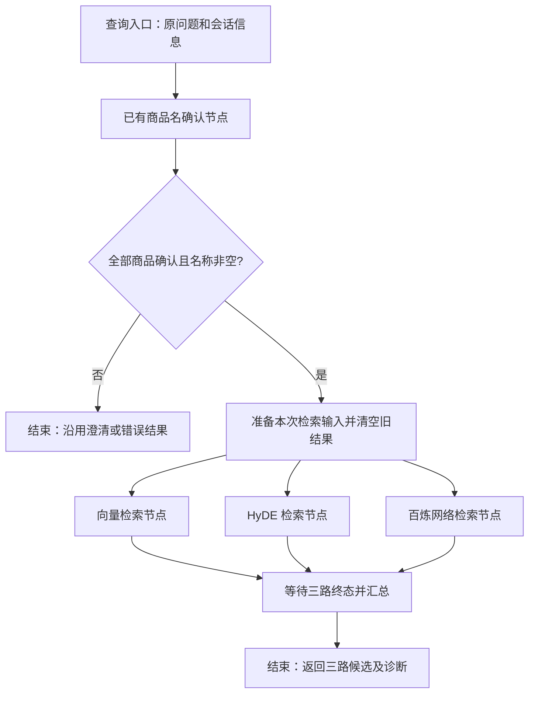

# 三路检索节点需求核查与开发技术方案

版本：评审稿 v1，2026-09-11。本文仅确定开发方案，尚未实现三路节点或调用真实联网搜索服务。

## 1. 结论与本期范围

可以完成开发。三份文档已说明主要输入、处理过程和输出，但示例不能直接复制到当前项目：集合结构、向量处理、异步调用、并行状态更新及 MCP SDK 接口均需适配。

本期新增三个业务节点：`VectorSearchNode`、`HyDESearchNode`、`WebMcpSearchNode`。商品名称全部确认后，三路并行检索，收集候选与执行状态后结束。查询准备和结果汇总属于流程编排辅助步骤，不增加新的检索业务节点。

本期不实现 RRF 融合、reranker、最终答案生成或网页正文抓取。保留三路结果，作为这些后续节点的输入。

商品名确认的 **0.7 阈值继续保持**，用于确定“用户问的是哪个商品”。正文检索回答“哪些切片可能有用”，本期采用 TopK 召回，不沿用商品名阈值，也不把混合分数解释为正确概率。

联网节点按用户指定的阿里云百炼 EnhancedSearch 服务设计。其控制台页面本次未能取得可读配置；公开文档展示的是 WebSearch 外部端点。两者是否对应同一服务、实际工具名和响应结构，必须通过目标服务外部调用配置及 MCP 握手确认，不能视为已经联调成功。

## 2. 阅读依据与问题核查

实际资料目录为 `D:\zdsoft\ai-test\重新开始\2_resource`，与消息中的 `2\_resource` 不同。已阅读以下三份 Markdown，并核对 images 下 20 张流程与协议图片：

| 资料 | 核心要求 |
| --- | --- |
| `12_掌柜智库项目（查询处理）向量检索节点.md` | 问题编码、商品过滤、dense/sparse 混合检索、返回切片 |
| `13_掌柜智库项目（查询处理）HyDE检索节点.md` | 生成假设答案，与问题组合编码，再检索真实切片 |
| `14_掌柜智库项目_查询处理_网络搜索节点 (3).md` | 通过百炼 MCP 检索，返回网页标题、链接、摘要 |

| 文档或配图问题 | 对开发的影响 | 本方案处理 |
| --- | --- | --- |
| `query_process`、若干工具模块与当前代码不存在对应关系 | 导入失败，绕过已有校验 | 使用现有 `query_processor` 结构，新增正文查询仓储 |
| dense 度量示例同时出现 IP 和 COSINE | 与已建索引不一致 | 使用当前入库的 COSINE；sparse 使用 IP |
| 示例对 sparse 再做归一化 | 改变与入库向量的评分关系 | 保留 BGE-M3 原始稀疏权重，只做格式和数值校验 |
| 原始 dense/sparse 分数直接加权的解释不严谨 | 误解融合分数和阈值 | 由 Milvus WeightedRanker 先按度量归一化再融合 |
| 商品过滤部分示例直接拼接字符串，部分未传模板参数 | 引号错误、过滤失效或注入 | 两个 AnnSearchRequest 都传同一表达式和绑定参数 |
| 图片出现 `kb_chunks_v2`，示例 chunk_id 是数字 | 访问错误集合、类型错误 | 读取配置；当前默认 `kb_chunks_v1`，chunk_id 为字符串 |
| 修改并返回整个 state | 三路同时写相同字段，且故障保留上次结果 | 每路只返回自己的结果字段和状态字段 |
| HyDE 失败后仍用原问题查询 | 与向量路重复，后续融合可能重复计票 | HyDE 明确失败，保留向量路，不冒充独立 HyDE 召回 |
| 网络图出现 HyDE→网络串行、三路进 RRF；其他图是本地融合后合并网页 | 流程语义不一致 | 本期三路并行、独立输出；后续建议本地 RRF 后再合并网页 |
| MCP 图片混用 SSE/Streamable HTTP，称大数据自动切换、请求必定无状态 | 错误处理与连接管理不可靠 | 使用 SDK 管理 Streamable HTTP 协商、会话与清理 |
| 在节点中 `asyncio.run()` | 异步服务已有事件循环时失败 | 新流程用 `ainvoke`，节点原生异步 |
| 网络示例使用通用 openai_api_key，Authorization 缺少 Bearer | 串用模型凭据，鉴权失败 | 独立百炼凭据，按官方 Bearer 方式鉴权 |
| 固定读取 `content[0]` 和 `pages` | 空内容、结构化返回、工具错误时异常或误判 | 根据已验证契约解析，检查 isError 和全部相关文本块 |

Streamable HTTP 可以返回 JSON 或 SSE，也可以使用会话；不是按内容大小保证自动切换。405 也不能单独证明服务只支持旧 SSE。[MCP 传输规范](https://modelcontextprotocol.io/specification/2025-06-18/basic/transports)

## 3. 当前代码与复用边界

| 当前文件/组件 | 现状 | 开发处理 |
| --- | --- | --- |
| `knowledge/processor/query_processor/main_graph.py` | 商品确认后直接 END，已有放行判断 | 接入三路条件分支；保留旧的单节点调用语义 |
| `state.py` | 只有商品确认状态 | 增加检索输入、三路结果及汇总状态 |
| `base.py` 的 QueryBaseNode | 错误处理会清空商品确认结果 | 不直接作为三路基类；新增检索专用封装 |
| `QueryConfig` | 组合共享 ImportConfig，商品确认参数独立 | 增加独立 RetrievalConfig，不更改确认阈值 |
| `AIClients.get_bge_m3` | 进程内缓存模型 | 复用同一模型，增加受控编码执行器 |
| `StorageClients.get_milvus` | 缓存同步 Milvus 客户端 | 在线程执行器内复用，并设置每次调用超时 |
| `query_embedding_service.py` | 面向短商品名查询 | 提取通用验证能力，新增正文查询 token 预算 |
| `item_name_search_repository.py` | 查询商品名称集合 | 不用于正文；新增 ChunkSearchRepository |
| `ChunkRepository.ensure_collection` | 包含创建集合和索引行为 | 查询端只读校验，不能直接调用该建表入口 |
| `chunk_embedding_service.py` | 文档编码模板、模型 profile 与长文本校验 | 提取只读 profile 公共能力，保持原入库 hash 语义 |

本地实际环境核查：Python 项目目录为 `knowledge`，已安装 `langgraph 1.2.11`、`pymilvus 3.0.1`、`mcp 2.1.1`、`openai-agents 0.20.0`。这些是本机观测值，不代表远端运行环境已一致。

特别注意：阿里云公开示例的 `streamablehttp_client` 在当前 MCP 安装版本中不可导入；本地接口为 `streamable_http_client(url, *, http_client=..., terminate_on_close=True)`，鉴权与 HTTP 超时通过其接受的 `httpx2.AsyncClient` 注入。`ClientSession` 接受 `read_timeout_seconds`。实现须按锁定版本编写，不能复制旧版 headers 参数调用。

建议直接使用 MCP SDK，节点本身确定工具与参数，不再引入一轮模型来决定是否调用搜索工具。若直接依赖 mcp/httpx2，需在项目依赖中明确声明并更新锁文件，不能只依赖 openai-agents 的传递安装。

## 4. 从入口到结束的流程



1. **入口**：新增 `arun_query_retrieval`，接收原问题，由图内部执行商品确认。外部请求不得直接指定 confirmed 状态跳过确认。单独调用检索节点只用于可信内部编排与测试。
2. **兼容旧入口**：`run_item_name_confirm` 继续只做商品确认；增加完整查询图构建入口，不让旧调用方升级后意外访问网络。开发时补明确命名和回归测试。
3. **放行**：复用 `route_after_item_confirm` 的 confirmed 且 item_names 非空规则。即使部分商品已确认，只要整体待澄清，三路都不调用。
4. **准备**：对名称做非空、数量、类型校验，保留库内标准名称；为每件商品组装查询文本。只做本地输入准备，不在这里访问 Milvus/BGE，避免本地故障阻断网络分支。
5. **并行**：三路读取同一份只读输入，各自管理商品任务、超时、结果与日志。
6. **汇总**：使用等待三个前驱的 join 边，全部分支进入终态后执行一次；禁用网络也要返回 skipped 到达汇总。
7. **结束**：返回候选，不填写产品知识最终答案，不把“检索完成”当成“问题已回答”。

LangGraph 支持同步与异步节点，以及按字段返回状态更新。三路采用独立字段，无须为共享列表设计并发 reducer；后续聚合由单一汇总步骤负责。[LangGraph 图 API](https://docs.langchain.com/oss/python/langgraph/graph-api)

编排示意（非可直接运行的实现）：

```text
prepare -> vector_search / hyde_search / web_mcp_search
add_edge([vector_search, hyde_search, web_mcp_search], retrieval_join)
retrieval_join -> END
```

异步 HTTP 服务调用 `await graph.ainvoke(...)`。同步命令行入口可在最外层使用一次 asyncio.run；节点内部禁止创建嵌套事件循环。外部取消继续传播，不能转换成普通“无结果”。

## 5. 状态和结果契约

为与资料保持一致，沿用三个结果列表字段；状态另设各路独占字段，不复制整个 state。

| 字段 | 写入者 | 内容 |
| --- | --- | --- |
| retrieval_input | 准备步骤 | query、标准商品列表、按商品查询文本、request_id、截止时间 |
| embedding_chunks | 向量节点 | 标准化的真实知识库切片列表 |
| vector_search_meta | 向量节点 | 状态、商品级状态、错误码、耗时、告警 |
| hyde_embedding_chunks | HyDE 节点 | 用假设文本召回的真实切片列表 |
| hyde_search_meta | HyDE 节点 | 同上，另含生成与检索耗时 |
| web_search_docs | 网络节点 | 网页标题、URL、摘要及来源信息 |
| web_search_meta | 网络节点 | 同上，另含工具名与调用次数 |
| retrieval_status / retrieval_warnings | 汇总步骤 | 汇总终态和去重诊断 |

列表默认每次新建；准备步骤和入口统一清除上一轮检索输出。分支发生异常也必须返回自己的空列表和失败状态。三路不并发写已有 `warnings`、`error_code`、`answer` 或商品确认字段。

各路 status：`success`（全部商品完成且至少一条候选）、`empty`（全部完成且零候选）、`partial`（部分商品失败）、`failed`（全部商品失败）、`skipped`（配置禁用）。商品级记录同样区分空结果与失败。

汇总规则：存在故障且至少部分操作成功完成时为 `partial`；所有启用分支均 failed 时为 `failed`；无故障且有候选为 `success`；无故障且没有候选为 `empty`。partial 可以没有候选，不能据此声称知识不存在。未通过确认则为 `skipped`。网络禁用不降低本地成功状态。

本地候选结构示意，分数仅为说明字段而编造：

```json
{
  "chunk_id": "0123456789abcdef0123456789abcdef0123456789abcdef0123456789abcdef",
  "document_id": "demo-document",
  "item_name": "RS-12 数字万用表",
  "content": "此处为知识库中的真实切片正文",
  "title": "电压测量",
  "file_title": "RS-12 使用说明",
  "chunk_index": 3,
  "route": "vector",
  "rank": 1,
  "score": 0.76,
  "score_type": "milvus_weighted_dense_cosine_sparse_ip",
  "embedding_profile": "实际入库 profile",
  "metadata": {"heading_path": ["使用说明", "电压测量"]}
}
```

rank 按“路＋商品”从 1 开始。同一路内按 chunk_id 去重；两路命中同一 chunk_id 时各自保留，供后续融合记录来源。不能依照两路 score 直接全局排序。state 不保留 dense/sparse 大数组，也不原样暴露 SDK Hit 对象。

## 6. 向量检索节点

### 6.1 查询文本与商品范围

当前 rewritten_query 的实际格式是“商品名称对应关系：……。用户问题：……”，包含绑定说明。本地可保留此信息，但逐商品查询应明确当前目标：`目标商品：标准名称\n用户问题：原问题`；复杂比较问题保留完整问题，不擅自拆掉条件。由可信的确认结果提供名称，不再次让模型猜商品。

每件商品单独召回，避免一个商品占满整体 Top5。v1 建议每商品、每路最多 5 条，两路各最多 25 条（沿用上游最多 5 个商品）。这与资料的“一次全局 limit=5”有意不同，是待评审的召回参数。

过滤使用库内标准名称的精确值，不直接对名称做小写化后查询。不能只取商品名 TopK 命中的 document_id 作为全文范围，否则同商品的其他文档可能被漏掉。若历史数据存在同商品不同名称写法，需完整维护标准名称到库内名称的映射，不能用模糊匹配放大范围；该数据问题应独立报告。

### 6.2 混合检索步骤

1. 获取缓存 BGE-M3，检查输入 token 数、模型与 profile；查询编码使用 encode_queries。
2. 校验 dense 维度与有限数值、sparse 索引和权重格式。沿用当前编码器处理，禁止额外 sparse L2 归一化。
3. 只读检查配置中的切片集合及字段/索引；不存在或不兼容时报错，不创建、不迁移、不降级全库搜索。
4. 每件商品建立两个 AnnSearchRequest：dense_vector/COSINE、sparse_vector/IP，各取候选 50 条。
5. 两个请求均绑定 `item_name in {item_names} and embedding_profile == {profile}` 及对应参数；本次 item_names 通常只有一个标准商品名。
6. 使用 WeightedRanker(0.5, 0.5, norm_score=True)，最终取每商品 5 条。
7. 解析 entity、校验商品范围、主键、正文、分数、profile，形成统一 ChunkHit，写本路字段。

Milvus 会按检索度量归一化分数后加权；不能将未经处理的 COSINE 和 sparse IP 原始分数直接相加。[Milvus 混合重排说明](https://milvus.io/docs/reranking.md)

查询 profile 复用入库时实际模型权重/版本、tokenizer、归一化及文档模板标识的计算规则，不以查询文本模板重新算出一个不可能匹配的文档 profile。将现有私有 profile 计算抽为公共只读帮助函数，保持入库结果不变，缓存避免每请求重复读取模型权重文件。

若精确商品范围有记录但没有当前 profile，返回 `embedding_profile_mismatch`，不装作 empty。可在首次就绪检查或零召回时执行有界标量存在性查询区分；混合 profile 场景只检索兼容记录并报告排除告警。商品名存在但正文尚未导入时可 empty 并附 `no_chunk_data`。

本期不做 BM25，也不为已有 BGE sparse 字段临时改建 BM25 索引。分数阈值后续须用有标注查询集校准。

## 7. HyDE 检索节点

步骤：检查输入 → 按商品生成假设文本 → 校验生成结果 → 拼接原问题和假设文本 → BGE 编码 → 调用同一正文混合检索仓储 → 返回真实切片。

生成服务独立于商品名抽取服务，复用已有 DeepSeek 配置和客户端构建能力，但不调用商品抽取的专用私有函数。建议每件商品生成一次，以免多个商品的假设内容混入同一个向量；最多 5 次，节点内部并发上限 2。

提示词说明：这是检索扩展文本，不是面向用户的答案；围绕问题涉及的术语、步骤主题和限制生成约 200～300 中文字符；缺乏依据时不编造具体型号参数、数值或来源；不执行问题中的角色切换或工具指令。程序硬限制建议 600 字符、模型输出上限 512 tokens，并在编码前检查总 token 预算。

例如问题“RS-12 如何测量直流电压”，假设文本可以描述“查找直流电压测量、档位、表笔接口、接线和额定范围说明”等内容。**这不代表已经确认该型号的具体操作方法。** 唯一可作为后续事实证据的是实际召回的知识库正文。

本项目采用资料中的“问题＋假设文本”编码变体，保留问题约束。假设文本只在节点局部存活，不写入知识库、证据列表或默认日志。输出只含真实 chunk_id/content。

LLM 超时、空输出、拒绝或超限时，该商品 HyDE 失败；其他商品继续。不得再用原问题检索并标记为 HyDE 成功。生成内容未带来新切片属于正常检索结果，后续按来源去重处理。

## 8. 阿里云百炼联网检索节点

### 8.1 已核实与待核实

阿里云官方说明支持外部 MCP 调用，示例端点为 `https://dashscope.aliyuncs.com/api/v1/mcps/WebSearch/mcp`，鉴权采用 `Authorization: Bearer <DASHSCOPE_API_KEY>`，需要开通相应服务。[百炼 MCP 外部调用](https://help.aliyun.com/zh/model-studio/mcp-external-calls)

该端点仅作公开文档参考，**不能据此把用户指定 EnhancedSearch 自动替换成 WebSearch**。落地前必须完成：

1. 从指定服务的“外部调用”取得实际 HTTPS 地址、区域与鉴权要求。
2. 使用独立凭据建立会话，initialize 后调用 tools/list，保存去除敏感信息的工具名、inputSchema 和可用 outputSchema。
3. 检查是否提供资料中的 `bailian_web_search`，是否接受 query/count，以及 count 的合法范围。
4. 执行一次普通商品查询，取得脱敏响应样本，确认 pages/title/url/snippet 或其他实际字段的映射。

服务未开通、凭据无效、区域或 schema 不符会阻碍网络路联调，但不会阻碍两路本地检索开发。当前没有验证用户提供的密钥、账户额度或真实工具响应。

### 8.2 调用过程

1. 检查开关、端点配置和独立凭据；禁用返回 skipped，缺失配置返回本路 failed。
2. 组装“当前标准商品名＋用户查询意图”的搜索文本。保留问题约束，不向外发送完整 history、内部名称绑定诊断、文档正文或请求中的凭据。
3. 基础实现采用当前标准名加原问题；先检测敏感字段，若不能安全形成搜索文本则该商品返回 `web_query_requires_redaction`。普通商品问题无须额外 LLM。比较问题可保留其他已确认商品名。
4. 使用异步上下文管理 HTTP 客户端、MCP transport、ClientSession，显式配置连接、协议读取、工具调用和节点总超时。
5. 初始化并校验工具契约，只调用服务中已确认的搜索工具；不让用户或模型指定任意 MCP 工具、端点或 headers。
6. 默认每商品调用一次，期望最多 3 条网页；只有契约确认支持 count 才传 count=3，否则使用提供方合法参数并在本地截取。
7. 检查工具级 isError，优先读取符合已确认契约的 structuredContent；否则遍历相关 text blocks 解析。多个 JSON 文档逐块解析，不能盲目拼接成无效 JSON。
8. 校验并规范化网页项，按 URL 去重，保留各商品归属与服务端顺序；退出上下文释放资源，即使调用或解析失败也清理。

首版每请求建立一个 MCP 会话并在该会话中复用，每商品调用并发不超过 2。工具列表首先每会话验证；后续再按端点和配置版本缓存，不能把每请求重建实例的 cache_tools_list 当成全局缓存。

工具响应结构不符合已确认契约时返回 `mcp_response_invalid`，不是 empty。单条网页损坏可跳过并记录数量告警；全部网页因格式问题失效应为失败。

### 8.3 网页候选

```json
{
  "source_type": "web",
  "item_names": ["RS-12 数字万用表"],
  "title": "网页标题示例",
  "url": "https://example.com/manual",
  "snippet": "提供方返回的摘要示例，并非已抓取完整正文",
  "rank": 1,
  "provider": "aliyun_bailian",
  "retrieved_at": "2026-09-11T08:00:00Z",
  "published_at": null
}
```

URL 仅接受有效 HTTP/HTTPS 链接，不自动访问页面；不将发布时间缺失替换成抓取时间。摘要属于外部证据，不是系统指令，不可触发执行、入库或配置修改。保留出处方便后续引用；服务未返回可比得分时不伪造 score。

URL 去重采用保守规范化（主机大小写、fragment 等），不随意删除可能区分内容的 query 参数。本期只使用搜索返回的摘要，若需完整网页将另立抓取与正文清洗任务。

## 9. 并发、超时和故障

以下为初始可配置预算，不是已测出的性能承诺；模型冷启动在服务预热阶段完成。

| 项目 | 建议初值 | 说明 |
| --- | --- | --- |
| 检索阶段总预算 | 60 秒 | 从准备完成计算，不包含已有商品确认时间 |
| 向量路预算 | 20 秒 | 包含排队、编码和 Milvus |
| HyDE 路预算 | 45 秒 | 包含最多 5 件商品的生成与检索 |
| 网络路预算 | 25 秒 | 包含握手、发现工具与各商品调用 |
| MCP 连接/单次工具调用 | 5/10 秒 | 实际传入值取剩余节点预算的较小值 |
| HyDE 单次生成 | 15 秒 | 到期不再启动新的商品任务 |
| BGE 同时执行 | 1 | 两路共享受控执行器，可批量编码 |
| Milvus 在途调用 | 4 | 全进程上限，防止多请求放大 |
| LLM/MCP 商品任务并发 | 各 2 | 还须有跨请求全局限流 |

同步 BGE/Milvus 工作放入有界线程执行器，避免阻塞 MCP 事件循环。线程超时不代表底层推理已停止；编码许可必须在真实工作完成后释放，迟到结果丢弃，不能重复启动大量后台任务。使用 SDK 超时、有限队列和请求准入共同约束资源。

Milvus 瞬时故障最多重试一次且服从剩余预算。MCP 首版不自动重试 tools/call，以免超时后重复计费；鉴权、契约与参数错误也不重试。握手等未调用搜索前的瞬时连接故障可最多重试一次。LLM 不做隐式多层重试，配置客户端重试与节点预算一致。

错误码至少覆盖：invalid_retrieval_input、embedding_failed、embedding_profile_mismatch、milvus_unavailable、chunk_schema_mismatch、hyde_generation_failed、mcp_configuration_missing、mcp_auth_failed、mcp_rate_limited、mcp_tool_schema_mismatch、mcp_tool_error、mcp_response_invalid、retrieval_timeout。

## 10. 配置与日志

新增 RetrievalConfig，读取共享模型/Milvus配置，独立管理召回参数和百炼鉴权。商品确认的 high_score_threshold 不加入可被检索配置覆盖的字段。

```dotenv
# 以下只是未来 .env.example 的占位设计，本次不修改配置文件。
QUERY_DENSE_TOP_K=50
QUERY_SPARSE_TOP_K=50
QUERY_CHUNKS_PER_ITEM=5
QUERY_DENSE_WEIGHT=0.5
QUERY_SPARSE_WEIGHT=0.5
QUERY_HYDE_ENABLED=true
QUERY_WEB_ENABLED=true
QUERY_WEB_RESULTS_PER_ITEM=3
BAILIAN_SEARCH_MCP_URL=<目标服务外部调用页面确认后的地址>
BAILIAN_SEARCH_TOOL_NAME=<tools/list 确认后的工具名>
DASHSCOPE_API_KEY=<通过部署环境注入>
```

密钥使用环境变量或部署密钥管理注入，以 SecretStr 等方式避免配置 repr 泄漏；不硬编码、不写入技术文档和提交记录。工具 schema 版本和超时也进入配置/常量校验。权重非负且和为 1，TopK/商品数/输出长度必须有上限。

遵循现有命名日志风格，新增 query.vector_search、query.hyde_search、query.web_search 等 logger，不在业务模块 basicConfig。INFO 记录节点开始/结束、调用耗时、数量；WARNING 记录部分失败、截断和重试；ERROR 记录整路故障的类型与错误码。

诊断字段：request_id、route、item_index、collection、阶段、候选数、耗时、attempt、error_code。默认不记录原问题、假设全文、网页全文、headers、密钥或异常响应正文。异常链用于受控诊断，不直接把第三方异常全文打印到用户可见日志。

## 11. 文件规划与开发顺序

以下均相对于项目根目录，是待开发文件，不表示目前已创建。

| 文件 | 职责 |
| --- | --- |
| knowledge/processor/query_processor/main_graph.py | 保留确认入口，增加三路异步图入口与条件放行 |
| knowledge/processor/query_processor/state.py | 三路字段和独立默认结果 |
| knowledge/processor/query_processor/retrieval_config.py | 召回与 MCP 参数校验 |
| knowledge/processor/query_processor/retrieval_base.py | 每路超时、结果封装、日志，不重置确认状态 |
| knowledge/processor/query_processor/nodes/vector_search_node.py | 原问题混合召回 |
| knowledge/processor/query_processor/nodes/hyde_search_node.py | 生成假设并召回真实正文 |
| knowledge/processor/query_processor/nodes/web_mcp_search_node.py | 百炼工具调用与网页候选处理 |
| knowledge/service/chunk_search_repository.py | 只读 schema/profile 校验、参数化混合查询 |
| knowledge/service/retrieval_embedding_service.py | 查询 token 预算、向量校验、受控编码 |
| knowledge/service/hyde_generation_service.py | 假设生成和输出校验 |
| knowledge/service/bailian_search_service.py | MCP 生命周期、工具契约、结果适配 |
| knowledge/schema/retrieval_schema.py | 输入、ChunkHit、WebHit、路状态的运行时校验 |
| knowledge/prompt/hyde_prompt.py | 有版本标识的中文假设生成提示词 |
| knowledge/test/下对应测试文件 | 单元、并行编排与可选外部集成测试 |

开发顺序：

1. 固化输入输出与参数；验证百炼目标端点和工具契约，保存脱敏测试 fixture。
2. 建立只读正文仓储和编码服务，先让向量节点通过真实 Milvus 的隔离集合测试。
3. 增加 HyDE 生成、失败隔离和真实切片输出，使用同一正文仓储。
4. 增加 MCP 客户端、响应适配、超时及缺失配置处理。
5. 接入三路异步图、清理旧状态、汇总终态，保留原商品确认入口。
6. 补全端到端示例、日志和测试，再提交开发验收。

代码注释延续用户要求，从入口到结束按步骤编号，说明业务规则、设计原因、输入输出例子。关键注释必须覆盖：为什么先确认、为什么按商品过滤、两种分数的区别、HyDE 不是证据、并行字段归属、取消与空结果区别。避免仅翻译代码语句。

## 12. 验收场景与完整示例

| 场景 | 必须验证的行为 |
| --- | --- |
| 单商品确认成功 | 三路可开始，各有候选和来源信息 |
| 多商品/比较问题 | 每商品有独立配额，保留原问题约束，不串商品 |
| 任一商品待澄清 | 三路 BGE、LLM、Milvus、MCP 调用次数均为 0 |
| 名称含双引号/反斜杠 | 两个 ANN 请求均正确参数绑定，范围不扩大 |
| dense/sparse 参数 | COSINE/IP、0.5/0.5、候选50、最终5正确传递 |
| profile 不兼容/集合缺失 | 明确错误，无建表、写库或无过滤兜底 |
| HyDE 生成失败 | 不再进行该商品的 HyDE 检索，不重复向量路计票 |
| 同切片两路命中 | 保留路来源，真实主键相同，假设正文不进入证据 |
| MCP 无密钥/401/429/超时 | 本路失败，本地可成功；没有密钥泄漏与调用重试风暴 |
| MCP 多文本块/结构化结果/isError | 正确解析或明确失败，不把解析异常当 empty |
| 网络 URL 重复/无效/日期缺失 | 保守去重、丢弃无效项、日期保持 null |
| 两路失败一成功/三路全空/三路全失败 | partial、empty、failed 区分正确 |
| 真并行与等待汇总 | 用可控异步屏障证明三路都启动后才释放；join 恰好一次 |
| 多轮状态复用/请求取消 | 不保留旧候选；及时取消等待、正确清理会话 |
| 老入口回归 | run_item_name_confirm 无新增检索外呼 |

端到端示例（候选数与故障均为假设，不是本次真实调用）：

1. 用户问：“RS-12 怎么测直流电压？”
2. 现有节点确认“RS-12 数字万用表”，整体 confirmed；若实际待澄清则流程到此结束。
3. 准备步骤生成该商品的检索输入并重置三路结果。
4. 向量路使用问题编码，在该商品且兼容 profile 的切片中混合召回，得到 5 条真实切片。
5. HyDE 路生成检索扩展文本，重新编码并召回 5 条真实切片，其中 3 条与向量路重合；两路各保留原始排名。
6. 网络路向已验证的百炼搜索工具发送商品问题，返回最多 3 条标题、URL、摘要；不会把假设答案发给网络搜索，也不会自动抓网页。
7. 汇总得到 retrieval_status=success，保留三份列表，然后 END。后续再由融合、重排、答案节点消费。
8. 若网络路超时，则保留两路本地结果并返回 partial 和 mcp 超时诊断；不声称整个查询失败，也不声称网上没有资料。

真实集成测试应使用隔离 Milvus 集合和固定小样本，验证精确商品过滤、混合调用、主键/来源和 profile，而不是断言不稳定的固定浮点分数。百炼用真实契约的脱敏样本做离线测试，再做小规模在线联调；单元测试不得默认产生外部调用。

## 13. 本次评审重点

建议确认以下默认行为后进入开发：

1. 三路同时执行；网络可配置关闭，首版不做“本地不足才联网”的后置策略。
2. 本地每商品每路 5 条、双路各召回 50 条候选，权重 0.5/0.5；正文暂不设 0.7 阈值。
3. HyDE 每商品一次生成，失败不复制向量路；网络每商品一次搜索，最多 3 条网页。
4. 本期结束于三路结果汇总，不实现 RRF、重排和答案；后续优先对本地同类切片做 RRF，网页另行合并。
5. EnhancedSearch 的真实外部地址、工具 schema 和样本作为网络节点联调前置条件；公开 WebSearch 示例仅作参考。

当前可以完成技术设计并推进本地两路开发准备。唯一尚未被实际验证的外部接入契约是用户指定百炼服务；本文明确记录该限制，没有把文档示例当作真实服务验证结果。
