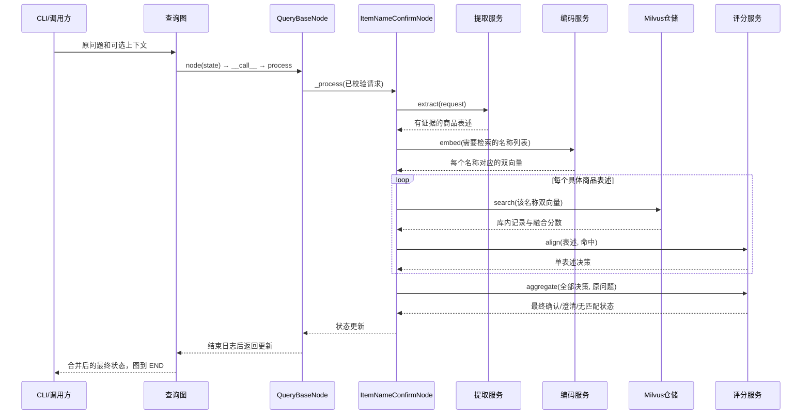

# 商品名确认节点：从入口到结束的代码阅读与示例

代码里的 `【00】`～`【09】` 与本文对应。建议先顺着编号理解数据流，再看具体分支。以下分数和候选均为构造示例，真实结果取决于提取模型、向量模型和知识库内容。

## 1. 按什么顺序读代码

| 步骤 | 文件（相对项目根目录） | 重点方法与作用 |
| --- | --- | --- |
| 00 | `knowledge/processor/query_processor/__main__.py` | `main`：接收用户问题 |
| 01 | `knowledge/processor/query_processor/main_graph.py` | `run_item_name_confirm`、`build_query_graph`：建立并执行查询图 |
| 02 | `knowledge/processor/query_processor/base.py` | `__call__ → process → _request`：输入校验、日志、异常边界 |
| 03 | `knowledge/processor/query_processor/nodes/item_name_confirm_node.py` | `_process`：全部业务步骤的调用顺序 |
| 04 | `knowledge/service/item_name_extractor.py` | `extract`、`_validate_evidence`：模型提取与原文证据检查 |
| 05 | `knowledge/service/query_embedding_service.py` | `embed`：名称批量生成 dense/sparse |
| 06 | `knowledge/service/item_name_search_repository.py` | `search`、`_parse`：混合检索与返回值转换 |
| 07 | `knowledge/service/item_name_aligner.py` | `align`：一个商品表述的确认决策 |
| 08 | 同上 | `aggregate`：汇总所有目标，生成节点最终状态 |
| 09 | `base.py → main_graph.py → __main__.py` | 结束日志 → 图合并状态并到 END → CLI 输出 JSON |

辅助文件：`state.py` 描述图数据包；`schema/query_models.py` 负责运行时字段校验；`config.py` 管阈值和限制；`prompt/query_prompt.py` 是真正发送给 LLM 的固定规则；`exceptions.py` 定义跨层错误。



图中未展开异常箭头：任一服务抛出 QueryError，由 Base 转为 error 状态，再照常返回图及 CLI。

## 2. 一次成功查询，数据怎样逐步变化

### 00～02：接收问题并校验

假设输入：

```json
{"original_query": "RS-12 怎么测电阻？", "request_id": "demo-001"}
```

`create_default_state` 补上空 history、item_names、answer 等字段。`compile()` 只是建立可执行图，`invoke()` 才运行节点。`QueryBaseNode._request` 只取输入字段构造 QueryInput，不把 answer 等输出交给输入模型。

`TypedDict` 像一份字段说明，不会自动验证输入；Pydantic 的 QueryInput 才会拒绝空问题、错误类型和超长历史。请求标识缺省时自动生成。

### 03～04：提取“用户说的名称”

假设 DeepSeek 返回：

```json
{
  "mentions": [{"name": "RS-12", "evidence": "RS-12", "source": "current_query"}],
  "rewritten_query": "RS-12 如何测量电阻？",
  "too_many_products": false
}
```

程序首先校验字段，再确认 evidence 能在原问题中定位、name 来自 evidence。此时只知道用户说了 RS-12，还不知道库内是否存在该商品。

注意：上面的 rewritten_query 是模型草稿，最终输出不会直接使用它。这样可以保留用户原问题中的否定、条件和比较要求。

### 05：一个名称变成一组双向量

节点调用 `embed(["RS-12"])`，模型调用 `encode_queries`，返回一组 `EmbeddingVectors`：

```text
EmbeddingVectors(
    dense=[0.12, -0.03, ...],    # 仅示意，实际默认 1024 维
    sparse={12: 0.7, 98: 0.2}   # token ID → 学习得到的词项权重
)
```

向量里的 0.7 只是某个 token 的权重，与确认门槛 0.7 没有关系。只有经过 Milvus 相似度计算和 WeightedRanker 融合后的 score 才参与确认。

### 06：两路召回并融合

两条 AnnSearchRequest 使用同一个商品名的不同向量：dense 走 COSINE，sparse 走 IP。不是在查询两个商品。数据只搜索与当前 embedding_model 一致的记录。

已验收的服务端评分例子：同一记录两路均命中，COSINE=0.8、IP=1，归一化后分别为 0.9、0.75，等权融合为 0.825。未在某路召回的记录，该路贡献为零。客户端不再归一化，也不先四舍五入。

为演示后面的分支，假设实际返回下列另一组融合结果：

| pk | document_id | item_name | 融合 score |
| --- | --- | --- | --- |
| p1 | d1 | RS PRO RS-12 数字万用表 | 0.86 |
| p2 | d2 | RS PRO RS-12 数字万用表 | 0.85 |
| p3 | d3 | UT61E 数字万用表 | 0.60 |

`_parse` 将 SDK 的 distance 字段映射成 score，验证字段、数值、模型和主键，再交回节点。p1/p2 是同一个名称的两份文档，下一步才能合成产品级候选。

### 07：单个表述评分

`align` 依次处理：

1. p1/p2 按名称分组，RS PRO RS-12 组取最大分数 0.86，保留 d1/d2；不累加成 1.71。
2. 0.86 和 0.60 都达到候选下限 0.45；只有第一名达到确认门槛 0.7。
3. 用户表述 RS-12 与完整库内名不完全相等，因此不走 exact_name 分支。
4. 用户型号 rs-12 包含在库内完整名称的型号集合中，没有发现型号冲突。
5. 两个不同商品候选相差 0.26，达到 0.15，第一名确认，reason 为 score_gap。

### 08～09：汇总、返回图、输出

本例只有一个目标且已确认，因此最终状态摘要为：

```json
{
  "request_id": "demo-001",
  "original_query": "RS-12 怎么测电阻？",
  "item_confirm_status": "confirmed",
  "item_names": ["RS PRO RS-12 数字万用表"],
  "rewritten_query": "商品名称对应关系：RS-12 → RS PRO RS-12 数字万用表。用户问题：RS-12 怎么测电阻？",
  "answer": "",
  "error_code": "",
  "warnings": []
}
```

以上省略了 history、options、confirmed_items 和 mention_results 等明细；实际结果保留这些字段。matched_document_ids 只有本次召回的 d1/d2，不保证覆盖该商品所有文档。

节点返回更新字典，图将更新覆盖到对应字段上，保留 original_query 等输入，并执行到 END。CLI 输出 JSON 和退出码 0。这里只确认商品，不返回测电阻的方法。

## 3. 其他分支对照

下表假定无召回截断，且除明确注明外没有精确名称或型号冲突。

| 场景 | 决策及原因 |
| --- | --- |
| 只有一个候选，0.700000 | 可以确认，unique_candidate |
| 只有一个候选，0.699999 | 需要澄清；不能显示为 0.70 后再确认 |
| 候选为 0.701、0.699 | 仍是两个候选，差 0.002，不能按“唯一高分”确认 |
| 候选为 0.90、0.75 | 差恰好 0.15，确认第一名 |
| 最高分为 0.45 | 保留候选并澄清 |
| 最高分为 0.449999 | not_found |
| 用户名称与某个库内规范名称完整一致，且该记录 >=0.7 | 走 exact_name，即使另一个不同名称分数更高 |
| L420 命中 L420x，分数 0.99 | model_conflict，澄清 |
| 扩召回到 200 条后仍满额且末位仍可作候选 | recall_truncated，澄清 |
| “这个怎么用？”且无上下文，提取为空 | needs_clarification，提示提供名称或型号 |
| 超过五个目标且模型返回 too_many_products=true | 请求拆分，不编码、不检索部分目标 |

多商品问题中，假设 A、B 各自通过确认，分数分别为 0.95 和 0.78，则二者都保留。若 A 已确认、B 只有 0.62 的候选，则整体是 needs_clarification，confirmed_items 保留 A，但 item_names 仍为 []。这样下游不会只回答 A 就忽略 B。

## 4. 故障如何结束

以第二个商品查询时 Milvus 超时为例：

```text
repository.search 抛 QueryError(code="milvus_unavailable", ...)
→ 异常离开 ItemNameConfirmNode._process
→ QueryBaseNode.process 捕获
→ empty_result 清空本次部分成功结果
→ 写入 item_confirm_status="error"、error_code 和安全提示
→ 记录结束日志 → 图到 END → CLI 输出结果，退出码 1
```

故障不是 not_found。即使第一项已经确认，error 状态也不会携带可执行的 item_names。旧 answer、options、rewritten_query 同样被清空，避免重复执行时残留上一轮结果。

## 5. 对应的可运行测试

激活 knowledge 虚拟环境后，在项目根目录运行：

```powershell
python -m unittest knowledge.test.test_item_name_confirm -v
```

这里的 AlignerTest 用固定分数演示阈值、近分、同名文档和多商品分支；NodeTest 演示图状态、缺少名称、错误和部分成功。测试以假服务替代真实模型和数据库，因此示例结果稳定，适合下断点沿流程阅读。

真实模型调用和隔离 Milvus 验收方法见同目录《商品名确认节点开发与联调说明》。本次阅读注释只解释现有行为，不改变算法、提示词内容、配置和日志逻辑。
