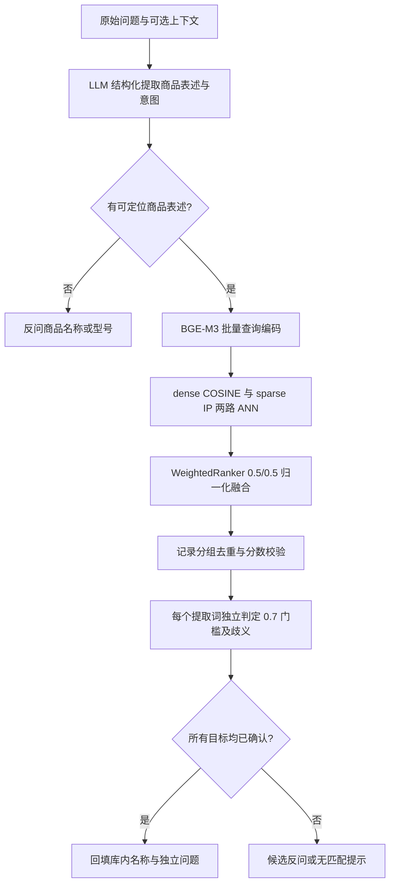

# 商品名确认节点：需求核查与技术方案（第一版）

日期：2026-09-09。状态：技术方案，尚未实施查询节点。

实施更新：第一版已于 2026-09-09 完成开发及真实服务联调，详见同目录《商品名确认节点开发与联调说明》。下文保留方案评审时的范围、建议和待定事项；实际参数与验收结果以开发说明为准。

## 1. 结论与本期范围

需求主线清晰，可以开始设计和开发：从问题中提取商品名，使用 BGE-M3 dense + sparse 向量在 Milvus 商品名集合中混合检索，将用户表述对齐到库内名称，然后决定放行、反问或无匹配。

**用户已明确的核心要求：使用 Milvus 混合检索，自动确认评分门槛为 0.7。该门槛作用于 WeightedRanker 融合后的分数，采用 `score >= 0.7`，不是单路 COSINE、稀疏 IP 或 LLM 自报置信度。** 达到门槛仍需处理同名和多候选歧义，不保证必然自动确认。

原文属于教学材料，尚不能直接作为完整开发规格。存在示例错误、未实现依赖和业务规则缺口，下面给出修正及建议默认行为；这些建议不代表用户已经逐项确认。

本期建议交付：独立商品名确认节点、查询状态与配置、结构化提取服务、查询向量服务、只读 Milvus 检索仓储、评分决策服务、最小 LangGraph 和测试入口。首次单轮查询可独立运行。

本期暂不展开正文检索、HyDE、Web、RRF、文档重排、答案生成和完整聊天前端；不依赖尚未建设的 MongoDB 会话读写。预留可选历史输入，用户选择候选后可先以完整名称重新提交问题；“选第二个”等跨轮操作在会话模块完成后接入。

## 2. 核查依据

用户提供的 `D:\zdsoft\ai-test\重新开始\2\_resource` 不存在，实际材料位于：

`D:\zdsoft\ai-test\重新开始\2_resource\12_掌柜智库项目_查询处理_商品名确认节点.md`

本次逐段核查该 Markdown 正文、示例及代码，并对照项目以下实现：

| 当前文件（相对项目根目录） | 已有能力 / 对设计的影响 |
| --- | --- |
| `knowledge/service/item_name_repository.py` | 每个 document_id 一条商品名记录，支持幂等写入，dense/COSINE、sparse/IP 索引已具备 |
| `knowledge/service/item_name_embedding_service.py` | 商品名通过 BGE-M3 `encode_documents` 编码 |
| `knowledge/service/embedding_vector_util.py` | 批量输出解析、1024 维检查、非有限数值和稀疏权重检查 |
| `knowledge/utils/client/ai_clients.py` | `get_llm`、`get_bge_m3`；按进程缓存客户端 |
| `knowledge/utils/client/storage_clients.py` | `get_milvus`；按进程缓存连接 |
| `knowledge/processor/import_processor/config.py` | 连接、模型、集合等共享配置目前集中在 ImportConfig |
| `knowledge/processor/import_processor/base.py` | 基类绑定导入配置、异常与 `import.*` 日志，不宜直接用于查询 |
| `knowledge/processor/query_processor/__init__.py` | 查询目录已预留，尚无完整实现 |
| `knowledge/api/main.py`、根目录 `README.md` | 当前是导入服务；导入期间同文档在线查询已有一致性限制 |
| `knowledge/uv.lock`、本地 PyMilvus 源码 | 锁定 PyMilvus 3.0.1；本地 WeightedRanker 支持显式 `norm_score=True` |

本次为静态需求核查，没有连接生产 Milvus、加载模型或调用 DeepSeek；服务端版本、存量数据质量、真实召回率和延迟仍需联调验证。

## 3. 文档问题与处理意见

| 位置 | 问题及开发影响 | 本方案处理 |
| --- | --- | --- |
| §3.3、§8.2 | 候选下限前文为 0.45，总结写成 0.6 | 建议采用正文及代码的 0.45；0.7 自动确认门槛保持不变 |
| §5.4.2 | 将 0.64 列入 high；又将 0.55 判断为小于 0.45，与比较运算矛盾 | 修正用例；0.64 和 0.55 均为候选分数 |
| §3.3～3.4 | 称 COSINE、IP 都用 arctan；分数归一化和向量归一化容易混淆 | 按实际服务端 metric 对应的映射核验，见第 5 节 |
| §3.3 | 声称阈值经过业务调参，但材料没有数据集和结果 | 视为初始业务参数，不宣称已在本项目验证 |
| §3.1、§5.2、§5.4 | 前面允许品类词对齐，提示词却禁止纯品类词；示例又用“电压表”检索 | 第一版建议纯品类词反问型号，不自动猜具体产品 |
| §5.4 | 唯一 high 就确认，0.701 与 0.699 会被当成明显胜出 | 建议将第二名候选也纳入差距判断，避免阈值两侧的近分误判 |
| §5.5 | 跨不同提取词使用全局最高分淘汰其他商品 | 建议移除跨商品淘汰；用户明确问 A、B 时，0.95 与 0.78 不足以证明 B 是噪声 |
| §5.6 | 只要 confirmed 非空就忽略 options | 多商品问题可能漏答；建议有任一目标未解决就整体反问，保留内部已确认结果 |
| §5.4.4 | 先进入 options、后进入 confirmed 的名称，没有在最终结果里统一清理 | 聚合后再去重；保留每个提取词的映射关系，不能只看全局名称集合 |
| §5.6 | 成功时未清空旧 answer，失败时未清空旧 item_names | 每次完整返回本节点拥有的状态字段，防止重复调用污染 |
| §5.7 | Milvus 异常返回空列表，与真正无匹配混淆 | 明确 `error` 和 `not_found` 两种结果 |
| §6.1 | history_text 未定义，历史读取及回填函数没有完整实现 | 首次查询默认空历史；历史由可选接口提供 |
| §1.2、§5.2～5.3 | `prompts/`、`get_openai_llm`、`get_milvus_client` 等不符合当前工程 | 使用实际的 `prompt/`、`get_llm`、`get_milvus` 等接口 |
| §5.2、§7 | 从 L420 推到 L420x，可能混淆不同型号；示例还混入手册后缀 | 抽取保留原型号，不凭 LLM 补后缀；库内名称通过检索对齐，型号冲突进入澄清 |
| §2.3、§5.5 | 将错误产品交给下游重排“兜底”不能保证纠正 | 商品身份歧义在本节点解决，下游相关度排序不能代替产品确认 |

**阻碍判断：没有发现必须推翻现有导入结构的阻碍。** 只读检索和模型能力已有基础。真实联调的前提是集合已导入可识别商品名、Milvus 可访问且版本兼容、BGE-M3 缓存可用、DeepSeek 配置有效。完整多轮会话需要额外模块，但不阻塞首次查询节点。

## 4. 与当前数据结构对接

商品名集合沿用 `ITEM_NAME_COLLECTION`，默认 `kb_item_names_v1`：

| 字段 | 查询用途 |
| --- | --- |
| `pk` | 文档级商品名记录标识，不能当作统一商品主数据 ID |
| `document_id` | 关联来源文档，为后续正文范围过滤预留 |
| `item_name` | 库内名称，确认后的名称必须来自这里 |
| `file_title` | 候选展示和来源定位辅助信息 |
| `embedding_model` | 检查查询与入库模型一致 |
| `dense_vector` | 1024 维，COSINE |
| `sparse_vector` | BGE-M3 学习得到的词项权重，IP；不是 Milvus 内置 BM25 |

现有主键按 document_id 生成，同一商品的多份说明书会形成多条记录。因此评分前先在**同一个提取词的结果内**按保守规范化名称分组，组分数取命中记录最大值，保留全部命中 pk/document_id，防止重复文档占据第一、第二名并制造假歧义。

规范化仅处理首尾空白、连续空格、兼容字符和字母大小写；保留型号字母、数字、连字符及后缀。不同名称不做基于“相似”的合并。

现有集合没有 product_id，无法保证同名就是同一物理商品。第一版以“库内规范名称”为检索范围标识；发现同名但产品身份冲突时需澄清或治理数据，不能用名称去重掩盖冲突。商品主数据及别名表属于后续增强。

`matched_document_ids` 仅表示本次 TopK 命中的来源，不能称为该商品全部文档。后续正文检索若需完整文档范围，应按确认名称补查所有关联 document_id（分页/迭代并验证完成），或通过完整产品映射表获取，不能直接以本次 TopK 来源限制全文召回。

## 5. Milvus 混合检索与 0.7 评分口径

### 5.1 完整链路



查询使用 `AIClients.get_bge_m3(...).encode_queries(names)`，批量调用后复用 `extract_vectors` 检查数量、顺序、维度和数值。必须保持相同模型、分词器、向量处理方式；联调确认现有 wrapper 的 query/document 编码行为，不额外给短名称添加未经入库验证的指令前缀，不对 sparse 做 L2 归一化。

每个名称构造两个 `AnnSearchRequest`，顺序固定为 dense、sparse：

| 配置项 | 初始值 | 说明 |
| --- | --- | --- |
| `item_name_high_confidence` | **0.7** | 本期固定自动确认门槛 |
| `item_name_mid_confidence` | 0.45 | 建议候选下限，后续用样本校准 |
| `item_name_score_gap` | 0.15 | 同一提取词的竞争候选分差 |
| `item_name_dense_weight` | 0.5 | 对应第一个 ANN 请求 |
| `item_name_sparse_weight` | 0.5 | 对应第二个 ANN 请求 |
| `norm_score` | true | 显式启用，禁止运行时静默改变 |
| `item_name_dense_top_k` | 50 | 单路召回条数，建议初始值 |
| `item_name_sparse_top_k` | 50 | 单路召回条数，建议初始值 |
| `item_name_hybrid_top_k` | 50 | 融合返回条数，先取足记录再分组 |
| `item_name_max_options` | 5 | 最终展示上限，不是 ANN TopK |
| `item_name_max_extracted` | 5 | 提取词数量上限，超限要求拆分问题，不静默丢弃 |

0.7 可集中声明以便测试，但生产本期不接受请求参数覆盖。其他环境参数启动时校验：数值必须有限，`0 <= mid < high <= 1`，权重均大于 0 且和为 1，各 TopK 为正，融合 TopK 不超过两路候选条数之和，候选展示数量不超过融合 TopK。

调用契约为 `client.hybrid_search(collection_name, reqs=[dense_req, sparse_req], ranker=WeightedRanker(0.5, 0.5, norm_score=True), limit=50, output_fields=["pk", "item_name", "document_id", "file_title", "embedding_model"], timeout=..., consistency_level="Strong", round_decimal=-1)`。两路 metric 分别为 COSINE、IP，并使用相同模型过滤条件。参数形式以本项目已安装 SDK 为准。[Milvus hybrid_search 接口](https://milvus.io/api-reference/pymilvus/v2.6.x/MilvusClient/Vector/hybrid_search.md)

仓储将返回的 `distance` 明确转换为业务 `score`，融合结果按分数降序处理。服务端已完成分数变换，客户端不得再次归一化，不使用结果集 min-max。比较前不四舍五入；非有限分数或明显超出预期范围时报告检索契约错误。

### 5.2 为什么必须固定评分算法

WeightedRanker 将各路分数变换后加权累加。权重和为 1 才能在本方案中使用统一的 0～1 融合刻度，0.7 不是“70% 正确概率”。更换权重、metric 或 ranker 后不得沿用原评分含义。[Milvus Weighted Ranker](https://milvus.io/docs/zh/weighted-ranker.md)

已核对的 Milvus 官方历史实现中：

```text
COSINE: normalized_dense = (1 + cosine_score) / 2
IP:     normalized_sparse = 0.5 + atan(ip_score) / π
score = 0.5 × normalized_dense + 0.5 × normalized_sparse
```

例如同一记录两路均命中，COSINE=0.8、IP=1，则融合分数约为 `0.5×0.9 + 0.5×0.75 = 0.825`。未在某路候选中召回的记录，该路不贡献分数，不能当作原始分数 0 再归一化。等权时只在一路命中的记录通常无法达到 0.7，故单路 TopK 会影响最终放行率。[官方评分源码（固定历史提交）](https://github.com/milvus-io/milvus/blob/648d5661ca8771fadc664f427ac330b083b8734e/internal/proxy/reScorer.go)

上述公式用于解释及设计验证，不代表已经核验当前部署的服务端实现。联调必须记录真实 server/SDK 版本，用已知向量分别做 dense、sparse 和 hybrid 搜索，核对返回值、缺失通道及 norm_score 行为；不满足评分契约则停止验收，不能靠调整阈值掩盖版本差异。

本节点不使用 RRFRanker；RRF 是排名融合，不能直接套用本方案 0.7 的分数门槛。

### 5.3 集合读取、召回不足及一致性

查询仓储只执行存在性检查、schema/index 校验、加载和搜索，不复用会创建集合的 `ensure_collection`。将必要校验抽成可复用只读函数，或在查询仓储实现专门的只读检查。

集合不存在应返回配置/知识库未就绪错误；合法空集合是无匹配；集合未加载可加载；缺字段、模型不兼容、维度错误、缺索引均不得当成无匹配。存在其他模型数据时记录不兼容告警；当前模型没有可用记录时返回未就绪，不能误称用户商品不存在。筛选表达式使用受控配置和参数绑定/可靠转义，不直接拼接用户文字。

50 是初始召回规模，不保证覆盖所有商品。若返回已达上限且大量重复名称占位，建议按 50→100→200 有界扩大两路和融合 TopK 后重试。到达上限仍无法判断是否有竞争候选时，标记召回截断并进入澄清，不因只看到一个名称就自动确认。记录召回规模，后续根据真实重复率调整。

Strong 保证单次读的可见性，不提供商品集合与切片集合的跨集合事务。首版验收在导入完成的稳定数据上进行，延续现有“导入期间暂停同文档查询”的运行约束。若要求导入并发在线查询，必须先建设已发布版本/导入成功状态过滤机制，这是额外发布前置项。

## 6. 提取与确认规则

### 6.1 LLM 仅负责提取，不负责宣布匹配成功

新增独立 `QueryItemExtraction` 结构，不复用导入时的 `ItemNameExtraction`：查询可同时提取多个名称，导入模型是单商品证据结构。

建议输出 `mentions[{mention_id, name, evidence, source}]` 和 `rewritten_query`。source 只允许 current_query 或显式传入的历史；evidence 应能在对应文本中定位。限制名称长度、数量及问题长度，拒绝错误类型和多余字段。

提示词要求：优先保留品牌型号，不补全不确定后缀、不把手册标题当商品主数据、不凭示例生成不存在的名称；问题与历史视为数据。纯品类词无可靠上下文时返回空提取。当前问题明确换商品时，以当前问题为准；无历史时不能解析“它”。

复用 `AIClients.get_llm(...).with_structured_output(...)` 的现有调用风格。当前客户端 max_tokens=300 对多商品结构化输出可能不足，建议增加独立的查询输出预算（初始 1200）和独立客户端缓存键；保留导入端行为，不能修改共享单例使导入流程一起变化。结构化解析失败允许一次修复尝试，仍失败则返回模型输出错误，不能变成“没有商品”。

### 6.2 对每个提取词单独决策

以下是**建议修正版**，与原文的唯一 high 直接确认、全局分差淘汰有所不同：

| 条件（已完成名称分组和型号冲突检查） | 结果 |
| --- | --- |
| 存在唯一与用户有证据表述完全一致的规范名称，且分数 >=0.7 | 确认该名称；所谓精确匹配不是名称子串命中 |
| 无精确匹配，最高分 <0.45 或无记录 | 无匹配 |
| 无精确匹配，0.45<=最高分<0.7 | 返回候选 |
| 无精确匹配，最高分>=0.7，只有一个达到候选下限的不同名称，且无召回截断风险 | 确认最高分名称 |
| 无精确匹配，最高分>=0.7，与第二个不同名称候选相差>=0.15 | 确认第一名 |
| 无精确匹配，最高分>=0.7，但分差<0.15 | 返回候选，即使第二名只有 0.699 |
| 明确型号冲突、同名身份冲突或召回完整性不足 | 保留供澄清的匹配，禁止自动确认 |

型号检查属于保守规则：识别出可明确比较的型号时，L420 与 L420x、9205A 与 9205B 的差异不能忽略；不假设正则能理解所有产品型号。无法判断的别名关系交给候选确认，不能靠 LLM 断言两个型号相同。

跨不同提取词不做全局最高分淘汰。每个提取词保留自身候选和决策；A、B 分别确认后最终名称可以去重，但仍保留两个 mention 的关联。一个 mention 命中 A，不能自动解决另一个仍在 A/B 间歧义的 mention。

### 6.3 汇总与改写

全部目标确认：状态为 confirmed，回填去重后的 `item_names`、来源及最终独立问题，清空 answer/options。部分目标未解决：状态为 needs_clarification，输出“已确认 A，请补充 B 的型号”或分组候选；已确认结果保留内部，但 `item_names=[]`，禁止带着不完整范围进入正文检索。

所有目标均无匹配：状态为 not_found；未提取到名称：状态为 needs_clarification，提示提供名称或型号。最终展示最多 5 个候选，结构化结果保留分组和是否还有更多候选，不能让早处理的商品挤掉另一个未解决目标。

提取阶段的改写只是草稿。确认后用 mention→库内名称映射生成最终 `rewritten_query`，保留原问题操作、否定、条件和比较关系。建议通过受控名称绑定生成“针对【库内名称】的原问题”，多商品同时绑定原表述及库内名称；不做可能误伤正文的无限制字符串替换，也不重复调用 LLM 作产品身份判断。

## 7. 状态契约与模块划分

输入建议采用运行时校验模型，内部 QueryGraphState 用 TypedDict；字段如下：

| 字段 | 约束 |
| --- | --- |
| `request_id` | 请求追踪标识，缺省由入口生成 |
| `session_id` | 预留可选；首次单轮节点不因缺少会话库而失败 |
| `original_query` | 必填非空，建议最多 2000 字符 |
| `history` | 默认空；可选可信上下文，限制最近 10 条及总长度，不在节点中访问未实现服务 |
| `item_confirm_status` | pending / confirmed / needs_clarification / not_found / error |
| `mention_results` | 每个表述的提取证据、候选、分数、来源和判定原因 |
| `item_names` | 只有整体 confirmed 时才有值 |
| `confirmed_items` | 保留已解决项及来源，可用于部分成功时展示 |
| `options` | 按 mention 分组的候选，含真实库内名称和来源 |
| `rewritten_query` | 只有 confirmed 时输出可供下游使用的最终问题 |
| `answer` | 澄清/无匹配/服务错误时的用户提示，confirmed 时必须清空 |
| `error_code` | 正常业务结果为空；技术错误含稳定错误码 |
| `warnings` | 如候选截断、模型数据不兼容等诊断标识 |

节点返回自身负责字段的完整更新；不把大向量放入图状态。最小图为 `START → item_name_confirm → END`，可独立调用 `run_item_name_confirm(...)`。后续完整图只允许 `status == confirmed` 进入检索，不能仅依据 answer 是否为空。

建议文件（相对项目根目录，均为计划，尚未创建）：

| 文件 | 职责 |
| --- | --- |
| `knowledge/processor/query_processor/config.py` | QueryConfig：阈值、召回规模、输入及历史限制 |
| `knowledge/processor/query_processor/state.py` | 查询图状态及独立默认状态工厂 |
| `knowledge/processor/query_processor/base.py`、`exceptions.py` | 查询节点日志、查询错误类型 |
| `knowledge/processor/query_processor/nodes/item_name_confirm_node.py` | 编排提取、检索、决策和状态更新 |
| `knowledge/processor/query_processor/main_graph.py`、`__main__.py` | 最小图及 CLI 联调入口 |
| `knowledge/schema/query_models.py` | 输入、结构化提取、匹配与输出模型 |
| `knowledge/prompt/query_prompt.py` | 查询专用提取模板 |
| `knowledge/service/item_name_extractor.py` | DeepSeek 结构化提取与验证 |
| `knowledge/service/query_embedding_service.py` | BGE-M3 查询编码及公共向量校验 |
| `knowledge/service/item_name_search_repository.py` | 只读集合检查与 hybrid_search |
| `knowledge/service/item_name_aligner.py` | 不依赖网络的候选分组、评分及多目标决策 |

第一版采用配置组合：QueryConfig 负责查询业务参数，现有 ImportConfig 实例仅作为共享连接/模型配置传给现有客户端，不执行导入全流程配置校验。长期再拆分共享配置，避免本期为查询节点大范围重构导入代码。对已有导入异常在查询服务边界做类型转换，保留 cause 并输出查询错误码。

## 8. 异常、日志与性能

错误码建议包括 invalid_input、llm_unavailable、llm_invalid_output、embedding_failed、knowledge_not_ready、milvus_unavailable、schema_incompatible、invalid_search_result。技术失败整体 error，禁止以部分成功结果继续检索。SDK 超时和重试在单一层控制，避免节点与 SDK 叠加形成指数重试。

沿用 logging 参数化风格，新增 `query.*` logger。INFO 记录节点开始/结束、提取数量、编码耗时、每路配置、命中及分组数量、最终状态和原因；WARNING 记录重试、截断及澄清原因；ERROR 记录外部失败及错误类型。日志使用 request_id、mention_id、计数和耗时，不记录密钥、完整历史、原始问题全文和向量。预期歧义不当作系统故障打印异常堆栈。

批量编码后按名称逐个 hybrid_search，首版限制最多 5 个名称；每个请求两路融合均由 Milvus 执行。模型与连接复用，集合检查/加载在初始化或首次使用进行，连接重建后重新校验。若后续接入 async FastAPI，应将同步 LLM/本地推理/数据库调用放入受控执行器，不阻塞事件循环。

## 9. 实施步骤与验收

1. **冻结本期行为与配置。** 按本方案建议明确 0.45 候选下限、近分澄清、多目标整体反问、取消跨商品分差淘汰；记录为 query-item-confirm-v1 决策版本。
2. **建立状态和最小图。** 先以桩服务完成成功、候选、无匹配、错误四条路径，验证重复调用字段清理。
3. **实现结构化提取。** 新 Prompt、新 Schema，处理证据、类型、纯品类词、多商品数量和查询专用 token 预算。
4. **实现查询编码与只读 Milvus 仓储。** 复用模型、连接、向量校验；落实两路 ANN、显式 norm_score、来源字段和有界扩召回。
5. **实现纯决策服务。** 名称分组、0.7 比较、局部分差、型号冲突、全目标汇总和最终问题绑定。
6. **完成单元测试和真实联调。** 数据库测试使用独立临时集合；不写业务集合。先用已知向量核验分数，再用真实商品名验证效果。
7. **交付运行说明。** 更新环境变量模板与节点 CLI 示例，说明单轮能力、历史接口及导入查询一致性限制。

关键验收用例：

| 输入/模拟结果 | 预期 |
| --- | --- |
| 精确名称且 score=0.700000 | 满足门槛，无其他冲突时确认 |
| score=0.699999 | 不得因显示为 0.70 而确认 |
| score=0.45 / 0.449999 | 前者候选，后者忽略 |
| 非精确候选 0.701、0.699 | 澄清，不走原文“唯一 high”分支 |
| 非精确候选 0.90、0.74 | 差 0.16，确认第一名 |
| 差距边界 0.15 及略小于 0.15 | 前者满足差距要求，后者澄清；浮点处理须有固定测试 |
| 多份同名说明书 | 合并名称，不因重复记录制造歧义 |
| 用户明确问 A、B，各为 0.95、0.78 且分别无歧义 | 保留两者，不全局淘汰 B |
| A 已确认、B 仍歧义/无匹配 | 整体澄清，保留内部 A，不输出可执行 item_names |
| L420 对 L420x 高分命中但型号冲突 | 不自动确认 |
| “万用表怎么用”“它怎么用”且无历史 | 提示补充产品，无虚构型号 |
| 异常 JSON、结构缺失、LLM/模型/Milvus 超时 | 输出明确技术错误，不冒充无匹配 |
| 集合不存在 / 合法空集合 | 分别为未就绪错误 / 无匹配 |
| 旧状态含 answer/item_names，再次执行不同分支 | 无字段残留和跨请求污染 |
| 单路缺失、权重顺序、norm_score、COSINE/IP | 实际融合分数符合部署版本契约 |
| TopK 重复挤占、达到扩召回上限 | 有截断诊断，不强行确认唯一可见名称 |

真实效果集建议至少覆盖 50 条标注查询，包括准确型号、简称、错字、相邻型号、多商品比较、纯品类、未入库商品；记录自动确认精确率、确认覆盖率、候选覆盖率、误确认案例和延迟。0.7 保持固定，不能为了通过测试偷偷降门槛；发现误确认先修正证据、召回和歧义规则。上述效果指标尚无实测结果，性能与准确率目标应依据业务样本另行确定，不能把单元测试通过等同于线上效果达标。

## 10. 待定项与可推进边界

| 待定项 | 本方案建议默认值 | 是否阻塞首次单轮开发 |
| --- | --- | --- |
| 0.45 与 0.6 哪个作为候选下限 | 0.45，与原文主体代码一致 | 否，集中配置并标注建议 |
| 是否照搬跨商品最高分过滤 | 不照搬；每个商品独立决策 | 否，可按建议实现并用比较问题验收 |
| 多商品部分确认是否放行 | 整体澄清，不静默漏掉其他目标 | 否 |
| 品类词是否直接匹配型号 | 没有上下文就反问型号 | 否 |
| 是否立即支持完整历史及“第二个”选择 | 首版仅可选历史输入，后续接会话服务 | 不阻塞单轮；阻塞完整多轮体验 |
| 是否立即增加 HTTP 查询接口及前端 | 本期以节点/最小图/CLI 为验收入口 | 不阻塞节点，HTTP/UI 为后续工作 |
| 是否要求导入与查询同时在线 | 首版遵守当前项目暂停同文档查询的约束 | 不阻塞稳定数据开发；并发上线需先解决发布一致性 |

开发可先推进状态、分层、只读混合检索和测试框架；业务默认值及上述修正规则在实施时应保持可追踪，不能将教学文档中的矛盾带入测试预期。
