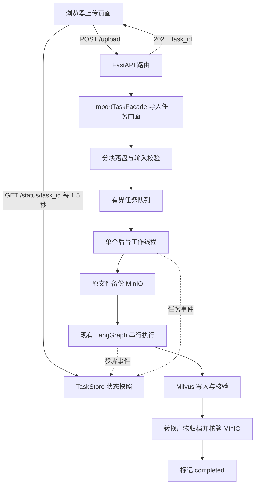

# 导入模块前后端交互与异步任务技术方案

版本：V1 待确认方案　日期：2026-09-07

本文是下一阶段的开发方案，不代表接口已经实现。确认后再修改业务代码、前端及测试。

## 一、目标与现状

将现有 LangGraph 导入流程接入 FastAPI，实现“上传返回任务编号 → 前端每 1.5 秒查询进度 → 后台依次执行节点 → 向量及文件均存储成功后显示完成”。

本方案依据用户提供的交互图、时序图以及参考页面 `D:/zdsoft/ai-test/重新开始/【免费课程瑞客论坛 www.ruike1.com】import.html`。图片和页面用于理解交互与展示，不将其中的示例代码视为必须原样采用的实现指令。

已核实当前代码：

| 部分 | 当前情况 | 本期工作 |
| --- | --- | --- |
| LangGraph | 已有 7 个节点，PDF/Markdown 入口分流 | 保留业务顺序，增加执行事件通知 |
| run_import_graph | 同步执行，进程锁串行导入，检查最终切片数量 | 由后台工作线程调用，支持可选观察者和受控来源信息 |
| BaseNode | 已统一记录开始、结束、异常日志 | 同时报告步骤状态与耗时 |
| FastAPI | api 目录尚无上传、状态接口 | 新增应用、路由及响应模型 |
| MinIO | 已有图片上传；处理后的 Markdown 目前仅保存到本地 | 新增原文件、原始 Markdown、处理版及资源归档 |
| Milvus | 已有切片向量、来源 metadata、写后核验 | 在现有 JSON metadata 中补充归档关联信息 |
| 参考前端 | 已调用 `/upload`、`/status/{task_id}`，读取 `done_list/running_list/durations` | 对接真实状态、动态步骤、失败信息和结果 |

本期采用本地单进程部署，不引入 Redis/Celery，不开发问答检索模块。DeepSeek、BGE-M3、Milvus、MinIO 复用现有配置。

## 二、整体设计与职责



本期明确落地门面职责，不把所有工作放进路由或再集中进 ChunkRepository：

| 组件 | 职责 | 不承担的工作 |
| --- | --- | --- |
| ImportTaskFacade | 提交任务、协调备份/图执行/结果核验、处理任务级失败 | 不实现 PDF 解析或向量计算 |
| TaskExecutor | 有界队列、单工作线程、启动与停止 | 不定义业务成功条件 |
| TaskStore | 线程安全的任务记录与快照 | 不调用模型、MinIO、Milvus |
| TaskProgressObserver | 将节点事件转换为 TaskStore 状态更新 | 不解析日志文本推测进度 |
| ImportArtifactService | 上传与核验原文件、Markdown、资源和清单 | 不执行图节点 |
| ArtifactManifestBuilder | 按文件角色、对象键、校验摘要逐项组装归档清单，再统一验证必需项 | 不访问对象存储 |
| 现有节点/Service/Repository | 保持已有业务职责 | 不引用 FastAPI Request 或 HTTPException |

门面和清单建造者会有独立类及调用点。建造者用于确有多个归档阶段和必需项校验的清单组装；本期不顺带重构上一阶段的全部 Milvus 仓储。

## 三、后台执行方式

### 3.1 采用单工作线程与有界队列

FastAPI 接收文件后只完成必要校验、落盘、任务登记和入队，立即返回 202。后台线程从队列依次取出任务，调用同步的 `run_import_graph()`。状态查询仅复制内存快照，不等待导入锁。

与示意图的两点细化：

1. 原文件上传 MinIO 放入后台第一步。前端拿到 task_id 后可以看到“备份原文件”的进度，避免 MinIO 慢时一直停留在上传请求。
2. 用有界队列和专用工作线程代替每个请求启动一个完整 `BackgroundTasks`。现有 BGE 是进程内单例且导入已有串行锁；队列可以明确显示等待状态，限制积压，避免大量后台线程等待同一把锁。

异步指 HTTP 请求与导入执行解耦；图内节点仍串行。单进程线程方案不保证重启续跑，也不能完全隔离 CPU 竞争，应实测推理期间轮询延迟。FastAPI 官方支持响应后执行后台任务，也指出重计算可按需求使用独立任务系统；本期基于本地规模选择上述轻量方案。[官方后台任务说明](https://fastapi.tiangolo.com/tutorial/background-tasks/)

### 3.2 资源与生命周期

- 建议配置：等待队列最多 10 个任务，1 个任务执行中；另限制同时上传数及临时目录总容量。
- 队列容量预留、任务登记和提交必须协调：并发提交不能超卖；只有确认入队才返回 202。
- 队列满返回 429，并携带 Retry-After；提交失败释放预留资源并清理本次未接纳文件。
- 使用应用 lifespan 创建和关闭 TaskStore、执行器等共享对象。
- 正常关闭时停止接收新任务、停止取新任务，允许当前任务在配置的宽限内结束；仍排队的任务标记失败。强制结束不承诺恢复。
- 内存任务默认保留到终态后 24 小时；不清理运行中任务；任务数和磁盘容量均有限制。
- 固定 `uvicorn knowledge.api.main:app --host 127.0.0.1 --port 8000 --workers 1`。执行任务时不使用自动 reload，也不能开启多 worker，否则各进程状态和队列不共享。
- 状态未知/已过期/进程重启丢失时返回 404，前端明确提示，不能伪造为 completed。

## 四、接口定义与跨域

### 4.1 POST /upload

请求为 multipart/form-data：

| 字段 | 类型 | 约定 |
| --- | --- | --- |
| file | UploadFile，必填 | 单个 PDF、MD 或 Markdown 文件 |
| document_id | Form 字符串，可选 | 同一业务文档更新时复用；缺省按原文件内容 SHA-256 生成 |

task_id 由后端生成，前端上传时不用传；拿到后用于查询。每个文件一个任务，拖拽多个文件时分别上传，后台排队。

示例响应 HTTP 202：

```json
{
  "task_id": "8aaaf6d7e29b47d2b0e7f38e6be3bc82",
  "document_id": "文档内容摘要或业务ID",
  "status": "queued",
  "status_url": "/status/8aaaf6d7e29b47d2b0e7f38e6be3bc82",
  "poll_interval_ms": 1500,
  "total_steps": 10,
  "message": "文件已接收，等待后台处理"
}
```

202 只代表接纳任务，不代表 MinIO 备份或向量导入完成。响应返回时线程可能已开始执行，下一次 GET 返回最新状态。

上传实现规则：

- 使用 UploadFile 分块读取并写入任务目录，同时计算内容摘要，避免一次性读取整个文件。multipart 支持需显式声明 `python-multipart` 依赖。[官方文件上传说明](https://fastapi.tiangolo.com/tutorial/request-files/)
- 建议单文件上限 100 MiB，可配置；读取时计数，并配置 ASGI 请求体接收上限，不能只在 multipart 完整解析后限制业务写入。
- 校验扩展名、空文件和基础内容格式；PDF 检查文件头，Markdown 检查 UTF-8 可解码，深度格式校验由现有节点完成。
- 任务目录由服务端生成；客户端文件名仅作规范化叶子名称，拒绝目录穿越和非法路径。保留原显示名称，避免所有文档标题都变成 task_id。
- 文件写入先用 `.part`，成功关闭后原子改名，再入队。后台只接收已保存文件路径，不持有请求结束后可能被关闭的 UploadFile。
- 本地磁盘写入及其他同步阻塞调用移出事件循环；不能在 `async def` 路由直接执行整张图。

### 4.2 GET /status/{task_id}

返回 HTTP 200；未知 task_id 返回 404；响应设置 `Cache-Control: no-store`。

```json
{
  "task_id": "8aaaf6d7e29b47d2b0e7f38e6be3bc82",
  "document_id": "文档内容摘要或业务ID",
  "status": "processing",
  "current_step": "pdf_to_md_node",
  "done_list": ["upload_file", "backup_original", "entry_node"],
  "running_list": ["pdf_to_md_node"],
  "skipped_list": [],
  "durations": {"upload_file": 0.8, "backup_original": 0.4, "entry_node": 0.01, "pdf_to_md_node": 16.2},
  "total_steps": 10,
  "finished_steps": 3,
  "progress_percent": 30,
  "elapsed_seconds": 17.6,
  "queue_wait_seconds": 0.1,
  "steps": [
    {"id": "pdf_to_md_node", "label": "PDF 转 Markdown", "status": "running", "duration_seconds": 16.2}
  ],
  "warnings": [],
  "result": null,
  "error": null
}
```

示例的 steps 为节选，实际返回有序完整列表。done_list、running_list 及 durations 键均使用稳定步骤 ID，中文名称由 steps.label 提供。保留这些字段兼容参考 HTML。

成功 result 返回 document_id、written_chunk_count、chunks_collection、embedding_model、manifest 的 bucket/object_key 和归档摘要；不返回全文、向量数组、本机路径或凭据。切片主键数量较大时通过清单关联，不全部塞入轮询响应。

失败 error 示例：`{"code":"ARTIFACT_BACKUP_FAILED","step_id":"backup_artifacts","message":"转换文件备份失败","retryable":true}`。同时返回已核验的部分结果，例如 `vector_status=verified`、`archive_status=failed`；未知写入结果用 `unknown`，不能默认未写入。对外错误使用受控消息，日志记录 task_id、步骤和异常类型。

### 4.3 错误状态码

| 状态码 | 含义 |
| --- | --- |
| 413 | 请求或文件超过限制 |
| 415 | 文件类型不支持 |
| 422 | 必填字段缺失、文档 ID 等参数非法 |
| 429 | 上传/任务接纳容量已满 |
| 503 | 服务停止接纳任务或执行器不可用 |
| 500 | 接纳阶段发生非预期故障 |

任务接纳后的业务失败通过状态接口返回 `status=failed`，GET 本身仍为 200，不让 HTTP 500 代替任务终态。

### 4.4 CORS 与页面访问

- 使用 CORSMiddleware，允许来源由 `CORS_ALLOW_ORIGINS` 配置；开发白名单建议包含 `http://127.0.0.1:5500`、`http://localhost:5500`、`http://127.0.0.1:5173`、`http://localhost:5173`。
- 允许 GET、POST，并由中间件处理 OPTIONS 预检；允许 Content-Type，必要时预留 Authorization；暴露 Retry-After。
- 本期不使用跨域 Cookie，`allow_credentials=False`；以后启用认证时显式配置来源和凭据规则。
- FastAPI 同时提供 `/import` 页面供本地同源访问，API_BASE 默认使用同源地址；独立前端开发时可配置 API 地址。
- 不建议双击 file:// 打开 HTML；其 null origin 不加入默认白名单。localhost 与 127.0.0.1 是不同来源，需要分别配置。

这些配置遵循 FastAPI 的 Origin 与凭据说明。[官方 CORS 文档](https://fastapi.tiangolo.com/tutorial/cors/)

## 五、任务状态与节点进度

### 5.1 两层状态

任务状态：`queued → processing → completed / failed`。

步骤状态：`pending → running → completed / failed`，不适用步骤为 `skipped`。

现有图内 `import_status=succeeded` 只表示图内切片成功；API 的 completed 还要求文件归档成功。不能直接把图内成功原样映射为任务完成。

PDF 正常流程共 10 步：

| 顺序 | 步骤 ID | 中文显示 | 执行位置 |
| --- | --- | --- | --- |
| 1 | upload_file | 接收上传文件 | 请求阶段 |
| 2 | backup_original | 备份原始文件 | 门面后台流程 |
| 3 | entry_node | 检查导入文件 | 现有图 |
| 4 | pdf_to_md_node | PDF 转 Markdown | 现有图 |
| 5 | md_to_img_node | 图片摘要与资源处理 | 现有图 |
| 6 | document_split_node | 文档切片 | 现有图 |
| 7 | item_name_recognition_node | 商品名称识别 | 现有图 |
| 8 | bge_embedding_chunks_node | 切片向量化 | 现有图 |
| 9 | milvus_import_node | 向量写入与核验 | 现有图 |
| 10 | backup_artifacts | 归档转换产物并核验 | 门面后台流程 |

Markdown 的 PDF 转换步骤显示 skipped，不计入 total_steps，因此共 9 步。商品名 not_found/ambiguous、图片摘要降级属于节点正常结束并附 warning，不是跳过或任务失败。

进度为“已完成适用步骤数 / 适用总步骤数”，不是耗时预测；运行中不假造 50% 节点完成度。只有 completed 才显示 100%，失败保持最后进度。耗时长的 PDF 转换展示实时运行秒数。

### 5.2 BaseNode 事件接入

在 BaseNode.__call__ 增加可选观察者：调用 process 前报告 start；正常返回后报告 complete；异常路径报告 failed，再保留原异常向上传播。

观察者通过构造参数从 build_import_graph/run_import_graph 传给所有节点；CLI 默认使用空实现。观察者、锁、客户端不能塞进 LangGraph state。TaskStore 写入异常不能吞掉原始业务异常；门面需保留最终兜底失败路径。

TaskStore 为一个带锁的记录仓储，不使用几份独立全局 dict 分别保存 done/running，避免查询到互相矛盾的状态。状态转换一次加锁原子更新；查询在短锁内复制快照，锁内不做模型、网络、文件操作。

耗时用 monotonic/perf_counter；展示时间用 UTC 时间戳。进行中步骤的耗时在每次查询时计算，结束后固定。总耗时包含排队，另给 queue_wait_seconds，不能只累加节点耗时冒充用户等待时间。终态必须清空 running_list，失败步骤不得加入 done_list。

## 六、MinIO 备份与 Milvus 关联

### 6.1 本地文件隔离

每个任务使用 `knowledge/runtime/imports/{task_id}/`，下分 original、work 等目录。原文件只读保留；转换和图片处理在工作副本执行。这样也避免现有 `_new.md` 命名规则在输入本身以 `_new` 结尾时覆盖上传原件。

PDF 节点完成后立即保存独立的 `raw_md_path`；图片节点将处理版路径记为 `processed_md_path`，不能只保留会被覆盖的 md_path。MD 导入时 raw 指工作区中的未修改 Markdown 副本。

### 6.2 对象目录

```text
imports/{document_key}/{task_id}/
  original/{安全文件名}.pdf 或 .md
  converted/raw.md
  converted/processed.md
  converted/images/{资源相对路径}
  manifest.json
```

document_key 为业务 document_id 的 SHA-256，避免业务 ID 中的特殊字符进入对象路径；task_id 区分多次导入版本。MinIO bucket 复用现有配置。

原文件在运行图前上传并核验；图成功后归档 raw/processed Markdown、转换生成的图片资源及 manifest。已有图片上传对象前缀调整为同一文档/任务范围，避免当前按文档文件名分目录导致同名文件覆盖。单张图片此前降级上传的，归档阶段仍尝试保存资源；必需归档失败则任务失败。

原始 Markdown 保留原字节及相对引用，归档清单保存资源映射；不声称直接打开 raw.md 的对象地址就能自动解析原目录结构。恢复时根据清单重建目录。处理版保留实际参与切片的文本。

### 6.3 归档核验与清单

每项记录 role、bucket、object_key、content_type、size、sha256、源相对路径。上传完成后 stat 核对大小及自定义摘要元数据；ETag 不当作 SHA-256。集成验收额外下载对比字节摘要，以验证实际上传内容。

manifest 最后写入，包含 task_id、document_id、原始文件名、归档列表、切片数量、集合、模型/切分指纹及 warning。所有必需项确认后才能标记任务 completed。MinIO 保持私有 bucket，不将存储凭据返回浏览器；本期只返回对象标识，下载/预签名接口可后续补充。

若图失败，保留已备份原件及本地已生成产物，并尽力归档可用产物与失败清单。二次归档失败不能覆盖最先发生的节点错误。

### 6.4 切片与归档的关联

在现有 Milvus JSON metadata 内追加 `source_archive`：document_id、task_id、原始文件显示名称，以及 original/raw/processed/manifest 的 bucket 和 object_key。在图执行前即可确定这些稳定对象键；对象最终可用性以归档状态及清单为准。

现有仓储只复制 META_FIELDS，因此必须显式扩展 metadata 组装与 32 KiB 校验，不能仅在 state 增加字段就假定它会入库。run_import_graph 当前只接受三个入口字段，也需增加内部受控的归档上下文传递；HTTP 请求不允许用户任意注入这些对象键。

保留 metadata.source_path 作为诊断来源，但不把本机临时路径作为长期文件访问地址。JSON 增加键不要求修改集合固定字段 schema；历史记录没有 source_archive 时按旧记录兼容处理。

### 6.5 成功与部分失败

completed 必须同时满足：

1. 图正常结束，切片写入数与实际切片数一致，Milvus 已完成既有读回核验。
2. 原上传文件已备份并核验。
3. raw Markdown、processed Markdown 及本次生成的图片资源已归档并核验；MD 的 raw 来自原文副本。
4. manifest 已成功写入并核验。

MinIO 与 Milvus 没有跨库事务。向量成功但归档失败时返回 failed，同时保留 `vector_status=verified`，不自动删除已写向量。反之，Milvus 部分写入失败也不声称自动回滚。人工重试重新上传并复用 document_id，现有稳定主键执行覆盖；新的 task_id 保留独立归档版本。本期不提供断点续跑或自动整任务重试。

成功任务在归档核验后清理本地工作目录；失败任务建议保留 24 小时便于排查。清理仅限明确解析在 runtime/imports 下的终态任务目录，不删除 MinIO 历史归档。

## 七、前端改造

保留参考页面的拖拽上传、文件卡片、进度条和步骤耗时展示，修改交互逻辑：

1. 上传成功后保存 task_id，展示 queued 状态；刷新页面可从 localStorage 恢复未终止任务的轮询。
2. 首次立即查询，后续在上次查询结束 1500ms 后使用 setTimeout 发起下一次，避免 setInterval 在慢请求时重叠。
3. total_steps、进度、中文步骤名以接口为准，删除当前 PDF=8/MD=7 的硬编码。浏览器文件传输中使用“上传中”指示，不把虚构百分比称作真实字节进度。
4. completed/failed 停止轮询；失败展示步骤及受控错误消息；warnings 作为质量提示显示。
5. 查询设置超时与 AbortController；短暂网络故障保留任务卡片并退避重试，恢复后继续 1.5 秒频率。404 停止并提示任务不存在或已过期；连续故障达上限后提供“重新查询”，不继续无限请求。
6. DOM 中的文件名、错误文案使用 textContent，替换参考页面将 file.name 直接插入 innerHTML 的写法。
7. Markdown 单文件上传不会自动携带用户电脑的 images 目录。本期支持纯文本或已有远程引用的 MD；缺少本地资源时返回 warning。完整本地图片文档优先上传 PDF；MD+图片目录/ZIP 上传作为后续扩展，不在本期隐式假定资源已上传。

## 八、计划文件与改动范围

```text
knowledge/
  api/main.py                         FastAPI 应用、CORS、lifespan、静态页面
  api/routes/import_routes.py         POST /upload、GET /status/{task_id}
  api/schemas/import_task.py           请求与响应契约
  api/static/import.html              基于参考页面改造
  service/import_task_facade.py        完整异步任务门面
  service/task_executor.py             有界队列和后台执行生命周期
  service/task_store.py                线程安全任务状态
  service/task_progress_observer.py    节点事件到任务进度的适配
  service/import_artifact_service.py   MinIO 归档与核验
  service/artifact_manifest_builder.py 归档清单建造者
```

现有修改点：BaseNode、各节点构造函数、main_graph、state/config、PDF/图片节点的路径与对象前缀、ChunkRepository 的 metadata 组装。保留 CLI 可直接导入的兼容性。

显式新增依赖 FastAPI、Uvicorn、python-multipart，版本在开发时与现有 Python 3.12 环境解析验证。配置加入 CORS、文件大小/磁盘预算、队列容量、临时目录、任务保留期、关闭宽限等参数；不输出已有密钥。

所有新增与修改的非测试代码继续提供详细中文模块说明、参数/返回值、执行走向和异常规则。重要日志记录 task_id、document_id、step_id、耗时和数量，不记录正文、向量或密钥。

## 九、验证与验收

| 场景 | 验收标准 |
| --- | --- |
| HTTP 接口/CORS | 允许来源通过预检；未允许来源无跨域许可；字段和错误码符合契约 |
| 长任务 | 测试替身阻塞转换时仍可查询 running 与增长耗时，响应不等待图结束 |
| PDF 全链路 | 10 步有序完成，MinIO 原件/两版 MD/资源/清单齐全，Milvus 数量和来源关联正确 |
| MD 导入 | PDF 步骤 skipped，总数 9；没有图片目录不会假报资源已备份 |
| 多文件 | 同名文件不覆盖；一个执行、其余 queued；队列满可预期拒绝 |
| 节点异常 | 当前步骤 failed，后续 pending，running 清空，前端停止轮询 |
| 备份异常 | 原件备份失败不运行图；最终备份失败不能显示 completed，保留部分结果 |
| 文件边界 | 超限/空文件/错误格式/恶意文件名拒绝，部分上传文件清理 |
| 状态一致性 | 并发查询不出现同一步同时 done/running，终态不回退 |
| 幂等与恢复 | 同 document_id 重导入不重复追加切片；服务重启后旧内存任务明确 404 |
| 回归 | 现有图与 CLI 测试继续通过，空观察者不影响离线调用 |

自动化接口/调度测试使用可控替身；真实联调用独立测试集合与任务归档前缀，验证实际 PDF、BGE、Milvus、MinIO，并记录推理期间轮询响应延迟。不会清理既有业务集合或 bucket。

## 十、确认范围

本版建议按“单进程有界队列 + 内存状态 + 1.5 秒轮询 + 完整文件归档”实施。需要确认的是这些取舍：原件备份后台执行；任务重启不续跑；所有必需归档成功才算完成；本期 MD 只上传单文件。确认本方案后再开始接口、门面、观察者和前端开发。
