# 导入模块实际代码全链路流程图与问题核查

核查日期：2026-09-07；修复更新：2026-09-08。本文描述当前代码，不是计划方案。图中 C 编号对应文末可点击的源代码位置；行号以本次核查时的文件为准。

2026-09-08 已修复此前复现的两处失败状态问题，保留现有队列和服务结构。当前图与源码索引已同步更新；代码中的【流程 01～10】是跨文件阅读顺序，函数内部 Step 是局部步骤。完整阅读导航见 import_routes.py 文件头。

## 一、先看完整总图

实线表示调用或顺序执行，虚线表示更新/读取共享状态。上传请求线程与后台工作线程可以同时运行，后台任务不必等浏览器收到 202 才开始。

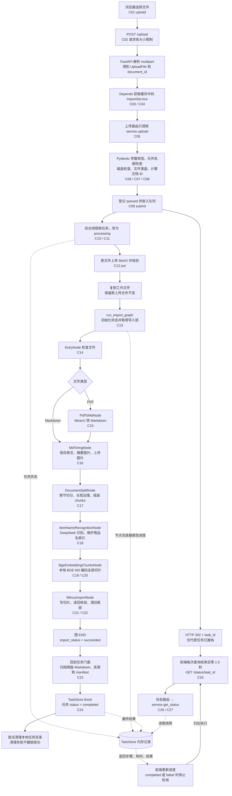

**成功有两个层次：**图内 succeeded 表示切片入库核验通过；API completed 还要等最后的文件归档成功。商品名集合也在图中被单独维护，不能把全部数据库写入都理解为最后一个 Milvus 节点的操作。

## 二、服务到底如何创建、缓存、注入

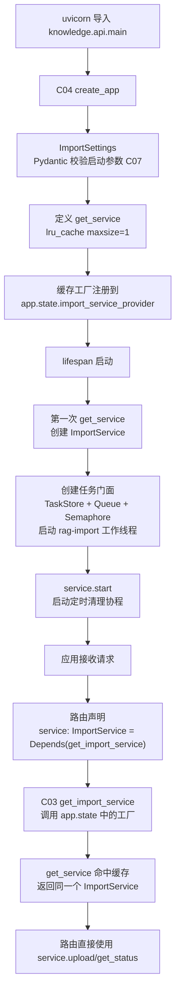

需要明确的三点：

- `Depends` 是请求执行时的依赖注入入口；这里跨请求共用实例，靠的是 get_service 的应用级缓存。
- `Request` 没有放进 lru_cache；只有无参数的工厂返回值被缓存。
- `app.state` 没有彻底消失，而是被集中在 main.py 和 dependencies.py。路由不再知道存储位置，声明的是具体 ImportService 类型。

同一 Python 进程中的 AIClients/StorageClients 还有另一套类级客户端缓存（C38/C39/C40）。它们与这里的服务缓存不同，关闭 ImportService 不会自动清掉这些客户端缓存。

## 三、上传请求内部：在哪个时刻开始校验和落盘

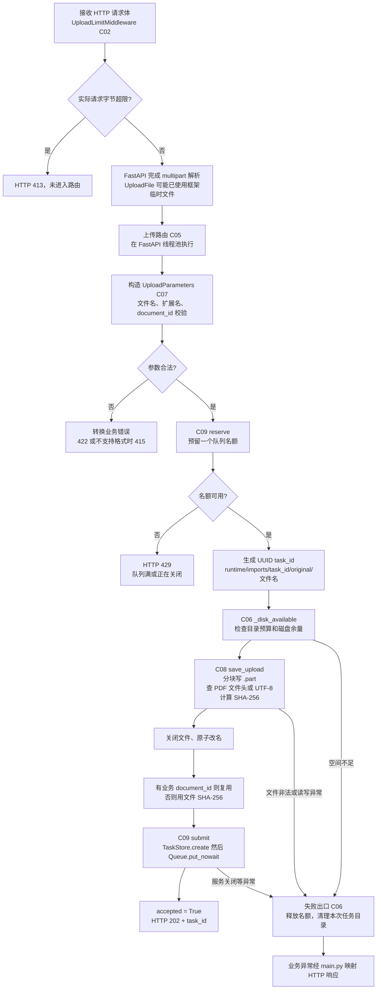

**重要修正：**预留队列名额发生在 FastAPI 已解析 multipart 之后。现有 `reserve` 的“上传前”注释，只能理解为“写入业务任务目录之前”，不是“浏览器开始传输之前”。队列满不会阻止此前已经发生的 HTTP 接收或框架临时文件写入。

Pydantic 校验也在 `ImportService.upload` 的开头显式构造模型时执行，并不是路由直接绑定一个完整上传请求模型。接口的文件字段仍由 FastAPI 的 File/Form 解析。

## 四、后台线程、图节点和进度回调怎样衔接

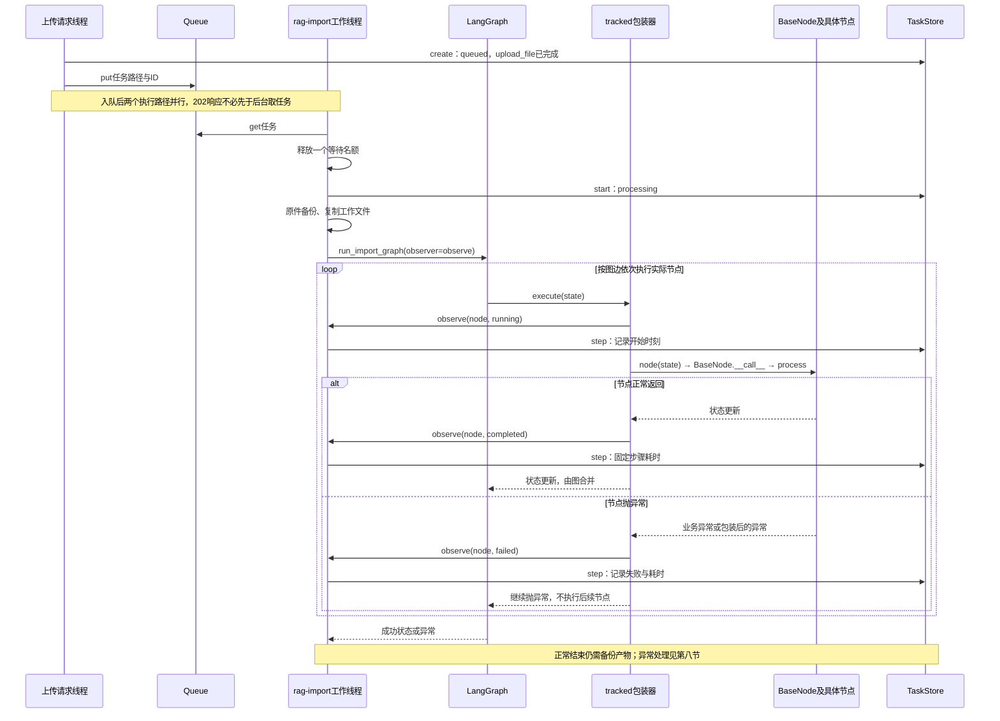

实际通知链是 **`tracked.execute → observe → TaskStore.step`**（C28/C29/C30）。`BaseNode`（C31）负责日志和异常包装，没有直接更新 TaskStore。Python 的 `node(state)` 会调用节点继承的 `__call__`，然后由基类调用具体节点的 process。

导入锁位于 C13 的 `with _import_lock`，覆盖图的 invoke；图外的原件备份和最终归档不在该锁内。同一个 API 门面只有一个工作线程，因此正常 API 任务之间仍然串行。不同进程不共享这把锁或 TaskStore。

## 五、七个 LangGraph 节点具体做什么

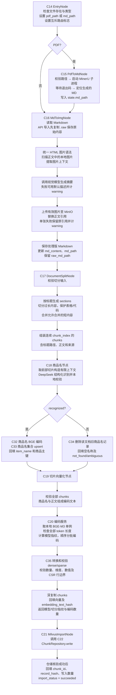

| 阶段 | 主要输入 | 新增或更新的数据 | 外部副作用 |
| --- | --- | --- | --- |
| 入口 | import_file_path、document_id | 路由标志、pdf_path/md_path | 读本地文件 |
| PDF 转换 | PDF 路径 | md_path | MinerU 子进程、工作目录中的转换产物 |
| 图片处理 | md_path | raw_md_path、md_content、处理后 md_path、警告计数 | 模型请求、MinIO 图片对象、本地处理版 |
| 切片 | md_content、标题与路径 | chunks，序号从 0 连续 | 无数据库写入 |
| 商品名 | 前部 chunks | item_name、识别状态、商品主键 | DeepSeek、本地 BGE、商品名集合写入或删除 |
| 切片编码 | 所有 chunks、商品名 | dense/sparse、文本摘要、模型指纹 | 本地 BGE 推理 |
| 切片入库 | 编码后的 chunks | 主键、record_hash、数量、图成功状态 | 切片集合 upsert、核验、清理旧尾部 |

DeepSeek 不负责切片 embedding。商品名和切片分别调用 BGE，服务端客户端管理器复用同一个 BGE 实例。原文件备份和最终产物归档是任务门面中的两步，不属于上述七个图节点。

## 六、Milvus 最后一个节点内部的写入顺序

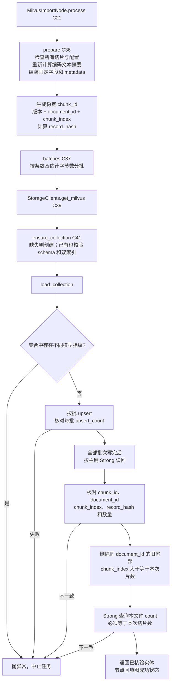

C42 `_call` 给数据库操作添加超时与有限重试，仅重试识别到的瞬时故障。**这里没有跨批次事务**：第二批失败时第一批可能已写入；商品名集合更早可能已经更新。稳定主键支持重跑覆盖，但不是自动回滚。

读回核验的是记录标识和摘要，不是逐个浮点数重新比较向量。`source_archive` 加进 JSON metadata，并参与业务记录摘要；它指向归档对象键，最终对象是否已经备份要看门面的归档结果。

## 七、文件从哪里来，最终存到哪里

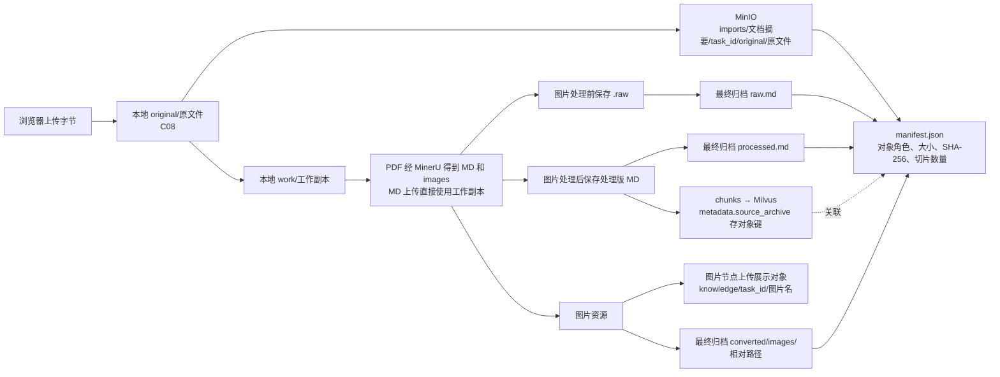

核验由 C12 的 put / C43 的 `_verify` 完成：上传时计算 SHA-256，stat 检查对象大小和摘要元数据。运行时并没有把每个对象重新下载一遍；此前端到端测试额外下载比对了字节，这两种验证范围不能混为一谈。

两点需要看清：图片目前有“展示对象”和“完整归档对象”两套路径，确实存在重复存储；单独上传 MD 不会自动上传浏览器电脑上的 images 目录。

## 八、轮询、成功和失败状态的真实走向

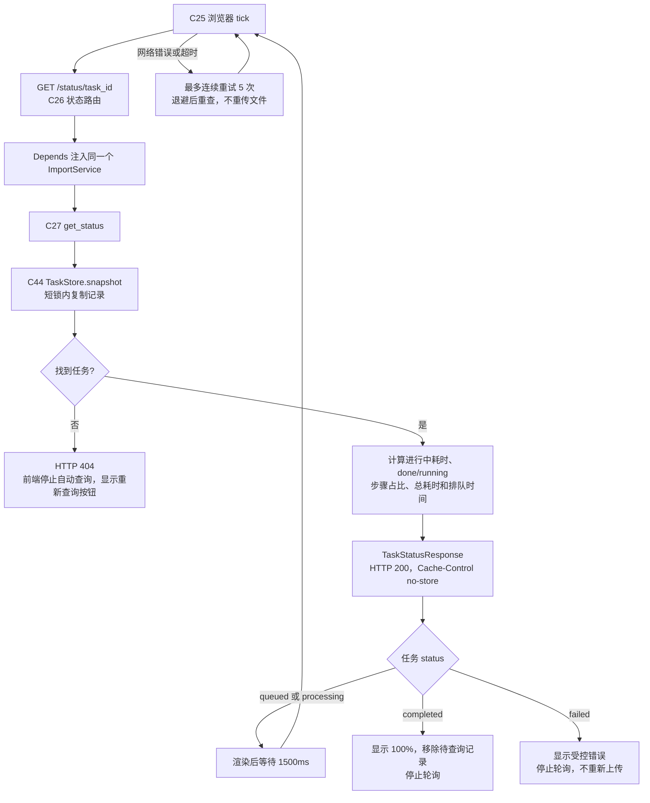

任务终态形成过程：

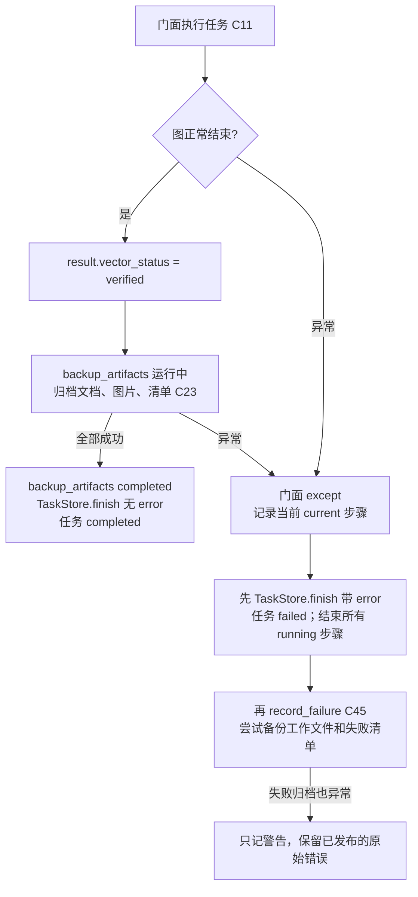

异常分支先更新本地目录保留时间，再发布 failed，最后尝试失败归档。因此，MinIO 补偿等待不会再让前端一直显示 processing；补偿仍占用当前工作线程，下一项排队任务需等补偿返回。

## 九、已修复的两个问题与保留的运行边界

### 修复 1：副本准备失败时，任务与步骤统一显示失败

位置：C11 `_run`、C24 `TaskStore.finish`。将 backup_original 的 completed 通知移到工作副本创建成功之后，显示名称改为“备份原件并准备工作副本”，保持原有步骤 ID 和总步骤数。

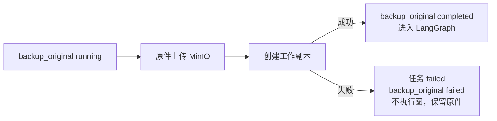

回归测试注入 copyfile 异常，从 `/status/{task_id}` 验证任务 failed、报错步骤为 backup_original、该步骤 failed、running_list 为空，并确认图未执行且上传原件保留。

### 修复 2：先发布失败，再补备份失败清单

位置：C11 except → C24 finish → C45 record_failure。将 finish 移到失败归档之前；补偿失败仅记录错误类型和任务 ID，不覆盖原始错误。

回归测试阻塞 record_failure，在它尚未返回时查询接口，确认已是 failed 且无运行步骤；随后令补偿抛异常，确认发布的状态、错误和耗时保持不变。

这个修复没有新建线程池或引入任务框架。补偿仍在原工作线程执行，前端可以停止轮询，但不代表工作线程已经空闲。

### 边界 1：关闭时等待 5 秒，不代表工作线程已经停止

位置：C46 close，C04 lifespan。

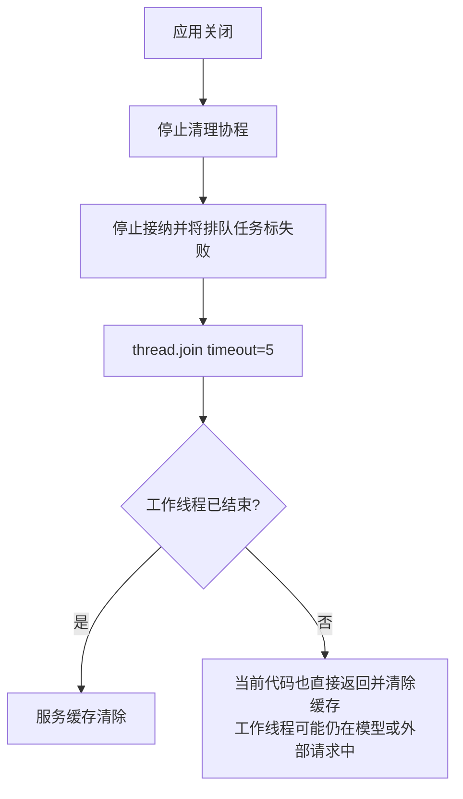

代码没有取消正在运行的模型请求，也没有检查 join 后是否仍存活。这是已有单进程轻量方案的限制；清除缓存不等于取消任务。如果要支持可靠停机或同进程重建应用，需要补关闭策略。

### 边界 2：客户端缓存与应用缓存不是同一生命周期

位置：C38/C39/C40。客户端使用类属性单例，不以配置为缓存键。一个进程固定一套配置时可以复用；如果同进程创建另一套不同连接/模型配置，不能假定 service.cache_clear 会让底层客户端更新。本文没有修改客户端实现。

### 边界 3：向量成功、归档失败时，已有写入不会撤销

位置：C22/C23/C11。这是实现采用的部分成功语义，不是假定的事务。失败任务可能已经更新商品名集合和切片集合；`vector_status=verified` 只表示切片核验通过，不表示文件归档成功。`vector_status=not_started` 也不代表所有数据库都没变，因为商品名集合可能已在较早节点更新。

本次只修复上述两个状态问题；停机、客户端缓存和跨存储事务边界保持原状，后续按实际部署需求处理。

## 十、按代码位置逐步阅读

下表由本次源码中的函数/类定义自动提取行号。图中编号与表中一致。

| 编号 | 用途 | 源码位置 |
| --- | --- | --- |
| C01 | 页面上传入口 | [import.html · upload](D:/zdsoft/project/shopkeeper_brain_ai/knowledge/front/import.html:58) |
| C02 | HTTP 请求体限额 | [upload_middleware.py · UploadLimitMiddleware.__call__](D:/zdsoft/project/shopkeeper_brain_ai/knowledge/api/upload_middleware.py:14) |
| C03 | Depends 服务获取 | [dependencies.py · get_import_service](D:/zdsoft/project/shopkeeper_brain_ai/knowledge/api/dependencies.py:14) |
| C04 | 应用装配、缓存、启停 | [main.py · create_app](D:/zdsoft/project/shopkeeper_brain_ai/knowledge/api/main.py:21) [main.py · create_app.get_service](D:/zdsoft/project/shopkeeper_brain_ai/knowledge/api/main.py:34) [main.py · create_app.lifespan](D:/zdsoft/project/shopkeeper_brain_ai/knowledge/api/main.py:39) |
| C05 | 上传接口 | [import_routes.py · upload](D:/zdsoft/project/shopkeeper_brain_ai/knowledge/api/import_routes.py:39) |
| C06 | 上传业务入口 | [import_service.py · ImportService.upload](D:/zdsoft/project/shopkeeper_brain_ai/knowledge/service/import_service.py:74) |
| C07 | Pydantic 参数与配置 | [import_models.py · UploadParameters](D:/zdsoft/project/shopkeeper_brain_ai/knowledge/schema/import_models.py:14) [import_models.py · ImportSettings](D:/zdsoft/project/shopkeeper_brain_ai/knowledge/schema/import_models.py:52) |
| C08 | 流式落盘与摘要 | [import_service.py · save_upload](D:/zdsoft/project/shopkeeper_brain_ai/knowledge/service/import_service.py:148) |
| C09 | 预留容量、登记入队 | [import_task_facade.py · ImportTaskFacade.reserve](D:/zdsoft/project/shopkeeper_brain_ai/knowledge/service/import_task_facade.py:41) [import_task_facade.py · ImportTaskFacade.submit](D:/zdsoft/project/shopkeeper_brain_ai/knowledge/service/import_task_facade.py:45) |
| C10 | 后台线程循环 | [import_task_facade.py · ImportTaskFacade._work](D:/zdsoft/project/shopkeeper_brain_ai/knowledge/service/import_task_facade.py:70) |
| C11 | 单任务完整执行与异常补偿 | [import_task_facade.py · ImportTaskFacade._run](D:/zdsoft/project/shopkeeper_brain_ai/knowledge/service/import_task_facade.py:94) |
| C12 | MinIO 上传归档对象 | [import_artifact_service.py · ImportArtifactService.put](D:/zdsoft/project/shopkeeper_brain_ai/knowledge/service/import_artifact_service.py:26) |
| C13 | 图执行入口 | [main_graph.py · run_import_graph](D:/zdsoft/project/shopkeeper_brain_ai/knowledge/processor/import_processor/main_graph.py:146) |
| C14 | 文件检查节点 | [entry_node.py · EntryNode.process](D:/zdsoft/project/shopkeeper_brain_ai/knowledge/processor/import_processor/nodes/entry_node.py:21) |
| C15 | PDF 转 Markdown 节点 | [pdf_to_md_node.py · PdfToMdNode.process](D:/zdsoft/project/shopkeeper_brain_ai/knowledge/processor/import_processor/nodes/pdf_to_md_node.py:26) |
| C16 | 图片处理节点 | [md_to_img_node.py · MdToImgNode.process](D:/zdsoft/project/shopkeeper_brain_ai/knowledge/processor/import_processor/nodes/md_to_img_node.py:1020) |
| C17 | 切片节点 | [document_split_node.py · DocumentSplitNode.process](D:/zdsoft/project/shopkeeper_brain_ai/knowledge/processor/import_processor/nodes/document_split_node.py:114) |
| C18 | 商品名识别节点 | [item_name_recognition_node.py · ItemNameRecognitionNode.process](D:/zdsoft/project/shopkeeper_brain_ai/knowledge/processor/import_processor/nodes/item_name_recognition_node.py:95) |
| C19 | 切片向量节点 | [bge_embedding_chunks_node.py · BgeEmbeddingChunksNode.process](D:/zdsoft/project/shopkeeper_brain_ai/knowledge/processor/import_processor/nodes/bge_embedding_chunks_node.py:28) |
| C20 | 切片编码服务 | [chunk_embedding_service.py · ChunkEmbeddingService.embed](D:/zdsoft/project/shopkeeper_brain_ai/knowledge/service/chunk_embedding_service.py:81) |
| C21 | 切片入库节点 | [milvus_import_node.py · MilvusImportNode.process](D:/zdsoft/project/shopkeeper_brain_ai/knowledge/processor/import_processor/nodes/milvus_import_node.py:23) |
| C22 | 写入、核验、清理旧切片 | [chunk_repository.py · ChunkRepository.write](D:/zdsoft/project/shopkeeper_brain_ai/knowledge/service/chunk_repository.py:206) |
| C23 | 最终产物归档 | [import_artifact_service.py · ImportArtifactService.finish](D:/zdsoft/project/shopkeeper_brain_ai/knowledge/service/import_artifact_service.py:53) |
| C24 | 任务终态更新 | [task_store.py · TaskStore.finish](D:/zdsoft/project/shopkeeper_brain_ai/knowledge/service/task_store.py:73) |
| C25 | 前端轮询 | [import.html · poll](D:/zdsoft/project/shopkeeper_brain_ai/knowledge/front/import.html:86) |
| C26 | 查询接口 | [import_routes.py · status](D:/zdsoft/project/shopkeeper_brain_ai/knowledge/api/import_routes.py:51) |
| C27 | 查询服务 | [import_service.py · ImportService.get_status](D:/zdsoft/project/shopkeeper_brain_ai/knowledge/service/import_service.py:127) |
| C28 | 图节点状态包装器 | [main_graph.py · build_import_graph.tracked.execute](D:/zdsoft/project/shopkeeper_brain_ai/knowledge/processor/import_processor/main_graph.py:87) |
| C29 | 进度回调 | [import_task_facade.py · ImportTaskFacade._run.observe](D:/zdsoft/project/shopkeeper_brain_ai/knowledge/service/import_task_facade.py:107) |
| C30 | 节点状态与耗时 | [task_store.py · TaskStore.step](D:/zdsoft/project/shopkeeper_brain_ai/knowledge/service/task_store.py:59) |
| C31 | 节点日志和异常边界 | [base.py · BaseNode.__call__](D:/zdsoft/project/shopkeeper_brain_ai/knowledge/processor/import_processor/base.py:53) |
| C32 | 商品名编码 | [item_name_embedding_service.py · ItemNameEmbeddingService.embed](D:/zdsoft/project/shopkeeper_brain_ai/knowledge/service/item_name_embedding_service.py:47) |
| C33 | 商品名索引写入 | [item_name_repository.py · ItemNameRepository.upsert](D:/zdsoft/project/shopkeeper_brain_ai/knowledge/service/item_name_repository.py:41) |
| C34 | 清除该文档旧商品名 | [item_name_repository.py · ItemNameRepository.delete_document](D:/zdsoft/project/shopkeeper_brain_ai/knowledge/service/item_name_repository.py:98) |
| C35 | 向量结果提取与校验 | [embedding_vector_util.py · extract_vectors](D:/zdsoft/project/shopkeeper_brain_ai/knowledge/service/embedding_vector_util.py:63) [embedding_vector_util.py · validate_vectors](D:/zdsoft/project/shopkeeper_brain_ai/knowledge/service/embedding_vector_util.py:29) |
| C36 | 生成并校验待写实体 | [chunk_repository.py · ChunkRepository.prepare](D:/zdsoft/project/shopkeeper_brain_ai/knowledge/service/chunk_repository.py:136) |
| C37 | 按条数和体积组批 | [chunk_repository.py · ChunkRepository.batches](D:/zdsoft/project/shopkeeper_brain_ai/knowledge/service/chunk_repository.py:183) |
| C38 | 模型客户端获取 | [ai_clients.py · AIClients.get_bge_m3](D:/zdsoft/project/shopkeeper_brain_ai/knowledge/utils/client/ai_clients.py:158) [ai_clients.py · AIClients.get_llm](D:/zdsoft/project/shopkeeper_brain_ai/knowledge/utils/client/ai_clients.py:91) |
| C39 | 存储客户端获取 | [storage_clients.py · StorageClients.get_milvus](D:/zdsoft/project/shopkeeper_brain_ai/knowledge/utils/client/storage_clients.py:103) [storage_clients.py · StorageClients.get_minio](D:/zdsoft/project/shopkeeper_brain_ai/knowledge/utils/client/storage_clients.py:41) |
| C40 | 底层客户端缓存 | [base.py · BaseClientManager._get_or_create](D:/zdsoft/project/shopkeeper_brain_ai/knowledge/utils/client/base.py:17) |
| C41 | 集合结构核验与创建 | [chunk_repository.py · ChunkRepository.ensure_collection](D:/zdsoft/project/shopkeeper_brain_ai/knowledge/service/chunk_repository.py:73) |
| C42 | Milvus 调用与重试 | [chunk_repository.py · ChunkRepository._call](D:/zdsoft/project/shopkeeper_brain_ai/knowledge/service/chunk_repository.py:47) |
| C43 | 对象大小与摘要元数据核验 | [import_artifact_service.py · ImportArtifactService._verify](D:/zdsoft/project/shopkeeper_brain_ai/knowledge/service/import_artifact_service.py:46) |
| C44 | 读取状态快照 | [task_store.py · TaskStore.snapshot](D:/zdsoft/project/shopkeeper_brain_ai/knowledge/service/task_store.py:88) |
| C45 | 失败归档补偿 | [import_artifact_service.py · ImportArtifactService.record_failure](D:/zdsoft/project/shopkeeper_brain_ai/knowledge/service/import_artifact_service.py:75) |
| C46 | 队列关闭与线程等待 | [import_task_facade.py · ImportTaskFacade.close](D:/zdsoft/project/shopkeeper_brain_ai/knowledge/service/import_task_facade.py:55) |

## 十一、本次验证的范围

- 2026-09-07 完成静态调用链核查及两个异常的隔离复现。
- 2026-09-08 新增两个 API 回归测试，覆盖复制失败、失败清单阻塞及补偿报错；相关接口和 Pydantic 测试共 14 项通过。
- 测试使用模型与存储替身，没有调用真实 DeepSeek/BGE/Milvus/MinIO，也没有重启服务。
- 代码从页面到接口、服务、队列、七个节点、编码入库、归档和查询均有统一编号的中文流程注释。
