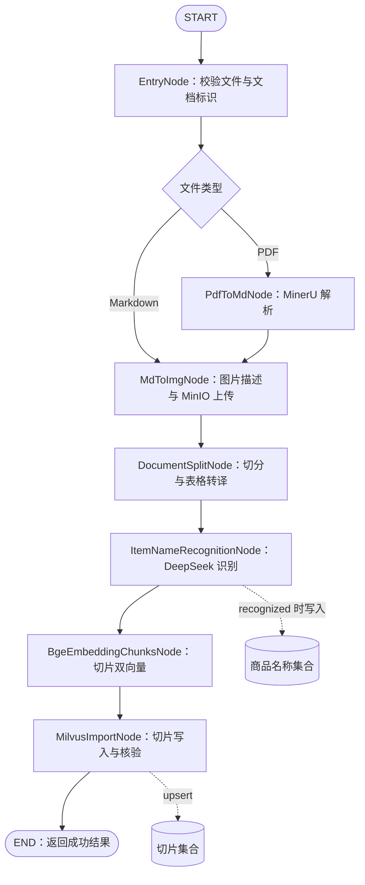

# 知识库导入全流程与切片向量化入库技术设计报告

文档版本：第一版  
编写日期：2026年9月6日  
适用项目：掌柜智库 `shopkeeper_brain_ai`  
交付状态：核心开发已完成。第2节记录开发前基线，后续章节保留设计依据；实际落地差异与验收证据见第15节。

## 1. 目标与设计结论

本次开发目标是在现有导入流水线末端增加切片向量化节点 `BgeEmbeddingChunksNode` 和向量入库节点 `MilvusImportNode`，通过 LangGraph 将文件入口、解析、图片处理、文档切分、商品名识别、切片向量化和本地 Milvus 写入串成完整流程。

DeepSeek 沿用项目已有配置，负责商品名称抽取；图片描述沿用已有 DeepSeek 兼容视觉接口配置。文档切片与商品名称的向量均由本地 BGE-M3 生成。DeepSeek 调用和 embedding 是两个不同环节，不新增未经配置的 DeepSeek embedding 接口。

第一版采用以下规则：

1. PDF 与 Markdown 是互斥入口，汇合后每个节点按顺序执行；向量批次和入库批次也顺序执行。
2. 每个切片同时保存 dense 与 sparse 向量、正文、章节信息和文档标识。
3. 全部切片通过校验才允许开始写库；缺失向量不能跳过后仍返回整份导入成功。
4. 使用稳定字符串主键与 `upsert`，支持重复导入及写入响应丢失后的重试。
5. 全部批次写入、旧尾部切片清理及读回核验完成后，才返回 `import_status=succeeded`。
6. 第一版是单进程、单导入执行器的离线串行导入。导入期间不承诺在线查询看到文档的原子版本切换；多批次及两个集合之间不存在本设计提供的事务。

本期覆盖导入链路和验证用检索，不开发在线问答、混合检索排序服务、前端上传页面、多任务队列及生产级断点恢复。

## 2. 设计依据与现状核查

### 2.1 原始资料

用户提供的路径为 `D:\zdsoft\ai-test\重新开始\2\_resource`，实际找到的对应资料目录为 `D:\zdsoft\ai-test\重新开始\2_resource`。已完整阅读其中唯一的 Markdown 文件：

`掌柜智库_导入处理_切片向量化与向量入库 .md`

已查看其 `images` 下全部18张配图：节点位置、向量化意义、稠密与稀疏向量、批处理、向量化流程及数据流、Milvus 集合、Schema、索引、度量、自动主键回填、门面与建造者、入库流程及两个节点协作关系。本文使用重新绘制的流程图表达项目方案，不依赖外部磁盘图片链接。

同时核对了仓库的三份既有设计文档、实际节点代码、状态类型、配置、AI/存储客户端、商品名向量服务与仓储，以及主图测试。若旧文档、README 与代码不同，以当前源码为现状基线。

### 2.2 已实现与待实现

| 模块 | 当前实现 | 本次开发计划 |
| --- | --- | --- |
| `EntryNode` | 验证文件，选择 PDF/MD，生成或接收 `document_id` | 保留；完善新任务状态重置与串行执行约束 |
| `PdfToMdNode` | 调用本地 MinerU pipeline，取得 Markdown 路径 | 保留并纳入全链路验收 |
| `MdToImgNode` | 读取 MD，扫描图片，生成描述，上传 MinIO，写出处理后 MD | 保留现有降级策略并补充质量状态；核查图片语法支持 |
| `DocumentSplitNode` | 标题拆分、长片拆分、短片合并、表格转译、组装 `ChunkRecord` | 复用；超长原子块须经过 embedding 长度检查 |
| `ItemNameRecognitionNode` | DeepSeek 识别，BGE-M3 编码商品名，Milvus upsert，名称回填 | 保留；补充重导入时未识别结果的旧商品记录处理 |
| `BgeEmbeddingChunksNode` | 尚不存在 | 新增，批量生成切片双向量 |
| `MilvusImportNode` | 尚不存在 | 新增，完成切片集合准备、写入、核验与结果回填 |
| `main_graph.py` | 当前终点为商品名节点后的 `END` | 延伸至切片入库节点后结束 |
| `knowledge/api` | 尚无完整上传导入接口 | 本期继续以 `run_import_graph` 作为程序入口 |

现有切分节点没有实现既有设计中的 Step 5 切片备份，当前状态也没有 `chunks_backup_path`；本流程不依赖该备份。主图目前直接 `compile()`，没有配置持久化 checkpointer，不能把“使用 LangGraph”描述成已经具备断点续跑。

### 2.3 配置与依赖事实

已按白名单读取非敏感配置，未将访问密钥写入报告：

| 项目 | 当前核查结果 | 设计含义 |
| --- | --- | --- |
| `MILVUS_URL` | `http://127.0.0.1:19530` | 使用本地服务端连接，不改成 Milvus Lite 文件模式 |
| `ITEM_NAME_COLLECTION` | `kb_item_names_v1` | 商品名称集合继续复用 |
| `CHUNKS_COLLECTION` | `.env` 未发现有效配置，代码默认空字符串 | 开发时补充 `kb_chunks_v1`，入口预检为空则失败 |
| `BGE_M3_MODEL_NAME` | `BAAI/bge-m3` | 本地模型加载，首次无缓存可能下载权重 |
| `BGE_M3_DEVICE` | `auto` | 现有客户端自动选择 CUDA 或 CPU |
| `EMBEDDING_DIM` | `1024` | 与实际模型输出及集合维度三方校验 |
| `DEEPSEEK_LLM_MODEL` | `deepseek-v4-flash-vision-exp` | 这是现有配置值，保留；真实接口能力需开发联调确认 |
| 锁文件 | `langgraph=1.2.11`、`pymilvus=3.0.1`、`pymilvus-model=0.3.2` | 是锁定依赖版本，不代表已核验服务端兼容性 |

本轮未连接 Milvus、调用 DeepSeek 或下载模型，因此不宣称服务可用、模型能力通过或端到端测试成功。后续实现应记录实际服务端版本，按安装的 SDK 验证请求参数和响应结构。

## 3. 对原资料的落地修正

| 原资料方案或示例 | 本项目采用的处理 | 原因 |
| --- | --- | --- |
| embedding 的 `process()` 返回切片列表 | 返回包含 `chunks` 等字段的状态字典更新 | 符合 `StateGraph(ImportGraphState)` 契约 |
| 直接修改输入 chunk | 在新字典中附加向量，全部成功后返回新列表 | 避免第二批失败时污染原始状态 |
| `get_bge_m3_client()`、`get_milvus_client()` | 使用实际存在的 `AIClients.get_bge_m3(config)`、`StorageClients.get_milvus(config)` | 避免照抄不存在的方法 |
| 缺少向量则 warning 并跳过 | 任一切片不合格即失败 | 不把缺页、缺段的知识库当作完整导入 |
| `INT64 auto_id` 配合 `insert` | `VARCHAR(64)` 主键、`auto_id=False`、`upsert` | 重试不生成重复记录 |
| 已有集合直接跳过检查 | 校验 Schema、维度、索引和度量 | 防止复用不兼容集合 |
| 动态字段自动接收所有 chunk 字段 | 显式字段和受控 JSON 元数据，关闭动态字段 | 防止误存临时字段或拼写错误 |
| 用 `zip(chunks, ids)` 直接回填 | 核验写入数量，按自有主键读回确认后回填 | 普通 zip 会静默截断 |
| 将商品名拼入内容即可天然聚合 | 拼接提供上下文，同时保留 `item_name/document_id` 标量过滤 | 语义相似度不保证业务分组与型号精确匹配 |

原资料 CSR 示例也有数值不一致：第三行实际有4个非零值，总非零数为8，正确 `indptr` 应为 `[0, 2, 4, 8]`，`indices` 应为 `[2, 4, 1, 3, 0, 2, 4, 5]`。批处理配图第二批漏标12，20条、批量8的正确范围是1–8、9–16、17–20。实现及测试使用校验后的数据，不照搬图中数字。

## 4. 总体串行编排



虚线仅表示节点内部的存储副作用，不是并行图边。商品名节点内的名称识别、向量化、名称入库已经串行实现，切片向量化在该节点返回后才开始。

完整成功顺序：

- PDF：`entry → pdf_to_md → md_to_img → document_split → item_name_recognition → bge_embedding_chunks → milvus_import → END`。
- Markdown：`entry → md_to_img → document_split → item_name_recognition → bge_embedding_chunks → milvus_import → END`。

`not_found` 和 `ambiguous` 是合法识别结果：不生成商品名向量，但继续执行切片向量化和入库，商品名保存空字符串。LLM 网络失败、结构化输出错误、向量异常和写库失败属于技术失败，抛出异常并停止后续节点。

## 5. 从导入入口到切片产出的处理

### 5.1 导入入口

继续使用 `run_import_graph(state, config)`。调用方通过 `create_default_state` 创建全新状态，传入 `import_file_path`，建议同时传入本次执行唯一的 `task_id`；需要覆盖同一业务文档时传入稳定的 `document_id`。

入口只支持 `.pdf`、`.md` 和 `.markdown`。文件必须存在且是普通文件，路径归一化为绝对路径。现有 `EntryNode` 在未传文档标识时对原文件字节流计算 SHA-256，相同文件改名仍使用同一标识。

这个默认标识具有两个边界：原文件内容改变会产生新文档；Markdown 引用的图片改变而 MD 字节不变不会改变标识。第二种情况重新导入会覆盖同一文档切片。若业务需要文档版本管理，应由入口提供业务标识和版本，不将文件摘要解释成完整资源包版本。

新增轻量预检放在启动模型和产生外部写入之前：校验集合名、批量大小、向量维度、最大任务量等配置。每次整图调用清空旧向量、主键、成功统计，禁止直接把上次最终状态作为新的导入输入。

### 5.2 PDF 解析

复用现有 MinerU 本地 `pipeline` 子进程调用，检查退出码与输出文件存在性，向状态写入 `md_path`。图片目录约定为生成 Markdown 同级 `images`。解析失败直接终止，不用空 Markdown 继续切分。

### 5.3 图片处理与资源保留

沿用 `MdToImgNode` 的读取、图片扫描、上下文提取、视觉描述、MinIO 上传、链接替换、写出处理后 Markdown 的顺序。向量输入来自处理后文字，因此图片通过描述文本进入文本检索；图片二进制保留在 MinIO，不作为浮点向量字段直接写入。

当前实现存在图片描述和上传失败后的降级分支。开发时保留这一行为，但增加 `image_summary_fallback_count`、`image_upload_failure_count` 和 `import_warnings`，把“图片处理降级但文本完整入库”与“所有图片均成功”区分开。远程图片、缺失本地图片以及未识别语法需统计，不能仅靠最终切片数量证明图片均被处理。

原始教学文档使用 HTML ``，现有图片扫描器主要基于 Markdown 图片正则。若将该文档作为导入样本，开发时需新增 HTML 图片引用解析或在读取阶段统一转为 Markdown 图片引用，并覆盖带空格、中文名、相对路径、代码块中的伪引用等情况。未补齐前不能宣称该样本全部图片可正确上传。

### 5.4 文档切分

复用当前实现：识别 Markdown ATX H1–H6、保留标题层级、避免将代码围栏内容误作标题；按长度拆长片，在不跨顶层章节且不超预算的前提下合并短片；HTML/管道表格统一交给 `MarkdownTableUtil` 转成可检索自然语言。

当前默认最大长度2000字符、短片合并阈值500字符、句子重叠1句。代码与图片等原子块可能超出字符预算并保留。字符数不等于模型 token 数，embedding 节点必须再校验完整输入的 token 长度，不能依赖模型静默截断。

输出保持现有 `ChunkRecord` 的11个基础字段：`chunk_index`、`file_title`、`title`、`parent_title`、`heading_path`、`source_titles`、`source_section_indexes`、`body`、`content`、`char_count`、`source_path`。可选商品名字段由后续识别节点补充。

### 5.5 商品名称识别

继续使用现有“前K片且总上下文受限”的识别逻辑，当前K=3、上下文预算2500字符。DeepSeek 输出经过结构和原文证据校验后，若为 `recognized`，使用本地 BGE-M3 编码名称，再写入 `ITEM_NAME_COLLECTION`，最终回填名称、状态、置信度、证据和商品名主键。

商品名向量用于商品级召回，切片向量用于段落召回，二者不能互相替代。切片集合保留 `item_name_milvus_pk` 作为逻辑关联；Milvus 不在这里提供外键约束。

## 6. 状态与节点契约

所有新增字段先在 `state.py` 定义，再实现节点；内部过程使用局部变量，不把客户端、模型实例、CSR 矩阵等对象放入图状态。

### 6.1 切片扩展字段

| 字段 | 类型 | 产生阶段与含义 |
| --- | --- | --- |
| `item_name` | 可选字符串 | 已有字段，商品节点回填，未识别为空 |
| `dense_vector` | 可选 `list[float]` | embedding 后存在，固定1024维 |
| `sparse_vector` | 可选 `dict[int, float]` | embedding 后存在，token ID 到权重 |
| `embedding_text_hash` | 可选字符串 | 实际编码文本 UTF-8 SHA-256，便于确认输入是否改变 |
| `record_hash` | 可选字符串 | 当前持久化业务载荷摘要，用于读回对账 |
| `chunk_id` | 可选字符串 | 入库全部成功后回填，64位十六进制主键 |

`content` 保留切分产出的检索正文，不被向量化覆盖。若模型输入增加商品名前缀，仅改变编码副本。`record_hash` 在入库实体准备时生成，对除向量、主键、任务号、时间戳及摘要自身之外的规范化实体字段计算；统一 JSON 键排序、UTF-8、固定分隔符，并纳入 `embedding_text_hash` 和模型/切分版本。它核验业务载荷对应关系，不等于验证每个浮点数，向量另做维度、数值和检索验证。

### 6.2 图级新增字段

| 字段 | 类型/默认值 | 语义 |
| --- | --- | --- |
| `import_status` | `pending/running/succeeded`，默认pending | 只在入库核验后标记成功；失败通过异常交付调用方 |
| `embedding_model` | 字符串，默认空 | 本次实际配置的模型 |
| `embedding_profile` | 字符串，默认空 | 模型权重/分词器与输入模板版本标识 |
| `split_profile` | 字符串，默认空 | 切分策略版本与关键参数摘要 |
| `embedded_chunk_count` | 整数，默认0 | 全部向量化成功的切片数 |
| `chunks_collection` | 字符串，默认空 | 本次切片集合 |
| `milvus_chunk_ids` | 字符串列表，默认空列表 | 按原顺序排列的已核验主键 |
| `written_chunk_count` | 整数，默认0 | 本次成功写入并核验的切片数，不是新增数 |
| `image_summary_fallback_count` | 整数，默认0 | 图片描述降级数量 |
| `image_upload_failure_count` | 整数，默认0 | 图片上传失败数量 |
| `import_warnings` | 字符串列表，默认空列表 | 不含正文或敏感信息的质量提示 |

默认列表继续通过现有深拷贝方式生成，避免任务之间共享可变对象。`chunks` 使用替换语义，不添加列表拼接 reducer，防止重复运行将旧切片再次累加。

新增节点返回状态更新字典，例如 embedding 返回 `chunks`、模型标识和计数；入库返回已回填的 `chunks`、主键列表、集合名、计数和成功状态。LangGraph 会合并这些更新，其他路径和业务字段得以保留。该返回契约依据 [LangGraph Graph API](https://docs.langchain.com/oss/python/langgraph/graph-api)。

## 7. 切片向量化节点详细设计

### 7.1 分层与接口

新增 `nodes/bge_embedding_chunks_node.py`，继承 `BaseNode`，节点名为 `bge_embedding_chunks_node`。节点负责输入校验、文本准备、顺序分批和状态更新；模型输出转换放到 `service/chunk_embedding_service.py`。

将现有 `ItemNameEmbeddingService` 的向量转换与校验抽为 `service/embedding_vector_util.py`，商品名服务与切片服务共同调用。转换器显式接收 `expected_rows`、`embedding_dim` 和调用节点名，不直接调用仅支持单行的私有方法。保持原商品名单条行为及测试不变。

### 7.2 输入校验

在获取模型之前一次校验所有切片：

1. `chunks` 必须是非空列表，每项为字典，`content` 为非空字符串。
2. `chunk_index` 必须为非负整数且不能是布尔值，按列表顺序恰好为 `0..N-1`。
3. 商品名若存在必须为字符串；切片商品名应与图级结果一致，未识别时统一为空。
4. 必需标题、来源字段类型及图级 `document_id` 合法；任一错误指出切片序号与字段名。
5. `embedding_batch_size`、`embedding_dim` 为正整数，拒绝0、负数及布尔值；总切片数不超过任务上限。
6. 实际编码文本按当前模型 tokenizer 计数，含特殊 token，必须在配置和模型共同允许的范围内。超长抛出 `EmbeddingError`，指明回到切分阶段处理；不截去尾部后当作完整编码。

### 7.3 编码文本与模型调用

固定第一版输入模板：有商品名时为 `商品名 + 换行 + content`；无商品名时只使用 `content`。仅对副本做换行规范化及首尾空白清理，不改型号、数值、单位、表格语义和原始展示文本。

现有 `content` 已包含标题，不重复拼接所有父标题。图片描述随 content 进入编码；第一版保持图片链接原文，后续如要去除 URL 噪声需升级输入模板版本并重新建库。

在循环外调用一次 `AIClients.get_bge_m3(self.config)`。模型初始化需显式保证 `return_dense=True`、`return_sparse=True`、`return_colbert_vecs=False`，保留现有设备选择和 CPU 禁用 FP16 的逻辑。每批调用 `encode_documents(texts)`，默认8条；20条按8、8、4分批。

此接口的 dense/sparse 输出契约参考 [BGEM3 encode_documents](https://milvus.io/api-reference/pymilvus/v2.5.x/EmbeddingModels/BGEM3EmbeddingFunction/encode_documents.md)。该链接是2.5版接口说明，落地参数以仓库锁定的 `pymilvus-model` 实际实现为准。

### 7.4 向量转换与校验

| 校验对象 | 必须满足的条件 |
| --- | --- |
| 返回结构 | 字典，dense、sparse 均存在；不对 numpy 数组直接做真假判断 |
| 行数 | dense 行数、sparse 行数均等于本批输入数量 |
| dense | 一维、维度一致、元素为有限数值，转换后仍可用 float32 表达；拒绝全零向量 |
| sparse CSR | `indptr` 长度=批大小+1，首项0，单调不减，末项等于 indices/data 长度 |
| sparse token | 非负整数，满足 SDK 支持范围；不把小数强转成 token ID |
| sparse 权重 | 有限且可用 float32 表达；零值去除，负值失败，去零后每行非空 |
| 字典键 | JSON 恢复的数字字符串可严格转换为整数；转换后碰撞必须失败 |

CSR 每行取区间 `[indptr[i], indptr[i+1])`，从 `indices` 取 token ID、从 `data` 取权重，再转换为原生字典。重复 token ID 第一版视为异常，不由普通 dict 静默覆盖。兼容现有服务支持的 `dense_vecs/lexical_weights` 返回格式，但同样严格校验行数。

BGE-M3 sparse 是模型学习的词项权重，不等同于 Milvus 内置 BM25，也不建立额外 BM25 Function。稀疏字典与 CSR 支持参考 [Milvus Sparse Vector](https://milvus.io/docs/sparse_vector.md)。

### 7.5 结果提交与内存

每批结果加入本地新切片列表，全部通过后一次返回图状态更新；任何一批失败都不向输入切片注入半成品，也不启动切片入库。

分批减少的是推理显存峰值，并未消除状态中保存全部向量的内存开销。第一版设置总切片数上限并记录峰值内存，超限在编码前拒绝。更大文档可在后续改为磁盘中间文件和分页入库，但需另行设计文件原子写入、恢复与清理协议。

## 8. Milvus 切片入库详细设计

### 8.1 职责与结构

新增 `nodes/milvus_import_node.py`，节点名 `milvus_import_node`。新增 `service/chunk_repository.py` 管理集合、实体映射、upsert、尾部清理与核验；Schema/索引构建作为该仓储内部方法，不把持久化代码全部堆入节点。

复用 `StorageClients.get_milvus(config)`，沿用 `MilvusError/ConfigurationError` 异常体系。第一版切片集合配置为 `kb_chunks_v1`，与商品名集合独立。

### 8.2 集合 Schema

设置 `auto_id=False`、`enable_dynamic_field=False`。表中字符串长度均为 UTF-8 字节上限。

| 字段 | 类型 | 约束与内容 |
| --- | --- | --- |
| `chunk_id` | VARCHAR(64) | 主键，稳定摘要 |
| `document_id` | VARCHAR(128) | 原始文档业务标识 |
| `chunk_index` | INT64 | 当前文档内从0开始的顺序 |
| `content` | VARCHAR(65535) | 切片完整检索正文 |
| `file_title` | VARCHAR(1024) | 文件标题，与商品集合约束一致 |
| `title` | VARCHAR(4096) | 当前切片标题 |
| `parent_title` | VARCHAR(4096) | 父标题 |
| `item_name` | VARCHAR(1024) | 识别名称或空字符串 |
| `item_name_milvus_pk` | VARCHAR(64) | 商品记录主键或空字符串 |
| `embedding_model` | VARCHAR(128) | BGE-M3 模型标识 |
| `embedding_profile` | VARCHAR(128) | 固定权重/分词器/模板版本 |
| `split_profile` | VARCHAR(128) | 切分策略标识 |
| `embedding_text_hash` | VARCHAR(64) | 编码文本摘要 |
| `record_hash` | VARCHAR(64) | 业务载荷对账摘要 |
| `metadata` | JSON | body、heading_path、source_titles、source_section_indexes、char_count、source_path |
| `updated_at` | INT64 | 写入时间，毫秒时间戳 |
| `dense_vector` | FLOAT_VECTOR | dim=`embedding_dim`，本项目1024 |
| `sparse_vector` | SPARSE_FLOAT_VECTOR | 模型输出稀疏权重，不指定固定dim |

`metadata` 只写白名单字段，控制序列化 UTF-8 大小不超过32KiB（应用限制）。字符串逐字段检查 `len(value.encode('utf-8'))`，超限即失败，不直接裁切事实正文。VARCHAR 字节约束参考 [Milvus VARCHAR 字段](https://milvus.io/docs/string.md)。

来源路径是内部定位信息，后续对外 API 展示时应转换为业务文档链接，不直接暴露服务器文件路径。状态字段与实体字段通过显式映射转换，不直接将 `chunks` 整个字典原样发送到 Milvus。

### 8.3 索引与集合兼容

沿用商品名仓储使用的策略：dense 为 `AUTOINDEX + COSINE`，索引名 `dense_vector_index`；sparse 为 `SPARSE_INVERTED_INDEX + IP`，索引名 `sparse_vector_index`。通过无参 `prepare_index_params()` 创建索引参数对象。稀疏度量依据 [SPARSE_INVERTED_INDEX](https://milvus.io/docs/sparse-inverted-index.md)。具体索引实现与可用参数受本地 Milvus 版本约束，联调时验证，失败不能静默降为单向量。

不存在集合则创建；已存在集合必须检查所有必需字段、主键、auto_id、动态字段开关、长度、dense维度、两个索引的目标字段和度量。并发建表冲突只在确认集合已由另一执行者创建且结构兼容时视作成功。

若集合已存在但索引缺失，报出修复项，不在导入途中自动删库重建。历史 `INT64 auto_id` 集合不能直接复用本方案，需新集合迁移。即使维度相同，更换 embedding 模型、权重或 tokenizer 也应使用新集合重建，禁止混合向量空间。

### 8.4 主键与重复导入

固定规则：`chunk_id = SHA256("chunk:v1" + NUL + document_id + NUL + 十进制chunk_index)`，输出64位十六进制字符串。主键不使用 task_id、商品名、文件名或时间戳。

因此同一 document_id 的第0片始终对应同一主键。重复导入N片仍是N个逻辑实体；正文、商品名或切分内容变化可覆盖原片。摘要使用NUL分隔避免拼接歧义；入口应拒绝自定义 document_id 中的NUL。

切片数量减少时，仅 upsert 不会删除旧尾部。例如原10片、新7片，全部新片写入并确认后，再删除同文档 `chunk_index >= 7` 的记录。禁止先删整份文档再开始写入。文档内容变化导致默认 document_id 改变时，旧记录作为不同文档保留，本期不自动猜测替换关系。

这些操作必须在单导入执行器中完整串行执行；仅串行图边无法阻止两个 `invoke` 同时运行。实现时在统一入口对整个导入运行加进程内锁，明确只允许一个 worker。多进程/多机器导入需先加入跨进程锁或文档版本发布协议，不能直接扩大 worker 数量。

### 8.5 入库执行步骤

```text
1. 校验完整 chunks、所有向量和配置，构建全部实体及稳定主键
2. 获取 Milvus 客户端，确保集合结构与索引兼容
3. 按记录数和请求体预算切成写入批次
4. 顺序 upsert 每批，检查响应 upsert_count 等于该批记录数
5. 加载集合，使用 Strong 一致性按主键分批读回核验
6. 所有新记录核验后，删除同文档超出新序号范围的旧尾部
7. 再次核验该文档精确记录数及不存在旧尾部
8. 在新 chunks 中回填 chunk_id，返回计数、主键列表和 succeeded
```

每批写入默认128条，序列化载荷预算4MiB；实体自身超出预算时提前失败，不陷入无法分批的循环。预算为应用保守值，仍需结合 protobuf 实际负载和服务端请求上限联调。

`upsert_count` 是本批已处理实体数，不表示新增数，不能通过集合全局实体计数差计算本次结果。响应缺少计数、计数不足、SDK返回无法识别都按失败处理。`upsert` 覆盖语义和返回字段参考 [Milvus Upsert Entities](https://milvus.io/docs/upsert-entities.md)。

主键由应用生成，因此不依赖响应中的 ids 顺序。按主键集合读回 `document_id/chunk_index/record_hash`，核验没有缺失、没有串文档、摘要一致。过滤条件使用 SDK 参数绑定或统一字符串字面量编码，不直接拼接自定义 document_id。读取分页大小与写入批次独立限制，不用一次带固定 limit 的查询充当完整核验。

完成核验后，`written_chunk_count == embedded_chunk_count == len(chunks) == len(milvus_chunk_ids)`，且主键唯一；同文档精确条数为N。Strong 读回用于确认本次数据可见；索引完成和检索就绪在集成测试另外验证。正常流程不逐批强制 `flush`，避免大量小 segment；不把 flush 当作事务提交。

## 9. 失败恢复与一致性边界

| 故障 | 处理与恢复 |
| --- | --- |
| 文件不存在、空chunks、字段错误 | 校验失败，后续节点不执行 |
| DeepSeek 调用失败 | 沿用有限超时重试，最终失败则停止，不伪造商品名 |
| 图片描述/上传失败 | 沿用图片节点降级并输出质量告警；文本入库可继续 |
| BGE-M3 加载失败、OOM、向量不合法 | `EmbeddingError`，不提交新向量列表、不调用切片写库；OOM 调整batch后重试 |
| 集合维度或结构不兼容 | `ConfigurationError`，不自动清空原集合 |
| 某个 upsert 超时或连接中断 | 批次结果视作未知，不报成功；有限重试相同主键和载荷 |
| 第二批写入失败 | 第一批可能已存在，停止后续步骤；重试可从第一批重新upsert |
| 读回不足或载荷不符 | `MilvusError`，不回填整体成功，保留诊断并重试 |
| 尾部清理失败 | 导入失败，重试重新核验、清理；新片可能已全部存在 |

建议 Milvus 请求超时30秒、瞬时失败最多额外重试2次，采用短指数退避。字段错误、鉴权失败、Schema不兼容不重试。DeepSeek 使用现有 SDK 重试策略，不再叠加整图无条件重试造成请求倍增。

新增节点不修改输入并不意味着数据库回滚。商品名可能已入库而切片尚未完成，MinIO图片也可能已上传；失败时不自动删除所有外部资源，以免误删其他成功导入复用的内容。

同一文档重新识别为 `not_found/ambiguous` 时，现有商品名节点仅清空状态，不会删除之前已写入的商品记录。开发需增加按稳定商品主键删除旧记录的仓储方法，在商品节点返回未识别状态前完成；删除失败按技术失败处理。即便如此，名称集合与切片集合仍不能原子提交，第一版离线验收须两者对账。

在线服务若要求“始终只看见完整文档版本”，下一阶段应增加版本化切片与持久化文档发布清单：先写新版本、核验、原子更新清单的活动版本，查询按活动版本过滤，再清理旧版。当前仓库未具备该清单，不在本次设计中虚构已有事务或 exactly-once 保证。

当前失败通过异常交付调用方，不保证 `.invoke()` 抛错后还能得到最终 state。调用层捕获异常后记录失败节点、任务号、已确认批次和错误类型；后续如增加任务表，应在外层持久化失败结果。没有 checkpointer 时，恢复方式是重新提交完整导入，不能用只调用最后一个节点冒充整图续跑。

## 10. LangGraph 与模块改动清单

### 10.1 图编排改动

在 `build_import_graph(config)` 中构造并注册两个新节点，继续传递同一个配置对象。删除现有 `item_name_recognition_node → END`，追加：

```text
item_name_recognition_node → bge_embedding_chunks_node
bge_embedding_chunks_node → milvus_import_node
milvus_import_node → END
```

保留原入口路由检查，两个文件类型标志必须且只能一个为真。新链路没有并行分发、循环边或向量化失败后直接结束的成功分支。注册节点对象以便走 `BaseNode.__call__` 的日志和异常包装。

`run_import_graph` 需在入口进行配置预检、持有运行锁，并在末尾确认成功状态及数量不变量。构图过程只注册对象，不连接数据库、不下载模型，方便图拓扑测试。

### 10.2 计划文件

| 文件（相对项目根目录） | 改动 |
| --- | --- |
| `knowledge/processor/import_processor/nodes/bge_embedding_chunks_node.py` | 新增向量化节点 |
| `knowledge/processor/import_processor/nodes/milvus_import_node.py` | 新增入库节点 |
| `knowledge/service/chunk_embedding_service.py` | 批量模型编码服务 |
| `knowledge/service/embedding_vector_util.py` | 统一向量格式转换和校验 |
| `knowledge/service/chunk_repository.py` | Schema、索引、实体映射、upsert与核验 |
| `knowledge/service/item_name_embedding_service.py` | 复用公共转换器并保持原接口 |
| `knowledge/service/item_name_repository.py` | 补充按文档删除旧名称、写入回执核验 |
| `knowledge/processor/import_processor/nodes/item_name_recognition_node.py` | 补齐未识别重导入旧记录处理 |
| `knowledge/processor/import_processor/nodes/md_to_img_node.py` | 补充降级统计、HTML图片支持及配置传递 |
| `knowledge/processor/import_processor/state.py` | 扩展chunk与图状态字段 |
| `knowledge/processor/import_processor/config.py` | 补充批量、超时、长度和版本配置 |
| `knowledge/utils/client/ai_clients.py` | 显式双向量输出与token长度能力适配 |
| `knowledge/processor/import_processor/main_graph.py` | 新节点串接、入口预检、串行约束 |
| `knowledge/test/` | 新增向量、仓储测试并更新整图测试 |
| `README.md` | 更新已过期的导入流程说明及真实运行方式 |

配置一致性需要额外注意：现有 AI/存储客户端是进程级单例，首次初始化后可能继续复用旧配置；图片侧部分客户端读取全局配置。第一版固定单进程一套配置，修改连接或模型配置后重启。实现时应补齐图片侧传参，测试使用显式替身；将来多知识库并存需按配置指纹缓存客户端，不能只改变节点参数。

## 11. 配置设计

现有 DeepSeek、Milvus、MinIO 的连接及鉴权字段继续使用 `knowledge/.env`，不在示例中填入密钥。以下是新增或需要完善环境变量读取的配置：

| 环境变量 | 配置属性 | 初始建议 | 说明 |
| --- | --- | --- | --- |
| `CHUNKS_COLLECTION` | `chunks_collection` | `kb_chunks_v1` | 属性已有，需补实际配置 |
| `EMBEDDING_BATCH_SIZE` | `embedding_batch_size` | 8 | 属性已有，目前未读取对应环境变量 |
| `EMBEDDING_MAX_TOKENS` | `embedding_max_tokens` | 8192 | 需与实际tokenizer和模型上限取更严格值 |
| `EMBEDDING_PROFILE` | `embedding_profile` | 开发时生成并固定 | 包含权重/分词器版本和输入模板版本 |
| `SPLIT_PROFILE` | `split_profile` | 开发时生成并固定 | 切分策略版本及参数摘要 |
| `MAX_IMPORT_CHUNKS` | `max_import_chunks` | 10000 | 第一版应用保护上限，基于实测可下调 |
| `MILVUS_BATCH_SIZE` | `milvus_batch_size` | 128 | 与推理批次独立 |
| `MILVUS_MAX_BATCH_BYTES` | `milvus_max_batch_bytes` | 4194304 | 应用请求预算 |
| `MILVUS_TIMEOUT_SECONDS` | `milvus_timeout_seconds` | 30 | 对网络操作显式设置 |
| `MILVUS_MAX_RETRIES` | `milvus_max_retries` | 2 | 首次失败后的额外重试次数 |

profile 生成算法需要可复现：规范化配置字典、键排序序列化后SHA-256；模型profile必须包含实际固定权重修订或本地权重清单摘要，不能仅对 `BAAI/bge-m3` 名称求哈希。每条实体存profile，验收时对齐同集合profile；生产更换模型前新建集合。

上述数值是待实现默认值，不是本机性能测试结论。服务启动时记录实际非敏感配置概要，并拒绝空集合名、两个集合同名、非法批量和维度。

## 12. 日志、注释与诊断

沿用 `logging.getLogger("import.<模块>")` 和 `BaseNode.log_step`。必要注释解释业务原因：为何稳定主键、为何整批校验、为何后置成功、为何清理旧尾部和限制并发，不重复描述赋值语句。

| 级别 | 记录内容 |
| --- | --- |
| INFO | 任务/节点开始结束、模型加载、批次范围、编码数量、集合准备、写入数量、读回核验、总耗时 |
| WARNING | 图片降级、超长原子块、可重试错误与退避、未识别或多商品歧义 |
| ERROR | 最终失败节点、task_id、document_id、批次起止序号、异常类型、预期与实际数量 |
| DEBUG | 向量维度、非零数分布、token数分布、受控性能统计 |

不记录密钥、鉴权头、完整请求响应、全文、图片base64和完整向量。现有 `ImportProcessError.__str__` 会附带 cause，`BaseNode` 会直接输出异常字符串，实施时需改为受控错误摘要和异常类型，避免上游SDK异常文本泄漏请求内容。

成功结果面向调用方提供文档标识、切片数、集合名、主键和质量告警。内部图状态虽保留向量，未来对外 API 不应将整份状态原样返回。

## 13. 测试与验收计划

### 13.1 单元测试

继续使用现有 `unittest` 与 mock 方式，不在普通单测中下载模型或连接外部服务。

| 范围 | 关键用例 |
| --- | --- |
| embedding输入 | 空列表、非字典、空content、重复/跳号index、错误商品名、batch为0/负数/bool |
| 分批行为 | 1/8/9/20条，模型只获取一次，输出顺序不变，20条为8+8+4 |
| 向量结果 | CSR/dict兼容、行数不足、多行缺失、错误维度、NaN/Inf、float32溢出、全零dense、空sparse、非法token、重复键 |
| 状态隔离 | 第二批失败时原state和chunk均未出现新增向量，入库调用次数为0 |
| 超长文本 | 标题+商品名前缀+特殊token全部计入，原子块超限显式失败 |
| Schema | 不存在则创建；已有兼容则复用；auto_id、字段、维度、长度、索引或度量不兼容则失败 |
| 持久化 | 完整字段映射、UTF-8长度、元数据大小、分批预算、响应计数缺失或不足 |
| 幂等 | 同doc/index主键相同、不同doc不同；同doc片数从10到7后旧尾部被清理 |
| 重试 | 超时重发相同主键；非瞬时错误不重试；第二批失败不报成功 |
| 核验 | 缺主键、record_hash不符、尾部删除失败、最终计数不符均失败 |
| 商品关联 | 未识别仍可导入切片；已识别转未识别时旧名称记录清理 |
| 图片 | HTML/Markdown图片、中文空格路径、缺图、上传失败与降级计数 |

### 13.2 LangGraph 集成测试

更新 `test_main_graph.py`，移除当前对 `item_name_recognition_node → END` 的断言。使用真实编译图和替身外部节点，检查两种入口都完整经过新节点、顺序正确、原字段保留、最终统计正确。

分别让商品名技术失败、embedding失败、Milvus失败，验证后继节点不会执行，调用方收到异常。验证 `not_found/ambiguous` 不阻断正常切片导入。构图测试不得触发连接或模型加载。

实现后的本地单测命令（本轮未执行）：

```powershell
Set-Location 'D:\zdsoft\project\shopkeeper_brain_ai'
& '.\knowledge\.venv\Scripts\python.exe' -m unittest discover -s knowledge/test -p 'test_*.py'
```

### 13.3 真实依赖联调

在同一本地 Milvus 实例使用独立验收集合，保留业务集合。先验证 SDK/服务端版本兼容、集合创建、双索引、Strong查询以及向量模型输出，再执行完整文件导入。

样本包括：无图片Markdown、含本地图片与表格的Markdown、万用表PDF、无唯一商品名文档，以及原资料中使用HTML图片标签的Markdown。DeepSeek配置模型必须实际通过商品名结构化输出验证，视觉模型须另验图片输入能力，不能根据配置名推断。

验收从入口创建新状态、调用 `run_import_graph` 开始，不能只向入库节点手工塞向量：

1. 首次导入得到N片，最终状态成功，N个主键唯一，双向量齐全，字段可追溯。
2. 按文档过滤读取，逻辑实体数恰好N；重新导入相同输入后仍为N。
3. 使用相同业务document_id导入较短内容，最终仅有新切片，无旧尾部。
4. 注入批次中断，整体不报成功；重试后恢复到完整N片，不出现重复主键。
5. 通过同一BGE-M3的查询编码分别验证dense与sparse检索，再进行一次混合检索冒烟检查；例如“如何测量交流电压”及包含“RS-12”的问题能返回相关正文和来源。
6. 核对图片描述、MinIO链接及降级告警，区分入库完整性与内容质量。

性能记录应分开报告：首次模型加载时间、后续编码耗时、切片token分布、批次写入时间、读回时间、峰值内存/显存。没有实测前不约定每秒处理多少文档。

## 14. 实施顺序与完成标准

建议按以下顺序开发并逐步验收：

1. 状态、配置、输入规范和集合Schema定稿，补齐切片集合名。
2. 公共向量转换器与切片编码服务，保持商品名现有行为回归通过。
3. 完成 `BgeEmbeddingChunksNode`，验证多批失败时不污染状态。
4. 完成切片仓储与 `MilvusImportNode`，验证幂等、清理和核验。
5. 补齐图片语法/降级统计及商品名重导入一致性问题。
6. 串接LangGraph、完善统一入口和串行执行约束，更新拓扑测试与README。
7. 运行真实PDF/Markdown导入及故障恢复验收，补录实际版本和性能数据。

开发完成的判据是：从文件入口发起后，依次完成处理、切分、识别、双向量编码和Milvus写入，全部切片可按主键与文档标识核验，重复导入不产生逻辑重复，任何关键失败不返回整体成功，且测试证据完整。

上述顺序为原始实施计划，实际完成情况见第15节。


## 15. 实际实施记录（2026年9月6日）

已新增两个节点、公共向量校验、批量编码服务、切片仓储和命令行入口，完成LangGraph串接。
商品名服务复用公共向量转换；未识别重导入时清理旧商品名记录；图片节点增加HTML引用
规范化、代码示例保护和降级统计。关键异常日志只输出受控摘要及异常类型。

### 15.1 与设计稿的明确差异

- `CHUNKS_COLLECTION`采用代码默认值`kb_chunks_v1`，同时补充`.env.example`，并仅向本地`.env`填充缺失配置，不覆盖已有非空值。
- 模型profile由实际权重commit（本地目录则计算权重文件摘要）、模型配置和tokenizer自动生成，
  切分profile由策略及参数生成；没有引入允许任意填写profile的环境变量，避免配置声称版本一致但实际权重不同。
- CSR输出中的零权重会移除；直接字典输入的非正权重严格拒绝，避免不完整中间文件被静默修正。
- 已声明`FlagEmbedding>=1.3.5,<2`并锁定当前安装版本1.4.2，更新`uv.lock`与`requirements.txt`，
  避免pymilvus模型封装在首次调用时要求交互安装。
- 本机Docker最初未运行，已启动已有Docker Desktop，原有Milvus、MinIO和etcd容器恢复。
  实测Milvus服务端为3.0.0，PyMilvus为3.0.1。
- 普通测试使用替身隔离模型/存储；真实Milvus与完整模型测试默认跳过，需显式开启环境变量。

### 15.2 已取得的验收证据

- 最终测试发现71项：68项本地回归通过，3项真实依赖测试在普通运行中按设计跳过，且已分别单独运行通过。
  本地回归覆盖批次顺序、失败中止、输入状态不被修改、向量异常、旧文本向量拒绝、
  回执异常、写后读回、幂等重试、尾部清理及文件入口等场景。
- 真实Milvus隔离集合验收通过：5片分批写入、重复写入主键稳定、缩减为3片后旧尾部清理，
  最后执行dense+sparse混合检索返回3条记录，整个测试约5.98秒。
- 真实Markdown整链路验收通过：DeepSeek识别出商品，BGE-M3输出1024维dense与非空sparse，
  Milvus完整写入1片，重复导入主键稳定。首次验收含模型下载/加载约76.73秒，
  此耗时不能视为稳定吞吐量指标。
- 真实PDF入口验收通过：临时生成的一页PDF经实际MinerU解析，再经DeepSeek、BGE-M3和Milvus，
  最终完成1片入库，约41.33秒。
- 真实HTML图片整链路验收通过：临时生成的产品文字示意图经视觉模型生成描述，图片上传独立MinIO测试bucket，
  两次导入均完成向量写入与核验，描述降级和上传失败均为0，约17.88秒。
- 图片联调发现原`.env`缺少MinIO配置，已从本机已有MinIO容器读取运行配置，仅填充缺失的
  endpoint、访问凭据、独立业务bucket名及协议选项。密钥未进入Git跟踪文件或报告。
- 所有真实验收使用UUID命名的独立集合；图片验收使用`codex-it-full-<UUID>`独立bucket并对清理名称显式校验。
  测试结束删除本次验收资源，未使用业务集合或业务bucket承载测试数据。

### 15.3 运行与已知边界

使用README中的命令行入口即可从本地PDF或Markdown开始导入。模型缓存沿用当前
HuggingFace环境设置；本机实际缓存位于`D:\zdsoft\ai-test\mineru-model`。

当前没有持久化任务表、checkpoint、跨进程锁或文档版本发布清单；多进程并发、在线读写
原子可见性仍不在本版范围。图片处理沿用Markdown同级`images`目录的直接文件扫描，
不递归导入任意目录树；远程图片与未解析资源通过告警保留。对象URL的读取权限沿用MinIO的bucket策略，
私有bucket对外展示仍需由查询/下载接口鉴权，不在导入时自动开启公共访问。测试样本覆盖功能正确性，
尚未进行万级切片性能压测或用户全部历史资料的批量迁移。
